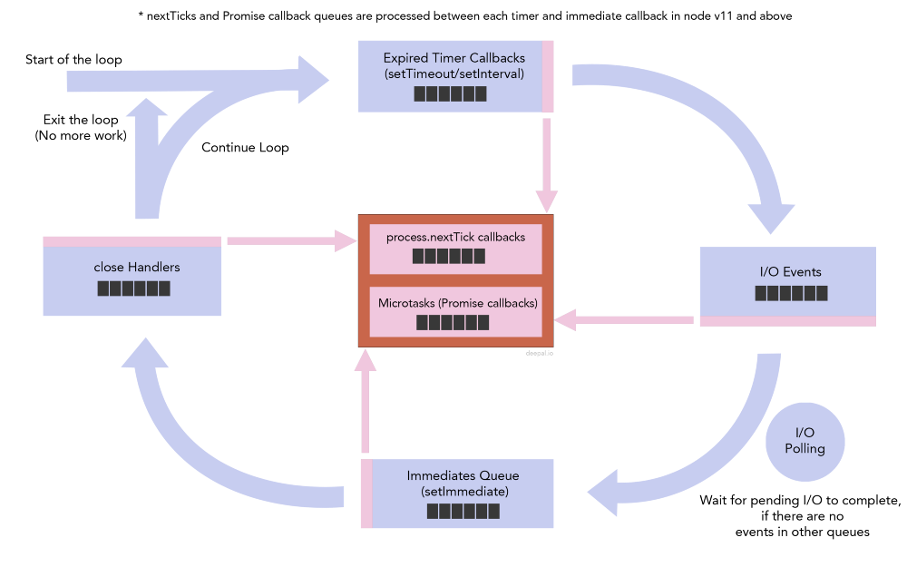
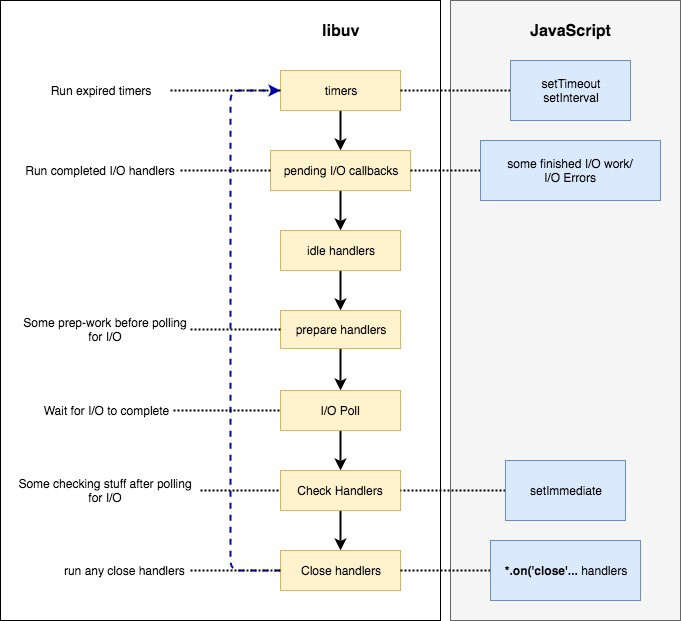

# Node Event Loop
## 概念

### I/O

通常，任何涉及除 CPU 之外的外部设备的工作都称为 I/O。最常见的抽象 I/O 类型是文件操作和 网络操作。

### Event Loop

事件循环 是计算机系统的一种运行机制。它描述了一个简单的循环，该循环遍历已完成事件的结果并对其进行处理。

### [libuv](http://docs.libuv.org/en/v1.x/design.html?fileGuid=JG8pVPY3WKt8YjD3)

基于事件驱动的异步 I/O 模型设计的跨平台支持库。为 nodejs 提供了对不同 I/O 轮询机制，如 epoll、kqueue、solaris 的简单抽象。

## 阶段

事件循环会无限地执行，一轮又一轮。只有异步任务的回调函数队列清空了，才会停止执行。

每一轮事件循环，分成 6 个阶段。

```plain
   ┌───────────────────────────┐
┌─>│           timers          │
│  └─────────────┬─────────────┘
│  ┌─────────────┴─────────────┐
│  │     pending callbacks     │
│  └─────────────┬─────────────┘
│  ┌─────────────┴─────────────┐
│  │       idle, prepare       │
│  └─────────────┬─────────────┘      ┌───────────────┐
│  ┌─────────────┴─────────────┐      │   incoming:   │
│  │           poll            │<─────┤  connections, │
│  └─────────────┬─────────────┘      │   data, etc.  │
│  ┌─────────────┴─────────────┐      └───────────────┘
│  │           check           │
│  └─────────────┬─────────────┘
│  ┌─────────────┴─────────────┐
└──┤      close callbacks      │
   └───────────────────────────┘
```
### timers

处理 setTimeout() 和 setIntval() 的回调函数。

### pending callbacks

执行延迟到下一个循环I/O 回调

### idle、prepare

仅供 libuv 内部调用

### poll

检查新的 I/O 事件，执行与 I/O 相关的回调

close 相关、timers 调度、setImmediate() 等回调除外

### check

执行 setImmediate() 回调

### close callbacks

执行 close 相关回调

## 事件队列

nodejs 中有多个队列，不同类型的事件在它们自己的队列里排队。

在处理完一个阶段之后，进入下一个阶段之前，事件循环将处理两个中间队列（intermediate queue），直到中间队列中没有剩余项目为止。



### 4 种主要队列

* **Expired timers and intervals Queue** 由使用 setTimeout() 和 setInterval() 增加的回调组成
* **I/O events Queue** 已完成 I/O 事件
* **Immediates Queue** setImmediate() 生成的事件
* **Close handlers Queue** close 回调，如 socket.on('close', ...)
### 2 种特殊队列

* **Next Ticks Queue** 由使用 process.nextTick 添加的事件组成
* **Other Microtasks Queue** 包含其他的微任务，如 resolved 的 promise
## 流程




---


## 相关资料

* [Event Loop and the Big Picture](https://blog.insiderattack.net/event-loop-and-the-big-picture-nodejs-event-loop-part-1-1cb67a182810?fileGuid=JG8pVPY3WKt8YjD3)
* [阮一峰 Node 定时器详解](http://www.ruanyifeng.com/blog/2018/02/node-event-loop.html?fileGuid=JG8pVPY3WKt8YjD3)
* [Node 官方文档](https://nodejs.org/en/docs/guides/event-loop-timers-and-nexttick/?fileGuid=JG8pVPY3WKt8YjD3)
