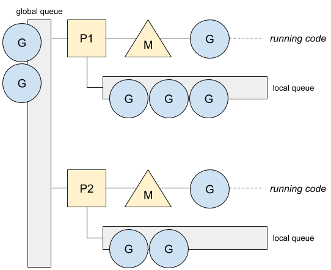
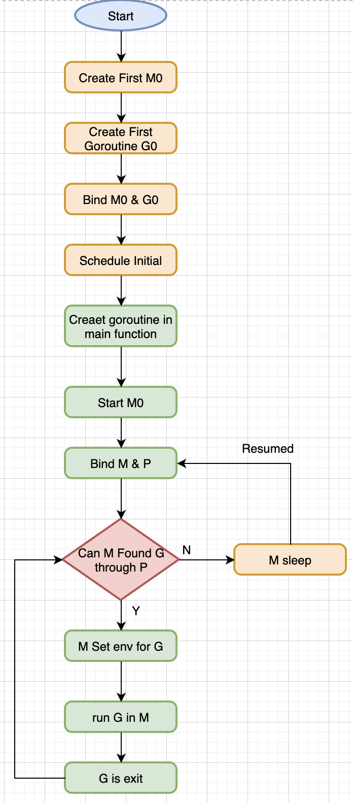
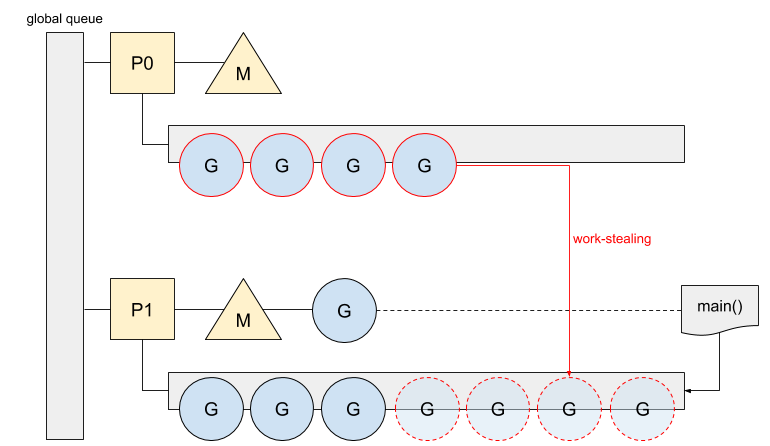
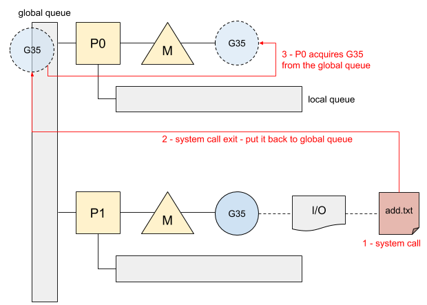

# Go GMP
## 概念

### Process

进程，操作系统资源分配最小单位。资源所有权，为了更好地利用 CPU 资源。

### Thread

线程，多个线程可以属于同一个进程并共享内存空间，不需要内存管理单元处理上下文切换，是执行和调度的基本单位。

### Coroutine

协程，一组序列化的子过程，可供用户自行调度，避免内核级别的上下文切换造成的性能损失。

### Work-sharing

工作共享，当一个处理器生成新线程时，它会尝试将其中一些迁移到其他被闲置或未充分利用的处理器上。

### Work-stealing

工作窃取，未充分利用的处理器会主动寻找其他处理器上的线程，并“窃取”来处理。

## Go 调度器的发展

### 单线程调度器 0.x

程序中只能存在一个活跃线程，由 G-M 模型组成。

### 多线程调度器 1.0

允许运行多线程的程序，但全局锁导致竞争严重。

### 任务窃取调度器 1.1

* 引入了处理器 **P**，构成了目前的 **G-M-P** 模型
* 在处理器 **P** 的基础上实现了基于工作窃取的调度器
* 在某些情况下，**Goroutine** 不会让出线程，进而造成饥饿问题
* 时间过长的垃圾回收会导致程序长时间无法工作
### 抢占式调度器 1.2 ~ 至今

#### 基于协作的抢占式调度器 1.2 ~ 1.13

* 通过编译器在函数调用是插入抢占检查指令，在函数调用是检查当前 **Goroutine** 是否发起了抢占请求，实现基于协作的抢占式调度
* **Goroutine** 可能会因为垃圾回收和循环长时间占用资源导致程序暂停
#### 基于信号的抢占式调度器 1.14 ~ now

* 实现基于信号的真抢占式调度
* 垃圾回收在扫描栈时会触发抢占调度
* 抢占的时间点不够多，还不能覆盖全部的边缘情况
## GMP 模型

### G

**Goroutine**，一个待执行任务，与协程的概念差不多，是在用户态提供的线程。

### M

操作系统的线程，最多可以创建 10000 个。

### P

处理器，是线程和 **Goroutine** 的中间层，提供线程需要的上下文环境，也会负责调度线程上的等待队列。

### GQ - Global Queue

全局运行队列

### LQ - Local Queue

**P** 持有的本地运行队列，由数组构成的环形链表，最多存储 256 个待执行任务。

### 概要

### 流程

**M0** - 是第一个创建的线程，它会完成系统的初始化和创建第一个 **Goroutine**，然后会转化为正常的 **M**。

**G0** - 是一个运行时中比较特殊的 **Goroutine**，它会深度参与运行时的调度过程，包括 **Goroutine** 的创建、大内存分配和 **CGO** 函数的执行。

)

### 工作窃取

如果处理器没有任务可以处理，会按照以下规则来执行，直到满足某条规则

* 从 **LQ** 获取
* 从 **GQ** 获取
* 从 Network Poller 获取
* 从其他 **P**的**LQ** 窃取任务

)

### I/O 和 GQ

G35 是一个涉及文件操作的系统调用，**Goroutine** 可能并不只是被一个 **P** 处理。

因为 **P** 在 **LQ** 跑完后可以从 **GQ** 获取任务。

)

---

## 相关资料

* [Go 语言设计与实现 by draveness](https://draveness.me/golang/?fileGuid=x8ycXx36YVxYHr88)
* [Work-Straling in Go Scheduler](https://medium.com/a-journey-with-go/go-work-stealing-in-go-scheduler-d439231be64d?fileGuid=x8ycXx36YVxYHr88)
* [Go's work-stealing scheduler](https://rakyll.org/scheduler/?fileGuid=x8ycXx36YVxYHr88)

