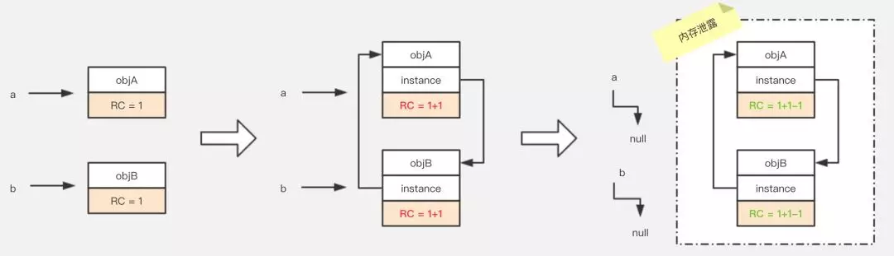
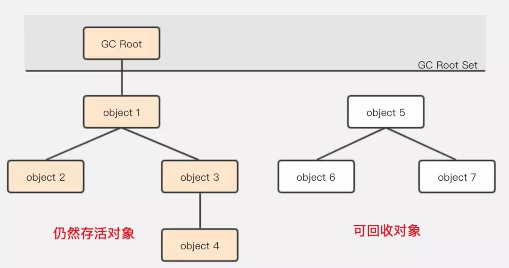
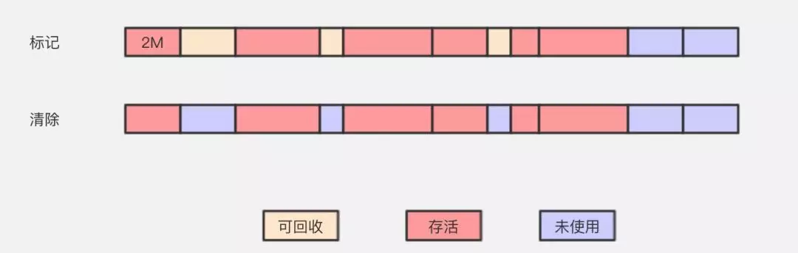
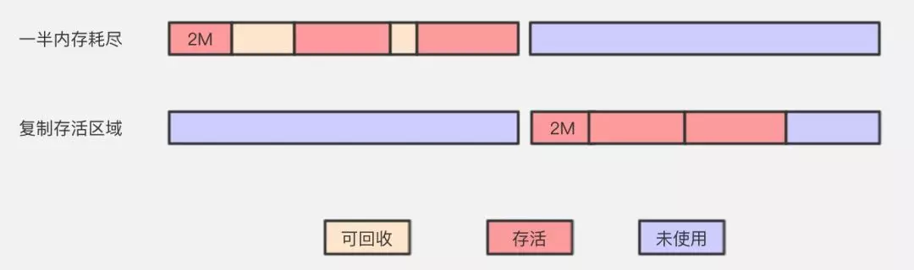
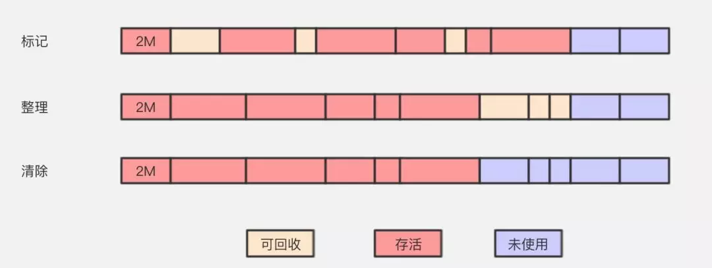
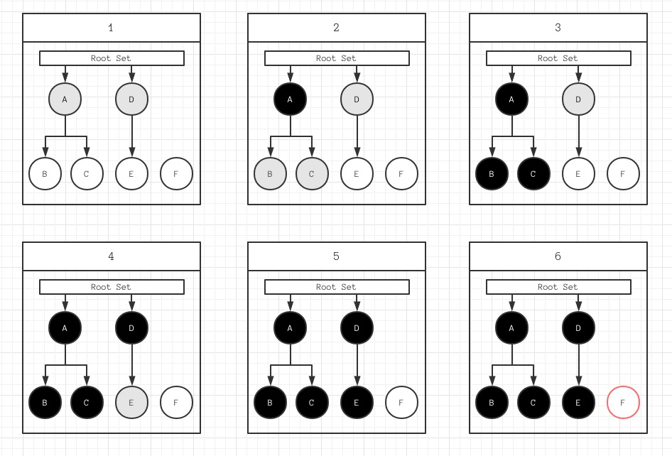

# GC 概述
## 概念

>计算机学院里曾经这个一个梗，说在食堂里吃饭，吃完把餐盘端走清理的，是刚学完 C 课程的新生，吃完直接就走的，是学完 Java 的老鸟。

应用程序中的内存管理可简单概括为 **内存分配 - 释放** 的过程。在编程语言里，通常会使用手动和自动两种方式。

**C/C++** 等语言使用手动的方式管理内存，工程师需要主动申请或者释放内存，这是一项繁琐且对编程能力要求较高的事。

**Java/Ruby/Go** 等语言则会使用自动的内存管理系统，使工程师在这一过程中被解放出来。通过了解自动内存管理的原理，能让工程师在程序问题排查、性能提升等方面有更丰富的手段。

### Garbage Collection

释放垃圾占用的空间，防止内存泄漏。有效的使用内存，对内存堆中已经死亡或者长时间没有使用的对象进行清除和回收。

### STW

**Stop the world**

随着用户程序申请越来越多的内存，系统中的垃圾也逐渐增多，当达到一定的阈值时，整个应用程序就会全部暂停，垃圾收集器会扫描已经分配的所有对象并回收不再使用的内存空间。

## 引用计数

**Reachability Counting**

将资源（可以是对象、内存或磁盘空间）的引用次数保存起来，当被引用次数变为 0 时就将其释放的过程。

### 优势

* 尽快地回收不再被使用的对象
* 回收过程中不会导致长时间停顿
* 清晰地标明每一个对象的生存周期

### 缺陷

* 频繁更新引用计数会降低运行效率
* 原始的引用计数无法解决 **循环引用** 问题

## 可达性分析

**Reachability Analysis**

通过一些被称为引用链 GC Roots 的对象作为起点，从这些节点开始向下搜索，搜索走过的路径被称为 Reference Chain，当一个对象与 GC Roots 没有任何引用链相连时（即从 GC Roots 节点到该节点不可达），则证明该对象是不可用的。

## 标记算法

### 标记清除

**Mark-Sweep**

#### 过程

* 标记 - 从根对象出发查找并标记堆中所有存活的对象
* 清除 - 遍历堆中的全部对象，回收未被标记的垃圾对象

#### 特点

逻辑清晰，最大的问题就是会产生内存碎片。

### 复制

**Copying**

#### 过程

* 标记 - 从根对象出发查找并标记堆中所有存活的对象
* 复制 - 一半内存即将耗尽，按容量划分大小相等的两块
* 整理 - 将所有存活的对象迁移到新的未使用的内存块上，已使用过的一次清理掉

#### 特点

可保证内存连续可用，运行高效，但内存使用率低。

### 标记整理

**Mark-Compact**

#### 过程

* 标记 - 从根对象出发查找并标记堆中所有存活的对象
* 整理 - 让所有存活的对象都向一端移动
* 清除 - 清理掉存活端边界以外的内存区域

#### 特点

解决了内存碎片问题，也规避了复制算法只能利用一半内存区域的弊端。

但内存变动更频繁，需要整理所有存活对象的引用地址，效率比复制算法要差。

### 分代收集

**Generational Collection**

并不是一种思想或理论，以对象存活周期的不同为基准，将内存划分不同的区域。再根据不同区域的特点，分别采用上述 3 种基础算法之一进行垃圾收集。

## 三色标记

**Tri-color Marking**

为了解决原始 Mark-Sweep 算法带来的长时间 STW，多事现代的跟踪式垃圾收集器都会实现三色标记算法的变种以缩短 STW 的时间。

### 定义

* 白色对象 - 潜在的垃圾，其内存可能会被垃圾收集器回收
* 黑色对象 - 活跃的对象，包括不存在任何引用外部指针的对象以及从根对象可达的对象
* 灰色对象 - 活跃的对象，存在指向白色对象的外部指针，垃圾收集器会扫描这些对象的子对象

### 过程

* 根对象会被标记成灰色，垃圾收集器只会从灰色对象集合中开始扫描
* 从灰色对象集合中选择一个并标记成黑色
* 将黑色对象指向的所有对象都标记成灰色
* 重复上述两个步骤知道对象图中不存在灰色对象

图中 F 为待回收的垃圾。

### 缺陷

因为用户程序可能在标记执行的过程中修改对象的指针，所以三色标记清除算法本身不可以增量或者并发执行，它仍然需要 STW。

## 屏障机制

**Memory Barrier**

内存屏障，也称内存栅栏。它使得 CPU 或编译器在对内存进行操作的时候，严格按照一定的顺序来执行。现代计算机为了提高性能而采取乱序执行，这使得内存屏障成为必须。

### 完全内存屏障

**Full Memory Barrier**

保障了早于屏障的内存读写操作的结果提交到内存之后，再执行晚于屏障的读写操作。

### 读屏障

**Read Memory Barrier**

仅确保了内存读操作

### 写屏障

**Write Memory Barrier**

仅确保了内存写操作

### 三色不变性

**Tri-color Invariant**

想要在增量或并发的标记算法中保证正确性，需要达成以下两种三色不变性中的一种

* 强三色不变性 - 黑色对象不会指向白色对象，只会指向灰色或褐色对象
* 弱三色不变性 - 黑色对象指向的白色对象必须包含一条从灰色对象经由多个白色对象的可达路劲

垃圾收集中的屏障和并发编程中的屏障有所不同，这里的屏障技术像是一个钩子方法，它是在用户程序读取、创建新对象以及更新对象指针时执行的一段代码。因为读屏障需要在读操作中加入代码片段，对用户程序性能影响较大，所以编程语言往往都会采用写屏障保证三色不变性。

## 标记优化

多数的应用程序都无法接受标记过程中长时间的 STW，在屏障机制的保护下，我们可以利用更多的计算资源去缩短 STW 的最长时间和垃圾收集总暂停时间。

### 增量

将原本垃圾收集时间较长的暂停时间切分成更小的时间片。开始前打开写屏障，保证堆内存中对象关系的强/弱三色不变性。虽然增量式的垃圾收集能够减少 STW 的最长时间，但是由于写屏障的加入，会增加一次 GC 循环的总时间。

### 并发

利用多核与用户程序并行执行垃圾收集。部分阶段还是需要 STW，且由于读屏障的引入，会带来一定的额外开销。

## Deep Dive

### Ruby

* [Generational GC in Python and Ruby](http://patshaughnessy.net/2013/10/30/generational-gc-in-python-and-ruby?fileGuid=pKrd6yGkhvwRCwCx)
* [Optimizing Rails for Memory Usage](https://collectiveidea.com/blog/archives/2015/02/19/optimizing-rails-for-memory-usage-part-2-tuning-the-gc?fileGuid=pKrd6yGkhvwRCwCx)
* [How Ruby Uses Memory](https://ruby-china.org/topics/25790?fileGuid=pKrd6yGkhvwRCwCx)
* [Understanding Ruby GC through GC.stat](https://www.speedshop.co/2017/03/09/a-guide-to-gc-stat.html?fileGuid=pKrd6yGkhvwRCwCx)
* [Incremental Garbage Collection in Ruby 2.2](https://blog.heroku.com/incremental-gc?utm_source=rubyweekly&utm_medium=email&fileGuid=pKrd6yGkhvwRCwCx)
* [Ruby GC 自述](https://ruby-china.org/topics/37118?fileGuid=pKrd6yGkhvwRCwCx)

### Node

* [A tour of V8: Garbage Collection](http://newhtml.net/v8-garbage-collection/?fileGuid=pKrd6yGkhvwRCwCx)
* [解读 V8 GC Log](https://developer.aliyun.com/article/592878?fileGuid=pKrd6yGkhvwRCwCx)
* [Node.js 内存管理和 V8 垃圾回收机制](https://juejin.cn/post/6844903878928891911?fileGuid=pKrd6yGkhvwRCwCx)

### Golang

* [Garbage Collection In Go](https://www.ardanlabs.com/blog/2018/12/garbage-collection-in-go-part1-semantics.html?fileGuid=pKrd6yGkhvwRCwCx)
* [Go 语言设计与实现 - 垃圾收集器](https://draveness.me/golang/docs/part3-runtime/ch07-memory/golang-garbage-collector/#72-%E5%9E%83%E5%9C%BE%E6%94%B6%E9%9B%86%E5%99%A8?fileGuid=pKrd6yGkhvwRCwCx)
* [深入 Golang Runtime 之 Golang GC 的过去、当前与未来](https://www.jianshu.com/p/bfc3c65c05d1?fileGuid=pKrd6yGkhvwRCwCx)

---

## 参考引用

* [引用计数 wiki](https://zh.wikipedia.org/wiki/%E5%BC%95%E7%94%A8%E8%AE%A1%E6%95%B0?fileGuid=pKrd6yGkhvwRCwCx)
* [Tri-color marking wiki](https://en.wikipedia.org/wiki/Tracing_garbage_collection#Tri-color_marking?fileGuid=pKrd6yGkhvwRCwCx)
* [Memory Barrier wiki](https://zh.wikipedia.org/wiki/%E5%86%85%E5%AD%98%E5%B1%8F%E9%9A%9C?fileGuid=pKrd6yGkhvwRCwCx)
* [Go 语言设计与实现 by Draveness](https://draveness.me/golang/docs/part3-runtime/ch07-memory/golang-garbage-collector/#72-%E5%9E%83%E5%9C%BE%E6%94%B6%E9%9B%86%E5%99%A8?fileGuid=pKrd6yGkhvwRCwCx)
* [咱们从头到尾说一次 Java 垃圾回收 by 率鸽](https://mp.weixin.qq.com/s/aA1eDYIUHuIfigTw2ffouw?fileGuid=pKrd6yGkhvwRCwCx)
