## FSM

### 概念

**有限状态机 Finite State Machine**

表示有限个状态以及这些状态之间的转移和动作等行为的数学模型。在计算机科学中，**FSM** 被广泛用于应用行为建模、硬件电路系统设计、软件工程、编译原理、网络协议等领域。

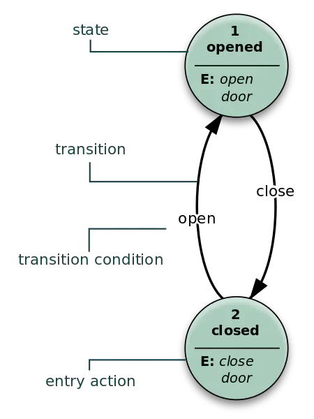

### 组件

* **CurrentState 现态**：指当前所处状态
* **Event 事件**：当一个条件被满足，可能会触发一个工作，或者执行一次状态的迁移
* **Action 动作**：条件满足后执行的动作行为。动作执行完毕后，可以迁移到新的状态，可可以仍旧保持原状态。动作不是必需的，当条件满足后，也可以不执行任何动作，直接迁移到新状态。
* **NextState 次态**：条件满足后要迁移的状态。**次态** 是相对于 **现态** 而言的，**次态** 一旦被激活，就转变成新的 **现态**。

### 特征

* 状态总数是有限的
* 任一时刻，只处在一种状态中
* 某种条件下，会从一种状态转变到另一种状态

### 逻辑

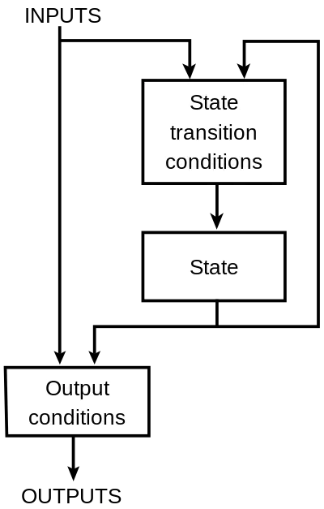

### 分类

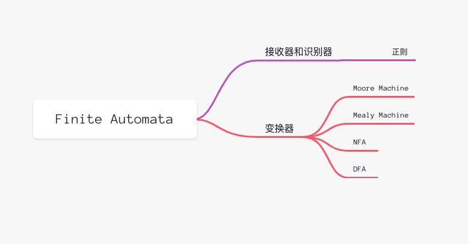

### 接受器和识别器

**序列检测器**

产生一个二元输出，说“是”/“否”来回答输入是否被机器接受。

如果一个语言被某个 **FSM** 接受，那么它是正则的。

解析单词 **nice**

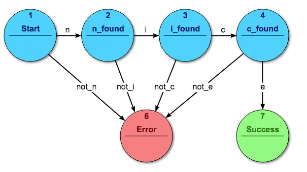

### 变换器

#### Moore Machine

**摩尔型有限状态机**

输出值依赖于当前状态

```plain
NextState = f(CurrentState, Input)
Ouput = f(CurrentState)
```
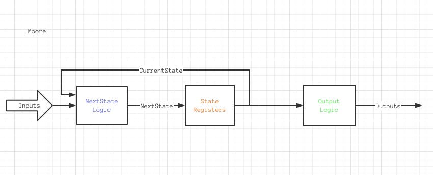

#### Mealy Machine

**米利型有限状态机**

输出依赖当前状态和输入

```plain
NextState = f(CurrentState, Input)
Ouput = f(CurrentState，Input)
```
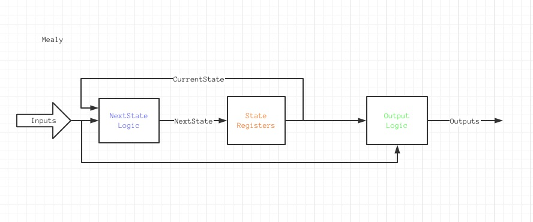

#### DFA

**确定有限状态自动机 Deterministic Finite Automaton**

下一个可能状态是唯一确定的，是 **NFA** 的一个极限。

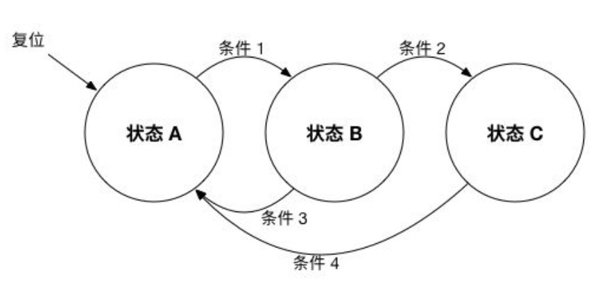


#### NFA

**非确定有限状态自动机**

是对每个状态和输入符号可以有多个可能的下一个状态的有限状态机。

### 表示法

#### 状态图

描述了一个对象在生命周期内所经历的各种状态，以及引起状态变化的事件。

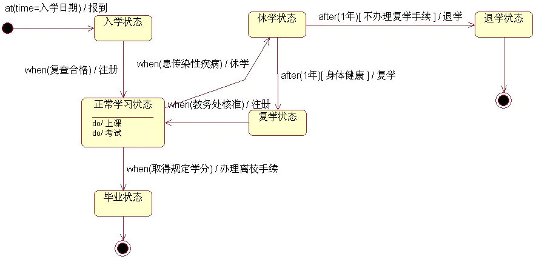

#### 状态转移表

展示有限自动机基于当前状态和其他输入，要移动到什么状态（NFA 中多个状态）的表格。

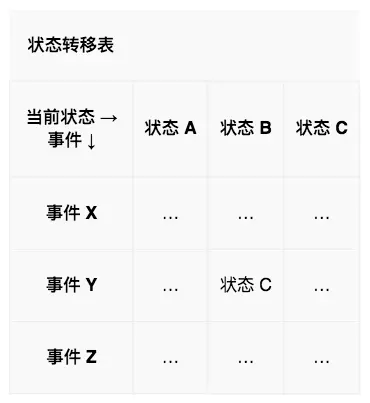

## 领域应用

### 正则表达式

[《正则表达式 DFA 构造方法》](https://blog.csdn.net/Chinamming/article/details/17166577?fileGuid=HhP3vWRv3c6HCdcq)

**[a|b]*abb** 正则表达式 **NFA**

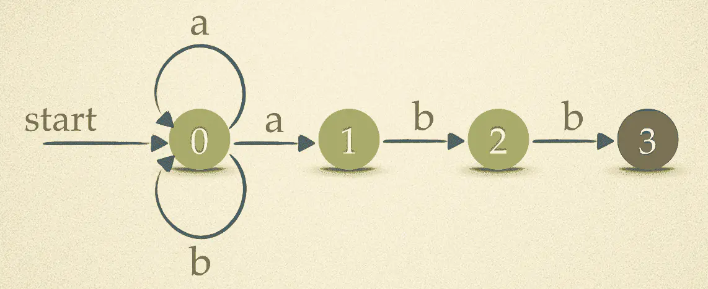

### 编译器

词法分析、语法分析。[《编译原理之词法分析》](http://kaiyuan.me/2016/04/19/compiler_lex/?fileGuid=HhP3vWRv3c6HCdcq)

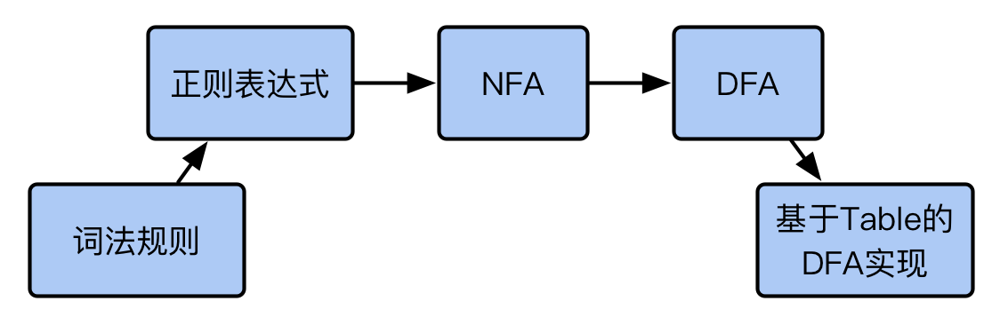

### 网络协议

[《TCP Finite State Machine》](http://www.tcpipguide.com/free/t_TCPOperationalOverviewandtheTCPFiniteStateMachineF-2.htm?fileGuid=HhP3vWRv3c6HCdcq)

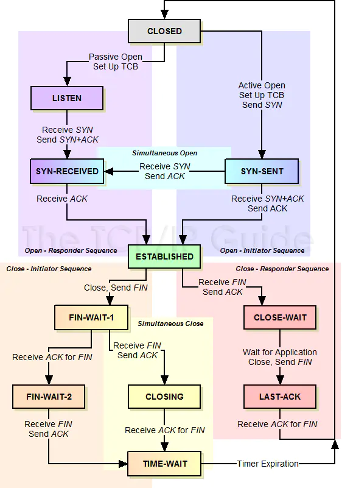

### 游戏设计

[《游戏设计模式--有限状态机》](https://www.cnblogs.com/KillerAery/p/9680303.html?fileGuid=HhP3vWRv3c6HCdcq)

### 业务系统

* 电商场景[《订单有限状态机架构设计》](https://blog.csdn.net/u011323949/article/details/107614387?fileGuid=HhP3vWRv3c6HCdcq)
* 用户养成体系
* 金融场景

## 工具库

**FSM 很高效，因为一旦将状态图或转移表编译进了 FSM，剩下的就是查表操作**。

实现一个 **FSM** 工具库的几个关键元素

* **DSL** - 将状态图或状态转移表转化为对应的简单描述代码
* **Event Chain** - 事件触发链，保存某事件对应的 现态 -> 次态 迁移路径
* **Callback** - 保存事件触发前后，除状态变更以外需要执行的操作
### Ruby

* [state_machines](https://github.com/state-machines/state_machines?fileGuid=HhP3vWRv3c6HCdcq)
* [aasm](https://github.com/aasm/aasm?fileGuid=HhP3vWRv3c6HCdcq)
* [finite_machine](https://github.com/piotrmurach/finite_machine?fileGuid=HhP3vWRv3c6HCdcq)
### Js

* [javascript state machine](https://github.com/jakesgordon/javascript-state-machine?fileGuid=HhP3vWRv3c6HCdcq)
* [machina](https://github.com/ifandelse/machina.js?fileGuid=HhP3vWRv3c6HCdcq)
### Go

* [looplab/fsm](https://github.com/looplab/fsm?fileGuid=HhP3vWRv3c6HCdcq)

---


## 相关资料

* [有限状态机 wiki](https://zh.wikipedia.org/wiki/%E6%9C%89%E9%99%90%E7%8A%B6%E6%80%81%E6%9C%BA?fileGuid=HhP3vWRv3c6HCdcq)
* [非确定有限状态自动机 wiki](https://zh.wikipedia.org/wiki/%E9%9D%9E%E7%A1%AE%E5%AE%9A%E6%9C%89%E9%99%90%E7%8A%B6%E6%80%81%E8%87%AA%E5%8A%A8%E6%9C%BA?fileGuid=HhP3vWRv3c6HCdcq)
* [Javascript 与有限状态机 by 阮一峰](http://www.ruanyifeng.com/blog/2013/09/finite-state_machine_for_javascript.html?fileGuid=HhP3vWRv3c6HCdcq)
* [深入理解 Aho-Corasick 自动机算法](https://blog.csdn.net/lemon_tree12138/article/details/49335051?fileGuid=HhP3vWRv3c6HCdcq)
* [状态机思维](https://www.jianshu.com/p/20d7f7c37b03?fileGuid=HhP3vWRv3c6HCdcq)
* [游戏开发之状态机的实现与优化](https://chenyuxiaodhr.github.io/zh-CN/Game-Development/Finite-State-Machine-in-Game-Development/?fileGuid=HhP3vWRv3c6HCdcq)
* [基于有限状态机与消息队列的第三方支付系统补单实践](https://cloud.tencent.com/developer/news/738245?fileGuid=HhP3vWRv3c6HCdcq)

