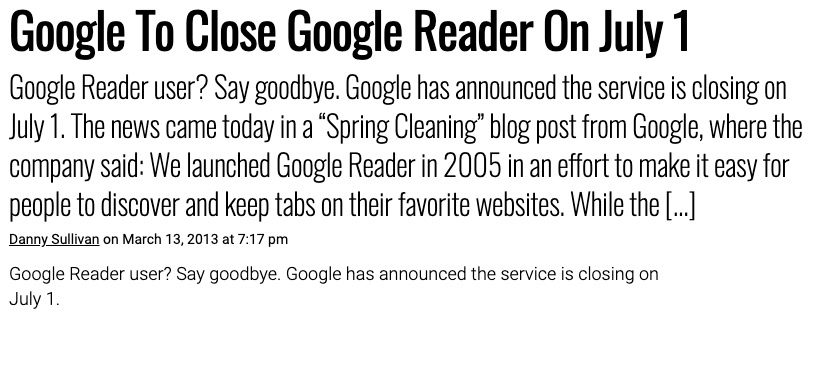
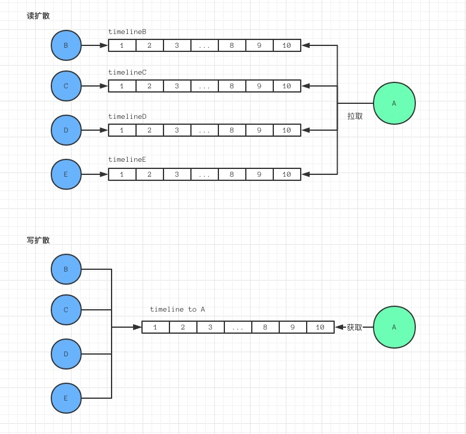
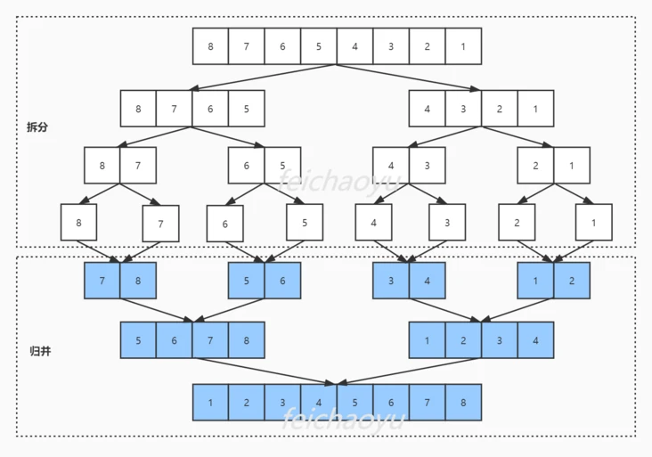
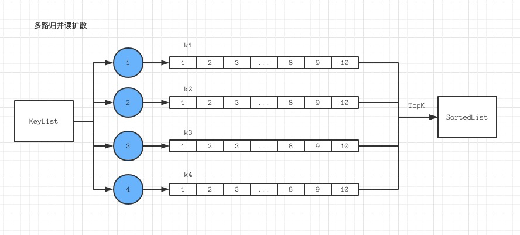

# 消息中心多版本兼容的思考
## 变迁

### Blog 时代

回想早年，拥有一个 **blog** 是多么令人自豪的一件事情。

**blog**，作为早期互联网获取信息的手段。简单的页面，混乱的排版，但毫不妨碍人们孜孜不倦地贡献着他们在各个领域的真知灼见。直至现在，荣光不再，却生生不息。


这种手段，我们可以简单抽象为以下结构

#### KeyList

```plain
blogID -> blogData
uID -> List<blogID> @timestamp
```
**特点**
* 时间序列 timeline，每个用户uID 拥有一个 SortedList 有序列表，列表之间互相隔离
* Key 的数量级可达到千万
* List 结构需要 size 长度，支持 TopK，支持 NextK 或分页 Get start + limit，增删改查，以上不容忍退化成 O(n) 的 case，支持高并发度

### 社区化

#### 互相评论

阅读了某些有深度的文章，难免会产生一些想于作者沟通的想法，评论就是很好的手段。

```plain
cID -> commentData
blogID -> List<cID> @timestamp
```
#### 消息通知

以 **消息盒** 或 **消息中心** 等形式，来集中管理我们在社区中的一些互动行为，是社区产品的一大特点。

```plain
mID -> msgData
uID -> List<mID> @timestamp
```
### RSS

简易信息聚合 Really Simple Syndication，是一种互联网信息协议，可以帮助我们高效地获取信息。

**blog** 繁荣的时候，人们每天起来需要浏览信息，不得不通过打开各种各样的网站。如何才能免去如此繁琐的操作？**RSS** 应运而生，通过主动订阅各个 **blog** 源，所有的更新都会及时自动地发送到我们的 **RSS** 收集器里，一劳永逸。

#### 局限性

* 性能和可用性不稳定 - **RSS** 通常是定时去抓取所订阅网站的内容，大的平台网站还好，但如果是某些小型的网站，可能会由于请求太多导致内容获取失败
* 限制应用范围 - 由于一些隐私或版权问题，并不是所有网站都支持 **RSS**。
* 无法直接互动
* 反商业 - 因为阅读可在用户的 **RSS** 收集器中，导致一些网站赖以生存的盈利手段如广告无法持续。

由于自身的一些局限性，加上 **社交网络** 的出现，**RSS** 渐渐被放弃。但也有不少人认为，**RSS** 依然是这个信息爆炸的时代最高效的信息获取手段。



## Feed 流

伴随着社交网络的发展，用户乐于将关系链中的事物动态，统一呈现到一个地方，我们称之为 Feed 流。

**读写扩散（推拉模式）** 是实现 Feed 流的两种有效模型。



### 读扩散

#### 特点

* 读很重，写很轻
* 实现较简单
* 关注与取关后，Feed 中的内容会动态变化，易于维护
* 超过一定数量好友后，读的效率变的很低
* 难以应对复杂的社交关系，假装关注，虚假友谊等

#### 相关

* 微信好友
* 微博关注
* FB 好友
* Twitter 关注

微博关注早期限制关注上限 <= **5000** 的原因即是避免超过这个数量之后带来的性能问题。

此时的 Feed 流，核心问题是 如何从 **5000** 个 SortedList 中聚合得到 TopK。

### 写扩散

#### 特点

* 读的性能高
* 可以覆盖多种业务场景
* 需要大量写入，如 大 V 发送了一条动态，所有粉丝需要得知
* 无法对关注关系进行动态维护
* 占用大量储存空间

### 混合扩散

很多社区产品通过引入 **标签** 来聚合一系列内容，使得用户能更便捷地浏览他们感兴趣的东西。

信息流向 **内容 -> TAG -> 用户**

#### 简化设计

* 内容 -> TAG = 写扩散
* 用户 -> TAG = 读扩散

#### 特点

* 从宏观上解决 **5000** 的限制

#### 相关

* 贴吧首页关注
* 知乎首页关注
* 微信朋友圈分组可见

### 推荐系统

2018 FB 发布公告，关闭 Friend List Feed 功能，将更多精力投入使用机器学习接管的 News Feed。

此场景下，传统的 **列表服务 + 混合扩散** 逐渐被 **推荐系统** 取代。

## 多版本兼容

一种特殊的 Feed 流

### 场景

一个 APP 消息中心，用于收取我发布的作品的多种类型的互动消息，如点赞、评论

```plain
v1.0 = [msgType1, msgType2]
```
msgType1 在 1.0 版本一直有效，而 msyType2 因为某些原因，需要撤掉
```plain
v2.0 = [msgType1]
```
3.0 我们需要新增一种类型的消息 msgType3，但 1.0 版本无法展示这类消息，所以需要将其过滤
```plain
v3.0 = [msgType1, msgType3]
```
一旦涉及消息类型的更改，就需要通过客户端发版去兼容，这种类似的多版本兼容问题，是业务快速发展的一大困扰。

### 转化为 Feed 流模型

#### 步骤

* 分析与版本无关的 msgType 因子，设计与版本无关的存储模型
* 生成数据是根据 msgType 因子写扩散，获取列表时根据 msgType 因子读扩散
* 利用 msgType 形态，将版本变化转化成 Feed 流订阅变化
* 最终实现原子服务存储去版本化，同时保证接口的版本友好

#### 特点

* 读性能不错
* 存储不冗余
* 存储易扩展
* 开发难度一般

## 多路归并

### 概念

归并排序是建立在归并操作上的一种有效的排序算法，该算法是采用分治法的一个非常典型的应用。

将已有序的子序列合并，得到完全有序的序列，即先使每个子序列有序，再使子序列段间有序。

若将两个有序表合并成一个有序表，称为二路归并，将二扩展到 M ，则是多路排序。



### 读扩散应用

* 在一个 KeyList 中根据 N 个不同的 Key 分别获取 TopK、NextK
* 得到 N 个有序 List，长度均 <= K
* 归并 N 个结果集，取 TopK 为最终结果




---


## 参考引用

* [多路归并如何在千万级 Feed 流中更有效的应用](https://t-tlearning.com/detail/v_5e202c9c34739_yI1kXp4W/3?fileGuid=HYHK9RkdJWvgkggw)
* [图解归并排序](https://segmentfault.com/a/1190000021734148?fileGuid=HYHK9RkdJWvgkggw)
* [外排序-多路归并](https://www.jianshu.com/p/dce6a43d4678?fileGuid=HYHK9RkdJWvgkggw)
* [如何打造千万级 Feed 流系统](https://blog.csdn.net/feeltouch/article/details/78539325?fileGuid=HYHK9RkdJWvgkggw)
* [读扩散？写扩散？推拉架构一文搞定-架构师之路](https://www.shangyexinzhi.com/article/273191.html?fileGuid=HYHK9RkdJWvgkggw)


