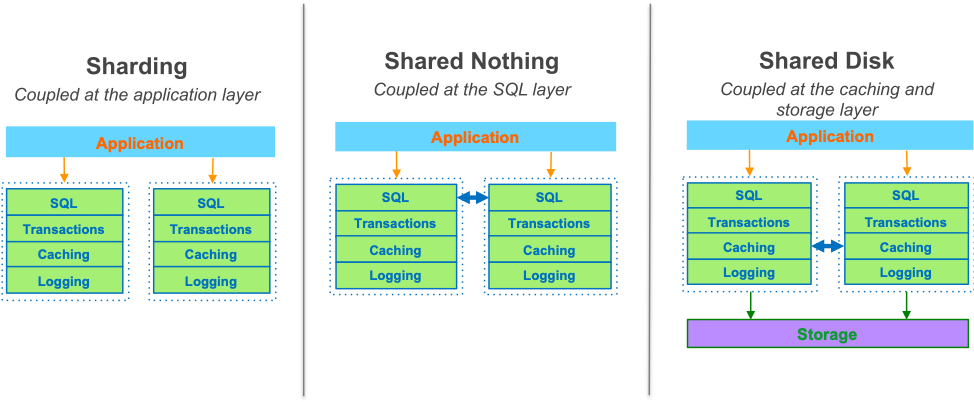
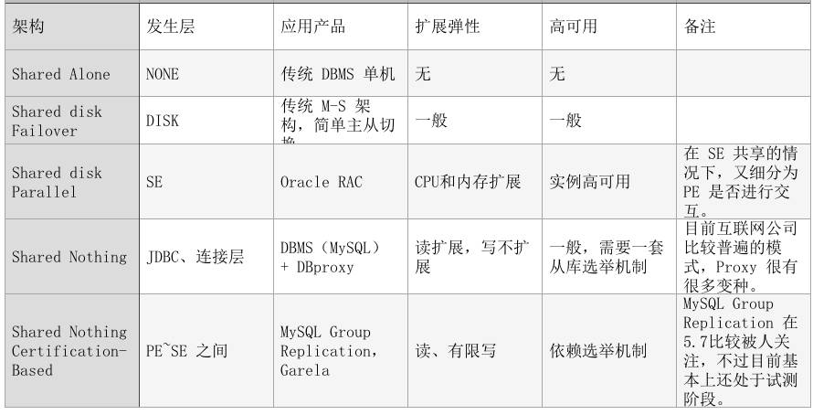
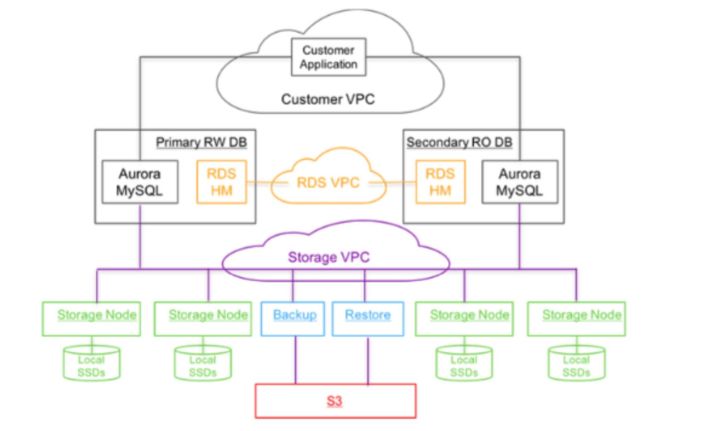
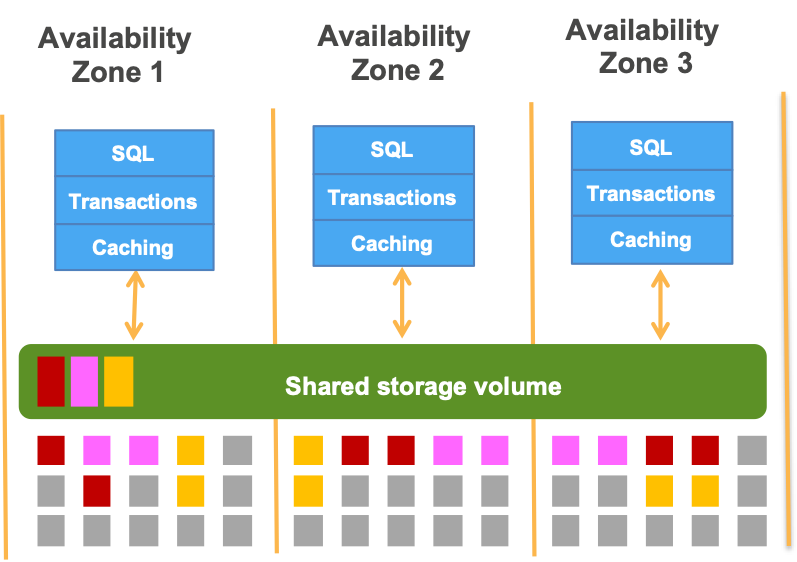
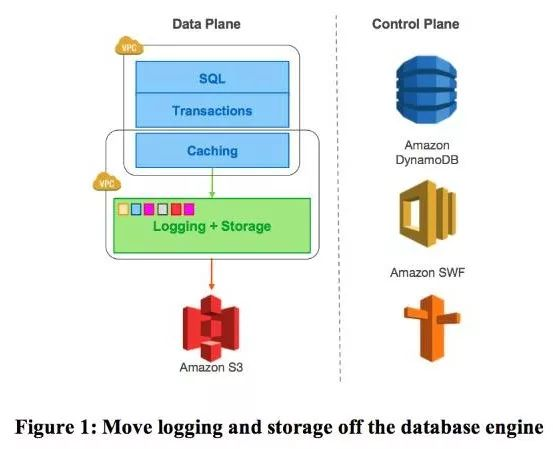
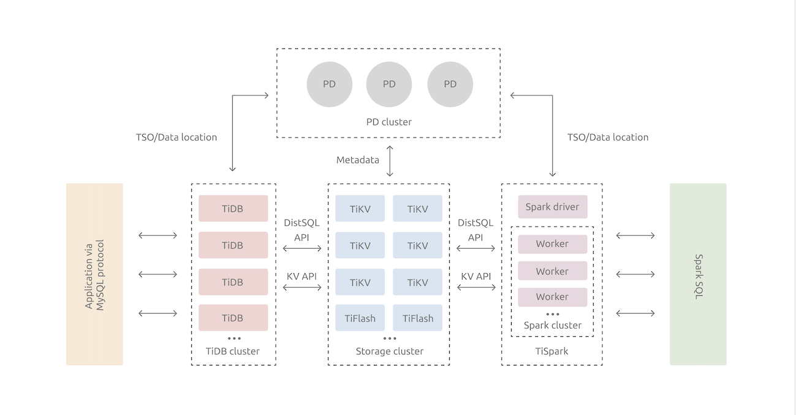

# NewSQL
## 术语

### OLTP

**Online Transactoin Processing** 联机事务处理过程，也称面向交易的处理过程

基本特征是前台接收的用户数据可以立即传送到计算中心进行处理，并在很短的时间内给出处理结果，是对用户操作快速响应的方式之一。

### OLAP

**Online Analytical Processing** 联机分析处理

使分析人员能够迅速、一致、交互地从各个方面观察信息，以达到深入理解数据的目的。

### ACID

指数据库管理系统在写入或更新资料的过程中，为保证事务是正确可靠的，所必须具备的

四个特性：

* atomicity 原子性
* consistency 一致性
* isolation 隔离性
* durability 持久性

### NewSQL

是一类关系型数据库系统，旨在为 OLTP 工作负载提供 NoSQL 系统的可伸缩性，同时保持传统数据库系统的 ACID 保证。

## 传统关系数据库架构

## Aurora

Aurora 是依托于 AWS 的 OLTP 企业级关系数据库。

Aurora 的设计者认为，当前海量数据处理的主要瓶颈已经从计算、存储 I/O 转移到了网络 I/O，为了解决这个问题，Aurora 通过将重做日志推到多租户的大规模存储服务当中，从而不仅大幅度的减少网络 I/O，而且数据的多副本可以进行快速故障恢复，以及容错损失，建立起一套自愈存储。

### Birds-eye View

### 基于元组

一切都会出现故障。Aurora 将所有写入复制到三个可用区，提供优异的数据持久性和可用性。

### Log is database

将 logging 和存储从数据库引擎中剥离到分布式的云存储环境中，虽然实例还包括大部分的传统内核组件（查询处理器、事务、锁、缓存、访问机制和回滚管理），但其中的几个功能（重做日志、数据持久化、闪崩恢复、备份/还原）则被下沉到了存储层。

### 特点

* 架构：属于 Shared Disk 架构（存储可以简单理解为共享，实际上是一套多副本复制）
* 写扩展：单点写入，从写流量看不属于真正的 Scale Out
* 读扩展：实例可弹性扩展
* 大小限制：数据集群卷大小上限 128 TB，MySQL 单表上限 64 TB，PostgreSQL 单表上限 32 TB
* 读写响应：大大简化 commit 的机制，读写响应时间很好
* 兼容性：无缝兼容 MySQL、PostgreSQL
* 移植性：很差，高度依赖 AWS 组件
* 高可用：不是强一致机制，极端情况下通过其他节点可能读不到最新的数据
* 内存交互：日志会在实例节点 Buffer 之间进行复制应用，通过这种内存交互方式读性能会更优
* 适合场景：OLTP
* 成本：可选多重价格梯度，参见[Auroa Pricing](https://aws.amazon.com/cn/rds/aurora/pricing/?fileGuid=GxJpdw8wPJrpxWwt)

## TiDB

TiDB 是一款定位于 HTAP（Hyprid Transactional/Analytical Process）的融合型数据库。

实现了一键水平伸缩，强一致性的多副本数据安全，分布式事务，实时 OLAP 等重要特性。

### Birds-eye View

### TiDB Server

SQL 层，对外暴露 MySQL 协议的连接 endpoint，负责接受客户端的连接，执行 SQL 解析和优化，最终生成分布式执行计划。

### TiKV

基于 RocksDB，并通过 Raft 协议保证了多副本数据一致性以及高可用的分布式事务型键值数据库。

### 特点

* 架构：属于 Shared Nothing 的分布式架构，通过 Raft 协议进行同步
* 存储：数据格式是 KV，数据模型基于 LSMTree 的模型，底层 RockDB
* 写扩展：分布式写入，线性扩展，LSM 写入性能好
* 读扩展：存储节点、实例节点均可线性扩展
* 大小限制：理论上无上限
* 读写响应：两阶段提交、Raft 复制对响应时间都会有一定的延迟成本
* 兼容性：高度兼容 MySQL，但比 Aurora 差，至少 4.0 不支持存储过程，触发器，还有一些字符集的问题等，参见[与 MySQL 的兼容性](https://docs.pingcap.com/zh/tidb/stable/mysql-compatibility?fileGuid=GxJpdw8wPJrpxWwt)
* 移植性：较好，可以直接通过 Docker 部署
* 高可用：只要网络条件允许，可以创建真正的异地多活
* 内存交互：实例节点 Buffer 不存在交互机制，不能共享内存
* 事务性能：分布式事务锁机制，冲突比较多的写入场景较差
* 适合场景：OLTP、OLAP 混合
* 成本：目前来看比较高，参见[生产环境部署要求](https://docs.pingcap.com/zh/tidb/stable/hardware-and-software-requirements#%E7%94%9F%E4%BA%A7%E7%8E%AF%E5%A2%83?fileGuid=GxJpdw8wPJrpxWwt)

---

## 相关资料

* [OLTP wiki](https://en.wikipedia.org/wiki/Online_transaction_processing?fileGuid=GxJpdw8wPJrpxWwt)
* [OLAP wiki](https://en.wikipedia.org/wiki/Online_analytical_processing?fileGuid=GxJpdw8wPJrpxWwt)
* [ACID wiki](https://zh.wikipedia.org/wiki/ACID?fileGuid=GxJpdw8wPJrpxWwt)
* [AWS Autora 用户指南](https://docs.aws.amazon.com/zh_cn/AmazonRDS/latest/AuroraUserGuide/CHAP_AuroraOverview.html?fileGuid=GxJpdw8wPJrpxWwt)
* [PingCap 文档](https://docs.pingcap.com/zh/tidb/stable?fileGuid=GxJpdw8wPJrpxWwt)
* [Amazon Aurora: Design Considerations for High Throughput CloudNative Relational Databases](https://www.amazon.science/publications/amazon-aurora-design-considerations-for-high-throughput-cloud-native-relational-databases?fileGuid=GxJpdw8wPJrpxWwt)
* [换个角度看 Aurora：缘何万能？对比 TiDB 有何不同？](https://dbaplus.cn/news-160-1748-1.html?fileGuid=GxJpdw8wPJrpxWwt)
* [比 MySQL 快 10 倍？这可能是目前 AWS Aurora 最详细解读！](https://mp.weixin.qq.com/s?__biz=MzkwOTIxNDQ3OA==&mid=2247533605&idx=1&sn=4924638b015faf27fcd177cfc447dd5d&source=41#wechat_redirect&fileGuid=GxJpdw8wPJrpxWwt)
* [Amazon Aurora 深度探索](https://zhuanlan.zhihu.com/p/33603518?fileGuid=GxJpdw8wPJrpxWwt)
* [我们是如何设计原生云关系数据库的-AWS Aurora](https://aws.amazon.com/cn/blogs/china/amazon-aurora-design-cloud-native-relational-database/?fileGuid=GxJpdw8wPJrpxWwt)
* [云原生数据库设计新思路-PingCAP](https://pingcap.com/blog-cn/new-ideas-for-designing-cloud-native-database/?fileGuid=GxJpdw8wPJrpxWwt)
* [对比五款数据库，告诉你 NewSQL 的独到之处](https://www.infoq.cn/article/zyyub0-qtpqmxfv5h9ch?fileGuid=GxJpdw8wPJrpxWwt)

