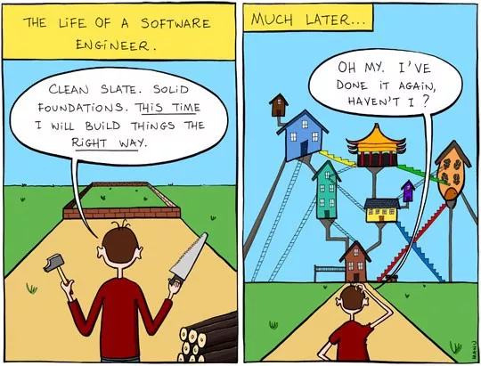

# 技术债务
## 复杂度

>软件架构的核心挑战是快速增长的复杂性。
>
>大型系统是生长出来，而不是建造出来。生长于建造的差异在于，我们无法像建造摩天大楼一样，事先设计出完整详尽的图纸，按图准确施工，保证质量就能完成。而系统是一个伴随项目本身的发展，研发团队的壮大，逐渐生长的过程。
>
>--- 阿里研究员谷朴

合适的架构能使软件按照咱们预想的方向去演进，不然就像以前院子里没了围墙的的爬山虎。

架构师的职责不是试图画出复杂软件的大图。大图好画，靠谱的系统难做。复杂的系统是从一个个简单的应用一点点生长出来的。

当我们发现自己的系统问题多多，别怪当初设计的人，坑不是一天挖出来的。每个设计决定都在贡献复杂度。

### 认知负荷

**理解软件的接口、设计或者实现所需要的心智负担**

影响认知负荷的因素

* 不恰当的逻辑带来的认知成本
* 模型失配，和现实世界不完全符合的模型带来的高认知负荷
* 接口设计不当
* 一个简单的修改需要在多处更新
* 命名
* 不知道一个简单特性需要在哪些做修改，或者一个简单的改动会带来什么影响
* 认知成本低要不易出错，而不是无脑简化

### 协同成本

**团队维护软件时需要在协同上额外付出的成本**

影响协同成本的因素

* 系统模块拆分与团队边界
* 服务之间的依赖
* 可测试性不足带来的协同成本
* 文档

## 债务管理

**复杂度增长带来的风险，选择在可预见的未来中解决，称之为技术债务，它的利息表现为系统的不稳定性和不断攀升的维护成本**

### **破窗效应**

一幢有少许破窗的建筑，如果那些窗户没修理好，可能将会有破坏者破坏更多的窗户。最终他们甚至会闯入建筑内，如果发现无人居住，也许就在那里占领、定居或者纵火。

### 手段

如何在软件演进的过程中控制技术债务的规模，不至于爆雷，是值得研究的课题。

#### 文档

一半时间写代码，一半时间写文档，可能才是软件工程师理想的状态。

清晰直白的系统架构描述、使用手册、API 文档、部署手册等都能在项目的不同阶段带来意想不到的益处，切忌口口相传。

#### DDD

**领域驱动设计**

是解决复杂业务的一套体系，但并不是所有规模的系统都需要引入。

但当中的**统一语言**概念，是有效减低复杂度的手段之一。

通过项目中多方角色的参与，**统一语言**可降低模型失配、服务模块拆分、服务间依赖所带来的摩擦成本，从而影响认知负荷和协同成本这两个复杂度关键因素。

#### TDD

**测试驱动开发**

写测试确实是一件相对费时的事情，但如果一旦能将核心的用例构建出来，剩下的往往只是边界条件的复制粘贴。

能将核心的代码测试覆盖网搭建好，在后面无论是 Bug 追踪和修复、重构或线上发布都能节省大量时间。

动态语言相比编译型的语言，对测试的依赖理应更加强烈。所谓动态语言一时爽，线上发布火葬场。

#### 重构

**动机**

改善既有代码的设计、提升开发效率、减低成本...

统统可归结为降低系统复杂度。

**投入与回报并非呈线性关系**

小型重构应不断持续，小步快跑。而大型重构的时机把握，并非易事。

在有限人员和时间的范围内，尽可能地展现重构能带来的业务价值。

**模式 EPDCA**

* 识别需要重构的地方
* 制定重构计划
* 执行计划的重构任务
* 使用测试对重构是否影响业务功能进行检查
* 调整下一次重构策略

---

## 参考引用

* [阿里研究员谷朴：警惕软件复杂度困局](https://zhuanlan.zhihu.com/p/199256624?fileGuid=WvxkPtQ9dqyKTtyw)
* [系统重构与迁移指南](https://migration.ink/?fileGuid=WvxkPtQ9dqyKTtyw)
