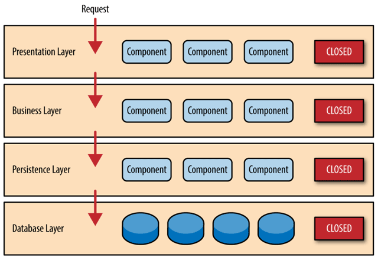
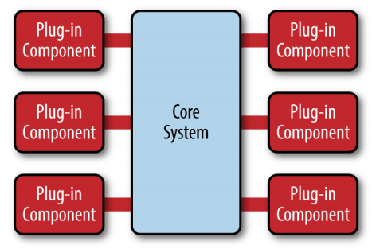
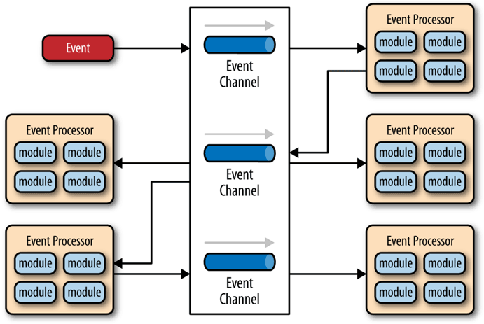
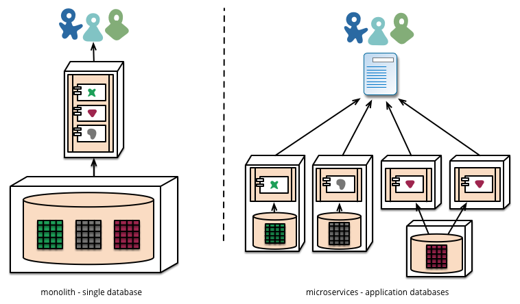
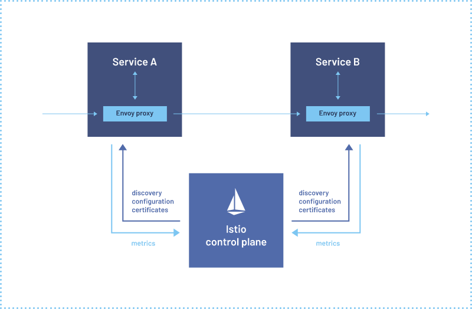
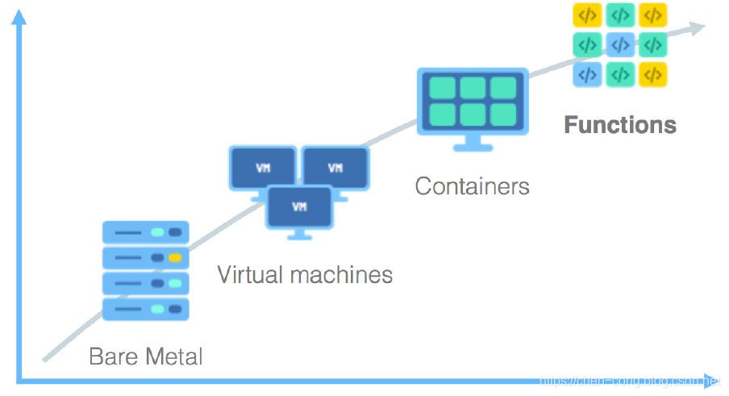

## 单体架构

"单体"只是表明系统中主要的过程调用都是进程内调用，不会发生进程间通信，仅此而已。

### 巨石系统

单体架构往往又被称为巨石系统 **Monolithic Application**。

>A monolithic application is self-contained and independent from other computing applications. The design philosophy is that the application is responsible not just for a particular task, but can perform every step needed to complete a particular function.

早期的软件系统往往都是基于这种模式去构建起来，而在微服务流行起来后，单体架构才事后追认地形成了概念，且是被 **批判** 的角色。

### **运行效率最高**

对于 **小型系统** --即由单台机器就足以支撑其良好运行的系统，单体不仅易于开发、易于测试、易于部署，且由于系统中各个功能、模块、方法的调用过程都是进程内调用，不会发生进程间通信，因此是运行效率最高的一种架构风格。

所以，以下讨论需要一个明确的前提-- **大型的单体系统**。

### 分层

单体并不意味着 **铁板一块，不可拆分。**

分层架构是现在几乎所有信息系统建设都普遍认可、采用软件设计方法。对代码进行纵向层次的划分，收到的外部请求在各层之间以不同形式的数据结构进行流转传递，往往会在系统的可维护性和可扩展性上得非常良性的反馈。

### 模块化

从横向角度，单体架构也可以支持按照技术、功能、职责等维度，将软件拆分为各种模块，以便重用和管理代码。单体系统并不意味着只能有一个整体的程序封装形式，各种语言中的包管理系统如 Java jar、Golang package 等即是通过静态链接的方式来达成模块化的目的。

即使是以横向扩展的角度来衡量，在负载均衡设备之后同时部署若干个相同的单体副本，以达到流量分摊的效果，也是非常常见的做法。

### 隔离能力

所有代码都运行在同一个进程空间之内，所有模块、方法的调用都无须考虑网络分区、对象复制这些麻烦的事情和性能损失、获得进程内调用的简单、高效等好处的同时，也意味着如果一部分代码出现了缺陷，过度消耗进程空间内的资源，所造成的影响也是全局性、难以隔离的。如果消耗的是高层次的公共资源，譬如端口号、数据库链接池泄漏，影响还会波及其他单体副本。

由于隔离能力的缺失，单体除了难以阻断错误传播、不便于动态更新程序以外，还面临难以技术异构的困难。

对隔离能力的重视不得不提及 Erlang 的 **任其崩溃 Let it crash** 哲学。让其即使有着晦涩难懂的语法情况下，依然能得到许多构建大型系统的机会。出错不仅仅是代码逻辑上存在问题，也有可能涉及业务方向的错误，组织能力的匮乏。在这个软件普遍工业化的年代，出错的概率往往只会越来越高。构筑可靠系统从“追求尽量不出错”，到正视“出错是必然”的观念转变，才是微服务架构得以挑战并逐步开始取代运作了数十年的单体架构的底气。

## SOA

**Service-Oriented Architecture** 面向服务的架构是一次具体地、系统性地成功解决分布式服务主要问题的架构模式。

### 烟囱式架构

**Information Silo Architecture** 又名信息孤岛。指的是一种完全不与其他相关信息系统进行互操作或者协调工作的设计模式。

### 微内核架构

**Microkernel Architecture** 又名插件式架构。

既然在烟囱式架构中，没有业务往来关系的系统也可能需要共享人员、组织、权限等一些的公共的主数据，那不妨就将这些主数据，连同其他可能被各子系统使用到的公共服务、数据、资源集中到一块，成为一个被所有业务系统共同依赖的核心，具体的业务系统以插件模块的形式存在，这样也可提供可扩展的、灵活的、天然隔离的功能特性。

### 事件驱动架构

**Event-Driven Architecture**

为了能让子系统互相通信，一种可行的方案是在子系统之间建立一套事件队列管道（Event Queues），来自系统外部的消息将以事件的形式发送至管道中，各个子系统从管道里获取自己感兴趣、能够处理的事件消息，也可以为事件新增或者修改其中的附加信息，甚至可以自己发布一些新的事件到管道队列中去，如此，每一个消息的处理者都是独立的，高度解耦的，但又能与其他处理者（如果存在该消息处理者的话）通过事件管道进行互动。

### 更具体

“更具体”体现在尽管SOA本身还是属抽象概念，而不是特指某一种具体的技术，但它比单体架构和前面所列举的三种架构模式的操作性要更强，已经不能简单视其为一种架构风格，而是可以称为一套软件设计的基础平台了。

### 更系统

“更系统”指的是SOA的宏大理想，它的终极目标是希望总结出一套自上而下的软件研发方法论，希望做到企业只需要跟着SOA的思路，就能够一揽子解决掉软件开发过程中的全部问题，譬如该如何挖掘需求、如何将需求分解为业务能力、如何编排已有服务、如何开发测试部署新的功能，等等。

### 复杂性

SOAP协议被逐渐边缘化的本质原因：过于严格的规范定义带来过度的复杂性。而构建在SOAP基础之上的ESB、BPM、SCA、SDO等诸多上层建筑，进一步加剧了这种复杂性。开发信息系统毕竟不是作八股文章，过于精密的流程和理论也需要懂得复杂概念的专业人员才能够驾驭。

## 微服务

**Microservices** 微服务是一种通过多个小型服务组合来构建单个应用的架构风格，这些服务围绕业务能力而非特定的技术标准来构建。各个服务可以采用不同的编程语言，不同的数据存储技术，运行在不同的进程之中。服务采取轻量级的通信机制和自动化的部署机制实现通信与运维。

### 特征

* 围绕业务能力构建
* 分散治理
* 通过服务来实现独立自治的组件
* 产品化思维
* 数据去中心化
* 强终端弱管道
* 容错性设计
* 演进式设计
* 基础设施自动化

### 脱离 SOA

微服务追求的是更加自由的架构风格，摒弃了几乎所有 SOA 里可以抛弃的约束和规定，提倡以“实践标准”代替“规范标准”。可是，如果没有了统一的规范和约束，以前 SOA 所解决的那些分布式服务的问题，不也就一下子都重新出现了吗？的确如此，服务的注册发现、跟踪治理、负载均衡、故障隔离、认证授权、伸缩扩展、传输通信、事务处理，等等，这些问题，在微服务中不再会有统一的解决方案。

### 双刃剑

没有约束和规范，充分的自由度，微服务构建的软件系统复杂度完全取决于上层架构设计者的能力。

## 后微服务

**Cloud Native** 或者称云原生。从软件层面独力应对微服务架构问题，发展到软、硬一体，合力应对架构问题的时代，此即为“后微服务时代”。

### 虚拟化和容器化

微服务时代，人们选择在软件的代码层面而不是硬件的基础设施层面去解决这些分布式问题，很大程度上是因为由硬件构成的基础设施，跟不上由软件构成的应用服务的灵活性的无奈之举。

但是，被业界广泛认可、普遍采用的通过虚拟化基础设施去解决分布式架构问题的开端，应该要从2017年 Kubernetes 赢得容器战争的胜利开始算起。

**K8s vs Spring Cloud**

|    |Kubernetes|Spring Cloud|
|:----|:----|:----|
|弹性伸缩|Autoscaling|N/A|
|服务发现|KubeDNS / CoreDNS|Spring Cloud Eureka|
|配置中心|ConfigMap / Secret|Spring Cloud Config|
|服务网关|Ingress Controller|Spring Cloud Zuul|
|负载均衡|Load Balancer|Spring Cloud Ribbon|
|服务安全|RBAC API|Spring Cloud Security|
|跟踪监控|Metrics API / Dashboard|Spring Cloud Turbine|
|降级熔断|N/A|Spring Cloud Hystrix|

仅从功能上看，单纯的 Kubernetes 反而不如之前的 Spring Cloud 方案。基础设施是针对整个容器来管理的，粒度相对粗旷，只能到容器层面，对单个远程服务就很难有效管控。

### 服务网格

**Service Mesh**

系统自动在服务容器（通常是指 Kubernetes 的 Pod）中注入一个通信代理服务器，以类似网络安全里中间人攻击的方式进行流量劫持，在应用毫无感知的情况下，悄然接管应用所有对外通信。这个代理除了实现正常的服务间通信外（称为数据平面通信），还接收来自控制器的指令（称为控制平面通信），根据控制平面中的配置，对数据平面通信的内容进行分析处理，以实现熔断、认证、度量、监控、负载均衡等各种附加功能。这样便实现了既不需要在应用层面加入额外的处理代码，也提供了几乎不亚于程序代码的精细管理能力。

## 无服务器

**Serverless** 是一种云计算执行模型，其中云提供商按需分配机器资源，代表客户管理服务器。无服务器计算不会在易失性内存中保存资源；计算是在短时间内完成的，结果保存在存储中。当应用程序未使用时，不会给应用程序分配计算资源。

### 后端设施

是指数据库、消息队列、日志、存储，等等这一类用于支撑业务逻辑运行，但本身无业务含义的技术组件，这些后端设施都运行在云中，无服务中称其为“后端即服务”（Backend as a Service，BaaS）

### 函数

是指业务逻辑代码，这里函数的概念与粒度，都已经很接近于程序编码角度的函数了，其区别是无服务中的函数运行在云端，不必考虑算力问题，不必考虑容量规划，按需收费，无服务中称其为“函数即服务”（Function as a Service，FaaS）。

### 局限性

无服务架构有一些天生的特点决定了它现在不是，以后如果没有重大变革的话，估计也很难成为一种普适性的架构模式。

无服务架构对一些适合的应用确实能够降低开发和运维环节的成本，譬如不需要交互的离线大规模计算，又譬如多数Web资讯类网站、小程序、公共API服务、移动应用服务端等都契合于无服务架构所擅长的短链接、无状态、适合事件驱动的交互形式；

但另一方面，对于那些信息管理系统、网络游戏等应用，又或者说所有具有业务逻辑复杂，依赖服务端状态，响应速度要求较高，需要长链接等这些特征的应用，至少目前是相对并不适合的。这是因为无服务天生“无限算力”的假设决定了它必须要按使用量（函数运算的时间和占用的内存）计费以控制消耗算力的规模，因而函数不会一直以活动状态常驻服务器，请求到了才会开始运行，这导致了函数不便依赖服务端状态，也导致了函数会有冷启动时间，响应的性能不可能太好。

---

## 参考引用

* [凤凰架构 - 周志明](https://icyfenix.cn/introduction/about-the-fenix-project.html?fileGuid=rgkHVptyWq8Q86JP)
* [Characteristics of a Microservice Architecture - Martin Fowler](https://martinfowler.com/articles/microservices.html?fileGuid=rgkHVptyWq8Q86JP)
* [从上帝视角看微服务 - early](https://ruby-china.org/topics/37899?fileGuid=rgkHVptyWq8Q86JP)
* [The Majestic Monolith can become The Citadel - DHH](https://m.signalvnoise.com/the-majestic-monolith-can-become-the-citadel/?fileGuid=rgkHVptyWq8Q86JP)
* [基于 DDD 的应用架构设计和实践 - 张建飞](https://time.geekbang.org/qconplus/detail/100059794?fileGuid=rgkHVptyWq8Q86JP)
* [腾讯课堂应对用户暴增的架构设计 - 董峤术](https://time.geekbang.org/qconplus/detail/100059749?fileGuid=rgkHVptyWq8Q86JP)

