## 概览

**Ethereumn - 以太坊**

旨在构建一个全球化的分布式系统。也就算具有分布式、公开透明、永不下线特性的全球计算机。

以太坊虚拟机 **EVM** 为大规模分布式应用提供了运行的平台，在此上面运行的小程序，被称为 **智能合约**。如今，智能合约的种类琳琅满目，整个以太坊的生态也非常繁荣。

### 发展

[The history of Ethereum](https://ethereum.org/en/history/?fileGuid=VdqJyGYV9t3YCtCY)

[EIPs](https://eips.ethereum.org/?fileGuid=VdqJyGYV9t3YCtCY)- Ethereum Improvement Proposals

以太坊的升级都是通过收集 EIPs 社区开发者提案，经过充分的讨论后进行的。

每个发展阶段的交接过程是以 **硬分叉** 的形式完成。之所以叫 **分叉**，不叫 **替换**，是因为这代表网络社群中总有一部分人不想更新软件。**硬分叉** 代表社区分裂，**软分叉** 则保持先前兼容。

有趣的是，早期的硬分叉命名跟东罗马帝国有些莫名其妙的关系，而后期则是根据举行以太坊开发者大会的地点进行命名。

**Frontier**

**区块高度 #0，2015年7月 ~ 2016年3月**

Beta 版，此时的以太坊并非是一个稳定、安全的版本。只要面向开发者推广，让他们使用软件进行试验。

**Homestead**

**区块高度 #1150000，2016年3月 ~ 2017年10月**

以太坊的底层协议在此期间保持稳定，社区开发者贡献的开发工具、图形界面钱包等不断完善，普通用户也可以参与到以太坊的使用。

**The DAO 安全事故分叉**

**区块高度 #1192000，2016年6月18**

这里需要特别提到的一次硬分叉是著名的 The DAO 安全事故。The DAO 是在以太坊上运行的一个众筹性质智能合约，因为合约代码中存在一个 **循环引用漏洞** 被黑客利用且盗走了大量的以太币。最终以太坊创始人 **Vitalik Buterin** 使用决定采用一次软分叉、一次硬分叉的方式回滚了交易，挽回了大部分社区用户的损失。但这次事件也引发了区块链世界的大讨论，是否遵循 **代码即法律**，且涉及到去中心化的信仰问题。这次回滚交易的行为，也打击了部分以太坊的信仰者，促使他们坚定地留在旧链上发展，即如今的 **ETC**。

**Metropolis**

**区块高度 #4370000，2017年10月 ~ 2019年2月**

包含两个阶段

**Byzantium** 延缓区块链出块的速度

**Constantinpole** 将显著增加区块计算难度，减少挖掘区块时候的以太币奖励

这两者促使 PoW 工作量证明挖矿难度上升

**Serenity**

**区块高度 #9069000，2019年12月 ~ 至今**

以太坊 2.0

前 3 个阶段均使用 PoW 型共识，而这个阶段将转为 PoS 型共识。

由于底层共识算法从根本性上做出了改变，这次升级不是一次传统意义上的硬分叉，而是从 1.0 链向 2.0 链迁移。用户迁移是自愿的，所以会同时存在两条链，一条是 PoS 的 **Beacon** 链，一条是正在运行以太坊主网。根据路线图，两条链将分别继续开发，最终合二为一。

但有序转型为 PoS 的研究和开发工作量过于庞大，而 DeFi 的热潮导致如今的以太坊不堪重负，在这个阶段已发布好几次分叉试图缓解以太坊当前问题。


## 经济模型

比特币，总量 2100 万，全部过程由挖矿产生，每 4 年减半。

与比特币相比，ETH 以太币有着鲜明的特点。它在创立之初即用众筹的方式筹集比特币启动资金。同时向募资人发放了 7200 万枚 ETH。也就是说，从创世那一刻起，ETH 已经有了 7200 万枚的流通量。在 PoW 的模式下，每年通过挖矿获得的 ETH 不超过初始 7200 万的 25%，也就是 1800 万。ETH 的发行总量是没有上限的，可以无限通胀。

而 ETH 在整个以太坊生态中扮演的角色是购买、调用智能合约所需的交易费，在后面的 PoS 时代可能是一种权益证明。

作为验证者的矿工所能获得的奖励有两种情况

* 作为真正出块的矿工 = 区块奖励 + 交易手续费
* 参与了计算，但缺乏时间优势的矿工 = （叔块高度 + 8 - 包含叔块的区块高度）* 区块奖励 / 8 + 交易手续费

[ETH 发行总量](https://etherscan.io/stat/supply?fileGuid=VdqJyGYV9t3YCtCY)2021-04

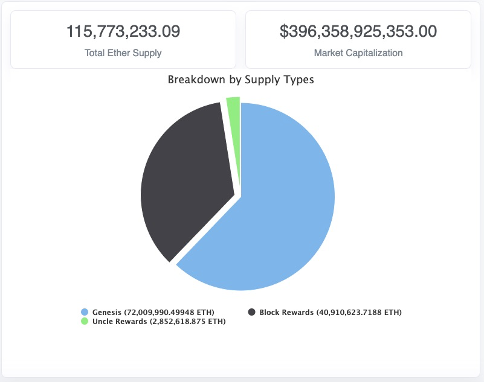

## 账户

不同于比特币的 UXTO 模型，以太坊使用的是账户的概念来保存用户的信息。

### 两种类型

* EOA - 外部账户，由一把私钥与该私钥对应的公开地址来表示
* CA - 智能合约账户，没有私钥，仅有公开的地址，它的行为由合约自身包含的代码逻辑控制

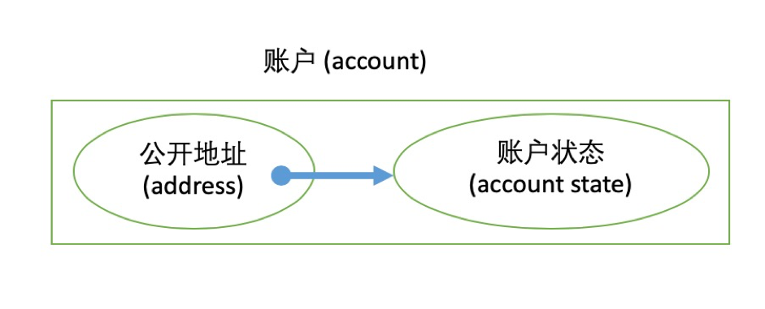

### 四大元素

* nonce - 已执行交易总数，用来标识该账户发出的交易数量
* banance - 持币数量，记录用户 ETH 的余额
* storage hash - 存储区的哈希值，指向智能合约账户的存储数据区，CA 特有
* code hash - 代码区的哈希值，指向智能合约账户的智能合约代码，CA 特有

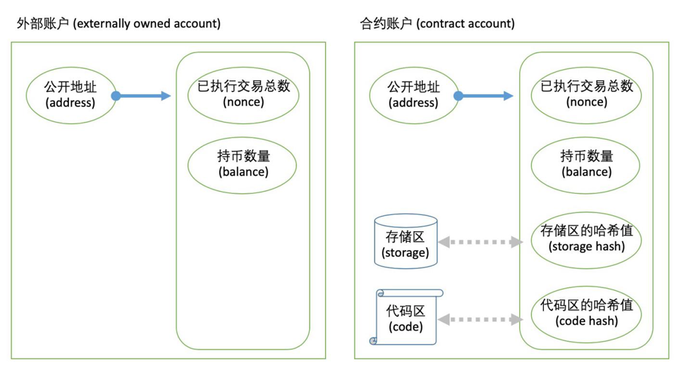

### 世界状态

每个账户的状态的总集合

世界状态是一份不断变化的数据。它在每个以太坊节点中都有一份一模一样的拷贝，该状态记录了所有以太坊账户的信息。

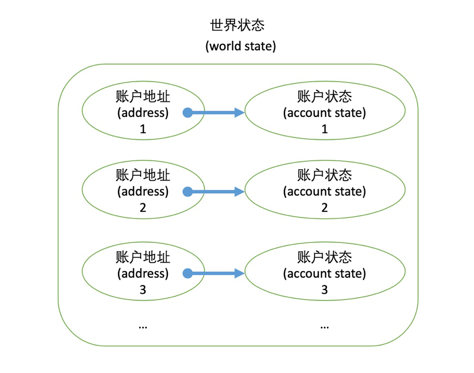

### 状态与区块链

Block 区块是多个合法签名的交易有序集合，区块组成的链条中包含了世界状态的转移。


交易账本

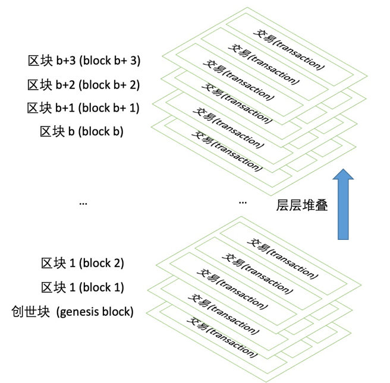

## 数据结构

### MPT

**Merkle Patiriicia Trie**

以太坊团队融合了 Radix Trie 和 Merkle Trie 的结构，并进一步优化该结构的存储性能，形成了实用的 MPT。

MPT 是一个可用存储键值对 key/value 的高效数据结构，key、value 分别可以是任意序列化过的字符串。它具有 Merkle Trie 的密码学安全校验功能，提供树中的数据完整性与存在性的 Merkle 证明。可在 log(N) 级别的时间内完成插入、删除、查询等操作。

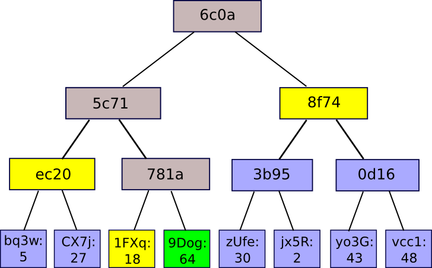


示例数据

```plain
{
  'cab8': 'dog',
  'cabe': 'cat',
  '39': 'chicken',
  '395': 'duck',
  '56f0': 'horse'
}
```
改进后的 MPT

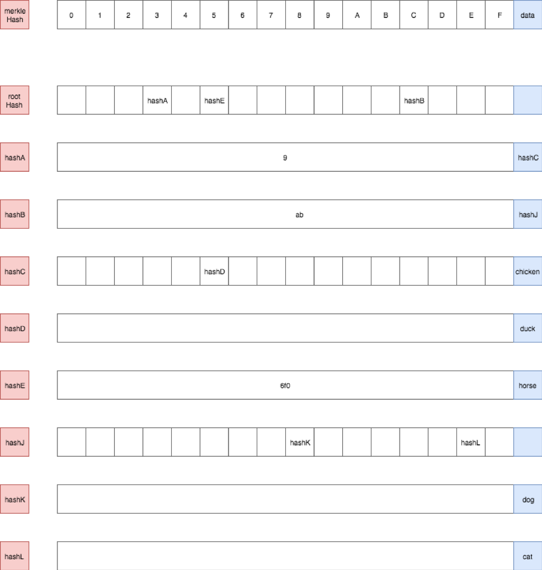

四种节点，均需要 RLP 编码

* 空节点 - 没有包含任何元素，用空字符串表示
* 分支节点 - 包含 17 个元素，前 16 个为路径，最后一个为数据
* 叶子节点 - 包含 2 个元素，一个路径，一个数据
* 扩展节点 - 包含 2 个元素，一个路径，一个索引

节点关系图

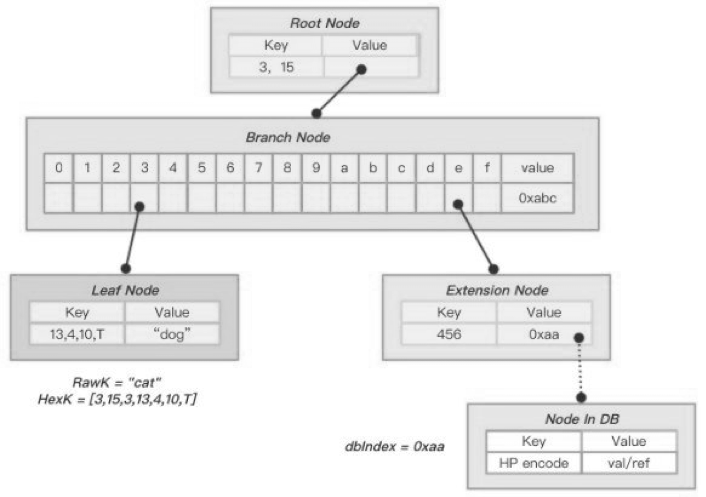

### StateRoot

**状态树**

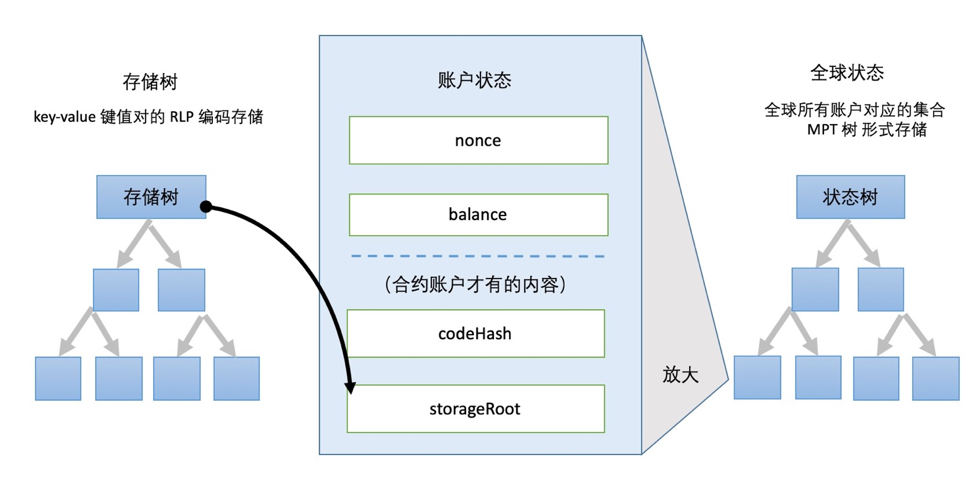

### TransactionsRoot

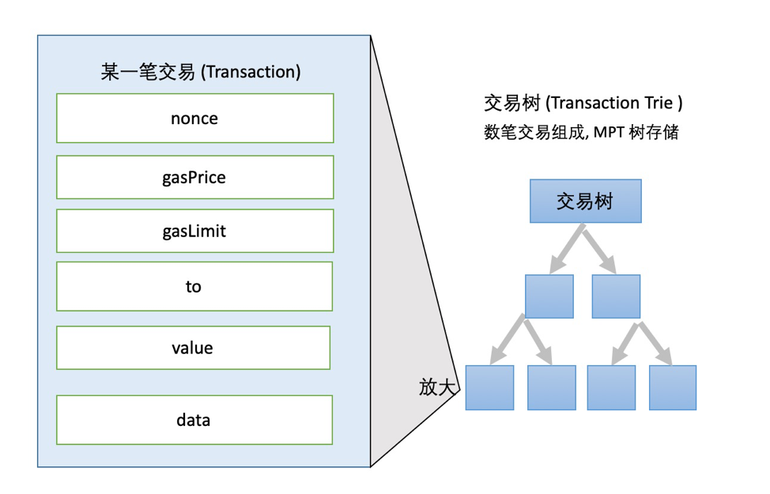

### ReceiptsRoot

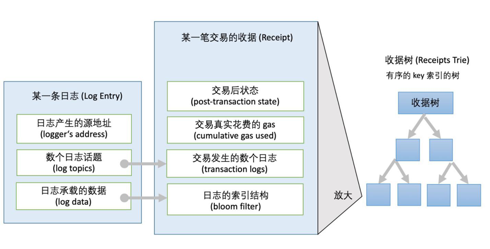

### Block

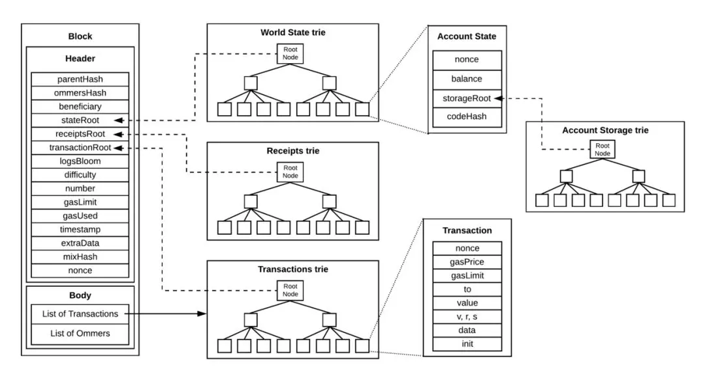

## ETHASH

**Ethash Dagger Hashimoto**以太坊的共识算法

本身是取 Dagger-Hashimoto 两种算法的精华，设计目的

* 抵抗 ASIC - 算法创建专用硬件的优势应尽可能小
* 轻客户端的可验证性 - 区块信息应能被轻客户端快速有效地验证

**Dagger**

这是 Vitalik Buterin 开发的一种算法，它使用 DAG 有向无环图数据结构来存储一个数据集。最初，此数据集占用的存储量略多于 1 GB，但每当 30000 个区块被发掘后会更新一次，目前大约为 3 ~ 4 GB。在此数据集上，将执行一系列内存运算，从而增加工作量。但此算法很容易受到共享内存硬件加速的影响。

**Hashimoto**

是 Thaddeus Dryja 开发的一种算法。旨在增加 ASIC 抵抗力并执行 hash 挖掘。这是通过使其具有较高的内存消耗来实现的，基本上，Ethash 所做的就是获取生成的 DAG，添加有关难度，根君交易信息生成标识正在开采的区块的 hash。

### 原理

* 使用块头创建计算的种子 Seed
* 使用该种子计算和生成 16MB 的伪随机缓存 Cache
* 此缓存用于生成大于 1GB 的数据集 DAG，该数据集是半永久性的，每 3 万个区块更新一次
* 生成数据集后，便开始挖掘。该过程是从数据集中获取随机值 Nonce，并使用网络提供的数据和要验证的交易，将它们组合在一起
* 通过使用缓存重新生成数据集的特定部分的过程来完成验证随机值的正确性

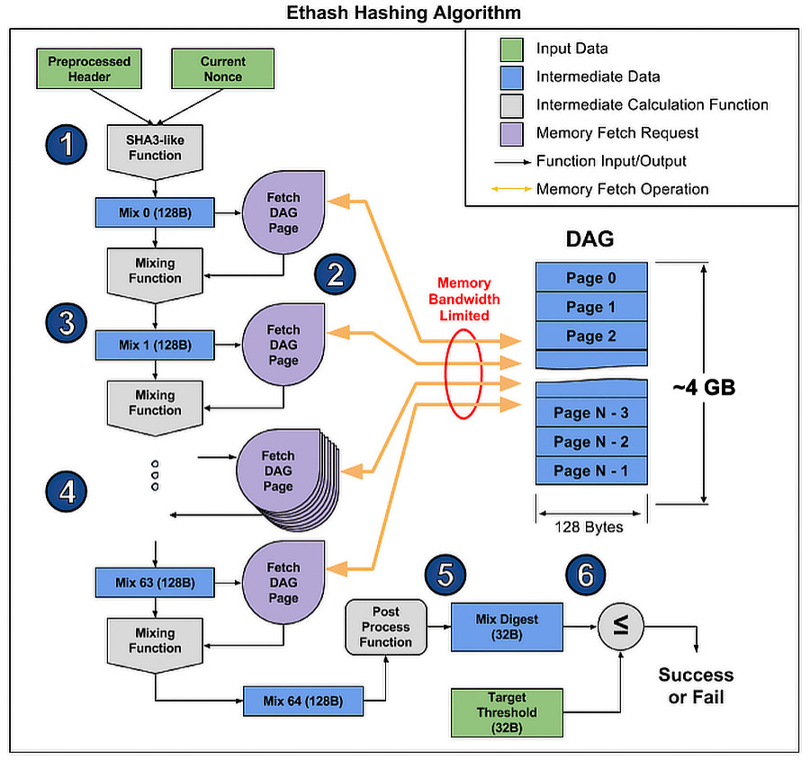


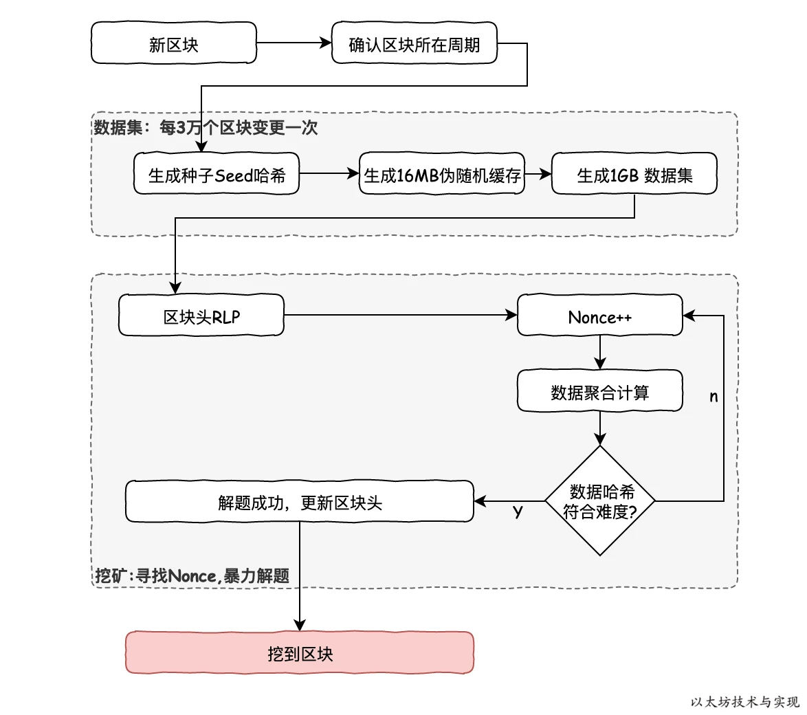

### 特点

* 曾经可安全且实用地抵抗 ASIC 的问题，但 2018 年依然出现了针对 Ethash 的 ASIC 矿机，不可避免地开始算力集中化趋势
* 使用 DAG、缓存、Keccak 等手段获得可接受的出块时间。以太坊可以依靠可调整的生产时间来满足网络需求，从而在安全性和可扩展性之间寻求平衡
* 异业竞争导致的游戏显卡灾难
* DAG 的高内存消耗使其很难在更适中的设备上进行挖掘

## Gas

**燃料费 - 以太坊交易手续费的计算模式**

前述提到，以太坊是一台全球性的计算机。在转移代币、执行智能合约等操作时，计算机需要消耗一定的资源，这样你必须支付一定的费用购买 gas 才能让计算机为你工作，最终 gas 会作为手续费支付给矿工。

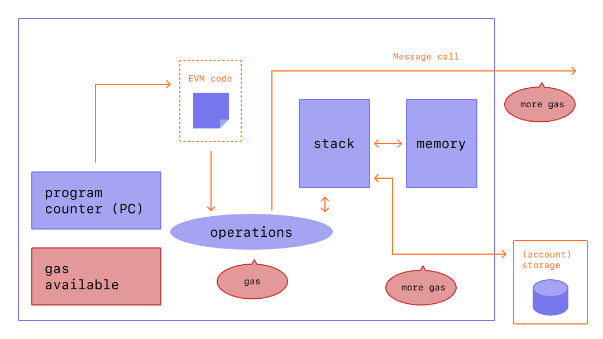

**手续费 = GasPrice * GasUsed**

### Gwei

以太坊中最小的 ETH 单位 1 ETH = 10^18 wei

因为 wei 的表示不是十分方便，社区制定了一些特殊的代称来表示 wei 的不同梯度

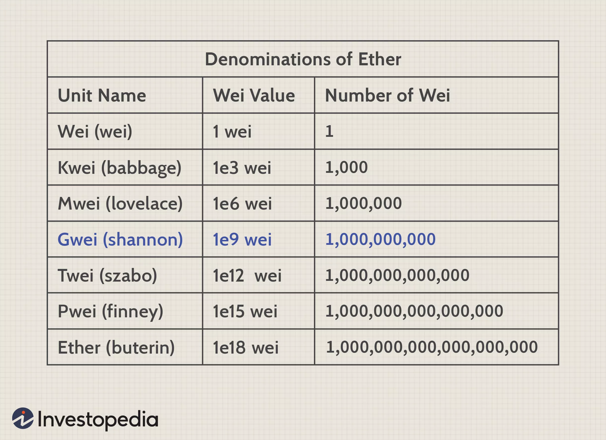

### GasUsed

燃料容量

EVM 中每个操作指令都设置了对应的 GasUsed。比如执行一次加法运算需要消耗 3 Gas，在一次交易中需要消耗多少 Gas 完全取决于交易中所有操作指令的 Gas 总和。

### GasLimit

在执行智能合约时 GasUsed 无法提前预知，如果合约一旦进入死循环等情况，将消耗无限的 Gas。

为了解决上面的情况，以太坊引入了 GasLimit 来规定每次交易最多能消耗的 Gas 数量，一旦超出该交易会抛出 Out of Gas 的错误。

如果最终的 GasUsed < GasLimit，剩余的 Gas 将在交易后退还。

区块中也通过设置 GasLimit 来限制打包交易数量的大小，具体由矿工投票决定。

### GasPrice

是你愿意为这笔交易所支付的 Gas 单价。

由于经济模型，矿工往往倾向于将 GasPrice 更高的交易打包进区块以获得更高的利润。

如何设置合理的 GasPrice？可以通过一些 GasPrice 预测[网站](https://www.gasnow.org/?fileGuid=VdqJyGYV9t3YCtCY)来查看。

## P2P

P2P 网络不同于传统的 C/S 结构，P2P 网络中的每个节点都既是客户端，也是服务端，因此也不适合使用 HTTP 协议进行节点之间的通讯，一般是使用 Socket 进行网络编程，协议使用 TCP 或 UDP。

### 四个发展阶段

#### **集中式**

即存在一个中心节点保存了其他所有节点的索引信息，索引信息一般包括节点 IP 地址、端口、节点资源等。集中式路由的优点就是结构简单、实现容易。但缺点也很明显，由于中心节点需要存储所有节点的路由信息，当节点规模扩展时，就很容易出现性能瓶颈，而且也存在单点故障问题。

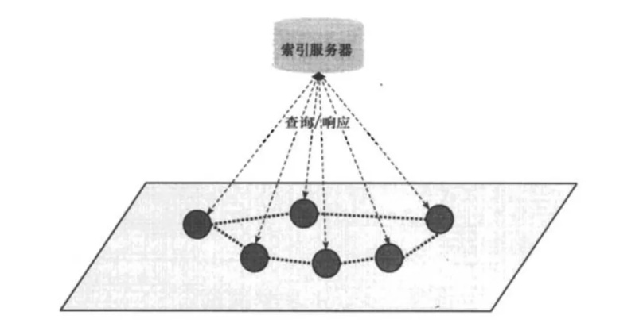

#### **纯分布式**

移除了中心节点，在 P2P 节点之间建立随机网络，就是在一个新加入节点和 P2P 网络中的某个节点间随机建立连接通道，从而形成一个随机拓扑结构。新节点加入该网络的实现方法也有很多种，最简单的就是随机选择一个已经存在的节点并建立邻居关系。新节点与邻居节点建立连接后，还需要进行全网广播，让整个网络知道该节点的存在。全网广播的方式就是，该节点首先向邻居节点广播，邻居节点收到广播消息后，再继续向自己的邻居节点广播，以此类推，从而广播到整个网络。这种广播方法也称为 **泛洪机制**。纯分布式结构不存在集中式结构的单点性能瓶颈问题和单点故障问题，具有较好的可扩展性，但泛洪机制引入了新的问题，一是容易形成泛洪循环，比如节点 A 发出的消息经过节点 B 到 节点 C，节点 C 再广播到节点 A，这就形成了一个循环；另一个棘手问题则是响应消息风暴问题，如果节点 A 想请求的资源被很多节点所拥有，那么在很短时间内，会出现大量节点同时向节点 A 发送响应消息，这就可能会让节点 A 瞬间瘫痪。

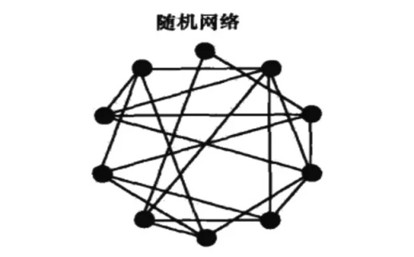

#### **混合式**

混合式其实就是 **混合了集中式和分布式结构**，网络中存在多个超级节点组成分布式网络，而每个超级节点则有多个普通节点与它组成局部的集中式网络。一个新的普通节点加入，则先选择一个超级节点进行通信，该超级节点再推送其他超级节点列表给新加入节点，加入节点再根据列表中的超级节点状态决定选择哪个具体的超级节点作为父节点。这种结构的泛洪广播就只是发生在超级节点之间，就可以避免大规模泛洪存在的问题。

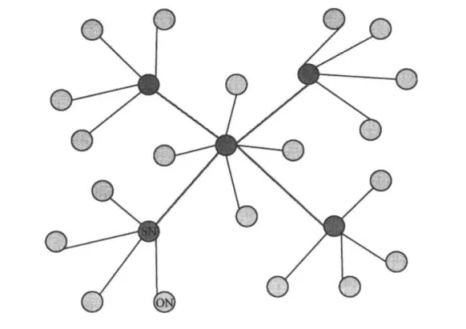

#### **结构化**

它也是一种分布式网络结构，但与纯分布式结构不同。纯分布式网络就是一个随机网络，而结构化网络则将所有节点按照某种结构进行有序组织，比如形成一个环状网络或树状网络。而结构化网络的具体实现上，普遍都是基于 DHT(Distributed Hash Table，分布式哈希表) 算法思想。

### 以太坊 P2P

两部分构成：节点之间互相连接用于传输数据的 TCP 网络和节点之间互相广播用于节点发现的 UDP 网络。

#### UDP

以太坊里的每个节点会维护一张路由表 table，table 是通过称为 K 桶的数据构造而成，K 桶相当于是内存数据，记录了节点 NodeId、distance、ip:port 等信息。以太坊 K 桶按照与目标节点距离进行排序，共 256 个 K 桶，每个 K 桶包含 16 个节点。节点启动时，首先会生成一个随机 ID，然后通过 Kademlia 算法从 K 桶里已知的节点寻找离随机 ID 最近的 16 个节点信息(ip:port 等)。对于初次启动的节点，由于 K 桶里面没有存有任何节点的信息，所以需要将硬编码的种子节点加入 K 桶，并且向种子节点通过 Kademlia 算法寻找离随机 ID 最近的 16 个节点。寻找成功后，会将成功获取的节点保存到 DB 和 K 桶里，而且这些节点一定是可以 ping 通的(节点通过发送一个 UDP ping 包探测是否可以正常连接到目的端)，这样节点下次重启后，会首先将 DB 里存有的历史节点添加到 K 桶里，最多添加 30 个历史节点信息存到 K 桶里，并且将种子节点也添加到 K 桶里，并且向 K 桶里的这些节点发送相关信息，目的是为了更新本节点的 K 桶数据，同时也让对端节点记录本端的节点信息。以太坊每个节点的 K 桶会每隔一个小时定时更新，对于 udp 通信失败次数过多的节点会及时从 K 桶和 DB(database)删掉。

[Kademlia 算法](https://xie.infoq.cn/article/f87fc217512b2b40f462e4f6e?fileGuid=VdqJyGYV9t3YCtCY)

#### TCP

以太坊里的每个节点启动时会尝试通过 UPNP 或者 NAT-PMP 方法将本端内网地址和端口映射到外网地址和端口，并且通过 TCP 方式监听映射的外网地址和端口。以太坊里的每个节点会作为 TCP 客户端最多主动连接到 13 个节点，13 个节点里有的是通过读取配置文件获取的静态节点(如种子节点)，有的是通过 K 桶里随机选取的节点，以太坊保证本端节点和每个终端节点最多建立一个连接，如节点 A 作为客户端连到 B 后，B 作为客户端时不会再建立一个到 A 的连接。TCP 连接建立好后，本端节点会和对端节点协商获取一个公共对称密钥。密钥获取成功后会给对端发送一个握手请求，请求交换本端和对端的信息，信息主要包括本端 id、协议版本等内容，通过匹配协议版本和收到的 id 信息来确认是否需要继续和对端保持 TCP 连接。以上操作完成后，后面本端发送数据给对端时都要通过之前获取的对称密钥加密，对端发送给本端的数据也需要用对称密钥解密数据。

## Solidity

**是一种为实现智能合约而创建的高级编程语言**

深受 C++、Python 和 Javascript 影响的静态类型语言，支持继承、库和复杂的用户定义类型等特性，设计目标是能在以太坊虚拟机 EVM 上运行。

详见[官方文档](https://docs.soliditylang.org/en/v0.8.4/?fileGuid=VdqJyGYV9t3YCtCY)

## 工具

* [Etherscan](https://etherscan.io/?fileGuid=VdqJyGYV9t3YCtCY)
* [以太坊开发者文档](https://ethereum.org/en/developers/?fileGuid=VdqJyGYV9t3YCtCY)
* [geth](https://github.com/ethereum/go-ethereum?fileGuid=VdqJyGYV9t3YCtCY)
* [ethers.js](https://github.com/ethers-io/ethers.js/?fileGuid=VdqJyGYV9t3YCtCY)
* [web3.js](https://github.com/ChainSafe/web3.js?fileGuid=VdqJyGYV9t3YCtCY)
* [Truffle](https://github.com/trufflesuite/truffle?fileGuid=VdqJyGYV9t3YCtCY)
* [OpenZeppelin](https://github.com/OpenZeppelin/openzeppelin-contracts?fileGuid=VdqJyGYV9t3YCtCY)

---


## 参考引用

* [以太坊指南针](https://ethbook.abyteahead.com/howto.html?fileGuid=VdqJyGYV9t3YCtCY)
* [ETHFANS](https://ethfans.org/?fileGuid=VdqJyGYV9t3YCtCY)
* [以太坊工作原理](https://ethfans.org/posts/how-does-ethereum-work-anyway?fileGuid=VdqJyGYV9t3YCtCY)
* [谈谈以太坊的 Merkle 树](https://www.8btc.com/article/73758?fileGuid=VdqJyGYV9t3YCtCY)
* [《迅雷精品课》第九课：区块链 P2P 网络](https://xie.infoq.cn/article/37697816afbd37a427295c686?fileGuid=VdqJyGYV9t3YCtCY)
* [以太坊技术与实现](https://learnblockchain.cn/books/geth/part0.html?fileGuid=VdqJyGYV9t3YCtCY)
* [图解以太坊](https://www.infoq.cn/article/how-does-ethereum-work-anyway?fileGuid=VdqJyGYV9t3YCtCY)
