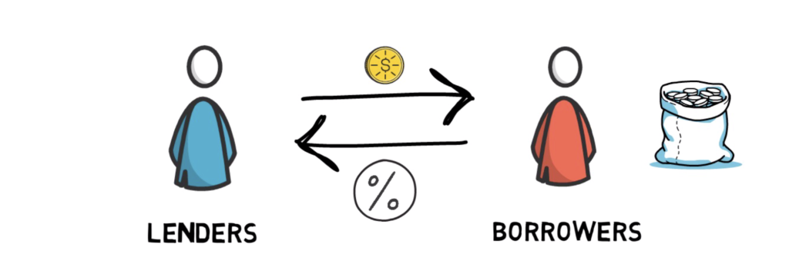
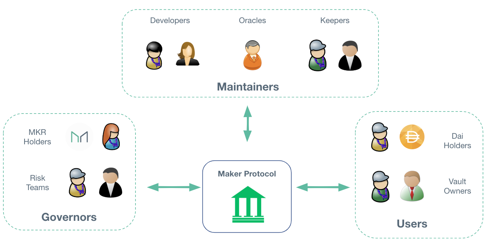

# DeFi on Ethereum
## 概念

Decentralized Finance 去中心化金融

旨在构建一个能消除交易过程与「信任」有关的摩擦成本，无需像银行这样的信用中介，对所有人都开放的金融系统。

为了实现这一目标，DeFi 很大程度上依赖于加密技术、区块链和智能合约。

## 借贷

在任何金融系统里，借贷无疑是最重要的环节之一。

毫不夸张的说，大多数人的人生里，总会有某些节点涉及到借贷，因为你对生活质量的期待超过当下所拥有的能力，而对未来你的能力也有充分的认识。

>周转，可以简单理解为地球自转和公转。别人问你借的时候，是自转。你要别人还的时候，就是公转。-- 黄子华

### DeFi 中的借贷

借方：存放数字资产，来赚取一定 APY 的利息

贷方：抵押数字资产，得到一定额度的贷款，在一定时间内归还利息，完成他们的的周转

由于双方完成借贷过程都是通过数字资产，在现实世界里面需要第三方证明的借贷协议就可以使用区块链上的智能合约去完成，依赖不可篡改性，无需贷方提供现实中详细的个人信息和信用证明。

与现实身份的脱钩，导致在 DeFi 中主流的借贷协议只能贷出 **不高于** 抵押物价值的资产。因为当借贷协议出现风险是，智能合约可以自动清算抵押物，来保证借方的根本利益。

那为何还会有人去申请贷款？

* 当铺，短期的资金问题导致我需要尽当所持有的数字资产，但总有一天我想把它们赎回来。
* 抵御数字资产在二级市场的波动性

但往超额抵押的方向去发展，达到传统金融的效率，这一点是毋庸置疑的。

借贷平台 [MakerDao](https://makerdao.com/en/?fileGuid=gCDcdyjh68XQJcR9)、[Compound](https://app.compound.finance?fileGuid=gCDcdyjh68XQJcR9)、[Aave](https://app-v1.aave.com?fileGuid=gCDcdyjh68XQJcR9)

## 组件

### 算法稳定币

币价波动，瞬息万变，为了方便数字资产之间的结算与兑换。

产生了一系列与美元挂钩的稳定数字货币，如 **USDT**、**USDC** 通过储存等值的美元到相关中心化机构，定期第三方审计（真实性有所保留），然后发行对应量的数字代币，达到与美元 1:1 的目的。

而通过巧妙地使用智能合约，结合某些激励措施，也可以生成与美元挂钩的稳定币。

**DAI** 便是上面提到的 MakerDao 通过智能合约生成的一种算法稳定币

### 预言机

连接区块链和现实世界的一座桥梁。

借贷平台或者说智能合约如何确定你所抵押的数字资产所对应的价值？

这时候就需要引入报价系统，捕获市面上该资产大致的价格信息，将其注入到合约内部。

当然，为了减低风险，往往需要接入多个数据提供商，且时效性也要经过充分的考量。

数据提供商 [Chainlink](https://zh.chain.link/?fileGuid=gCDcdyjh68XQJcR9)、[witnet](https://witnet.io/?fileGuid=gCDcdyjh68XQJcR9)、[provable](https://provable.xyz/?fileGuid=gCDcdyjh68XQJcR9)

### 去中心化交易所

2020 DeFi 的爆发离不开 DEX 的发展。

去中心化的数字资产只能在中心化的第三方交易所里面交易，本来就是一个挺搞笑的事情。高昂的手续费、卷款跑路、竞价上币等镰刀时刻悬在用户绿油油的头上。

以 AMM、手续费大家分的名头，Uniswap V2 快速崛起。逐利的天性催生流动性挖矿、收益聚合器等手段，都在迫使 Ethereum 平台的扩容不得不提速。

DEX 本身也有不少缺点，高度依赖流动性、无常损失、资金利用率低，操作门槛高等，不得不说，与传统的交易所还是有很大差距。

其它 DEX [SushiSwap](https://app.sushi.com?fileGuid=gCDcdyjh68XQJcR9)、[Curve](https://curve.fi?fileGuid=gCDcdyjh68XQJcR9)、[Balancer](https://balancer.exchange?fileGuid=gCDcdyjh68XQJcR9)

### 衍生品

与传统金融类似，衍生工具是从标的资产的表现中获取其价值的合同。

其中较为典型的应用：

[dYdX](https://trade.dydx.exchange?fileGuid=gCDcdyjh68XQJcR9) - 保证金交易、期权交易

[Synthetix](https://synthetix.io?fileGuid=gCDcdyjh68XQJcR9) - 为不同资产提供链上风险敞口

## 风险

* 合规化、系统性风险，导致整个生态的崩塌，现阶段来看不是没有可能性。
* 代码即法律。但人写的代码就会有 Bug，一旦涉及到金钱，一个小小的漏洞都会被无限放大
* Ethereum 的并不高效的结算能力和状态爆炸问题

## 未来

区块链的世界日新月异，几乎每天都有新的概念涌现，上述的名词回头看很可能已经过时，很多有趣的玩法在没有利益的支撑下都是昙花一现。大部分时间里大家其实都在零和博弈，什么时候才能达到真正的多赢普惠，我想还有很长的路要走。

---

## 相关资料

* [Guide To Decentralized Finance](https://finematics.com/guide-to-decentralized-finance/?fileGuid=gCDcdyjh68XQJcR9)
* [FORKIT](https://forkit.fm/5?fileGuid=gCDcdyjh68XQJcR9)
* [Maker Protocol 101](https://docs.makerdao.com/maker-protocol-101?fileGuid=gCDcdyjh68XQJcR9)
* [Ethereum doc Oracles](https://ethereum.org/en/developers/docs/oracles/?fileGuid=gCDcdyjh68XQJcR9)
* [ChainNews DeFi Section](https://www.chainnews.com/tag_9336.htm?fileGuid=gCDcdyjh68XQJcR9)
* [Theblockbeats DeFi](https://www.theblockbeats.com/tspecial/10?fileGuid=gCDcdyjh68XQJcR9)
