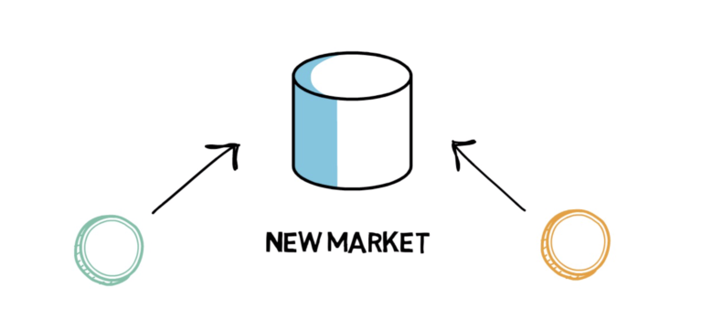
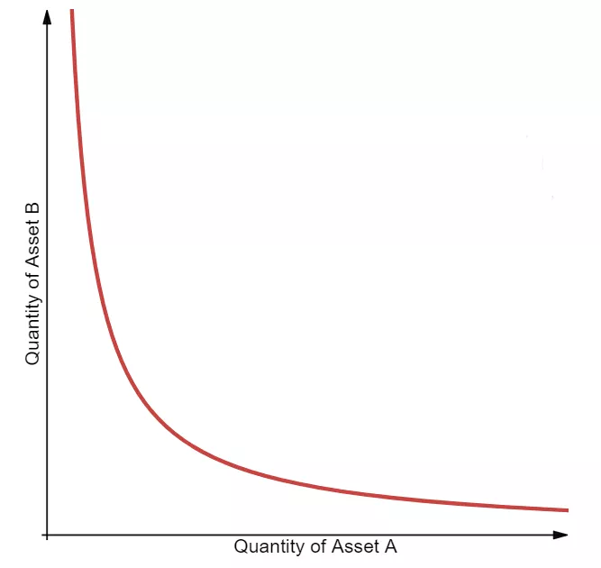
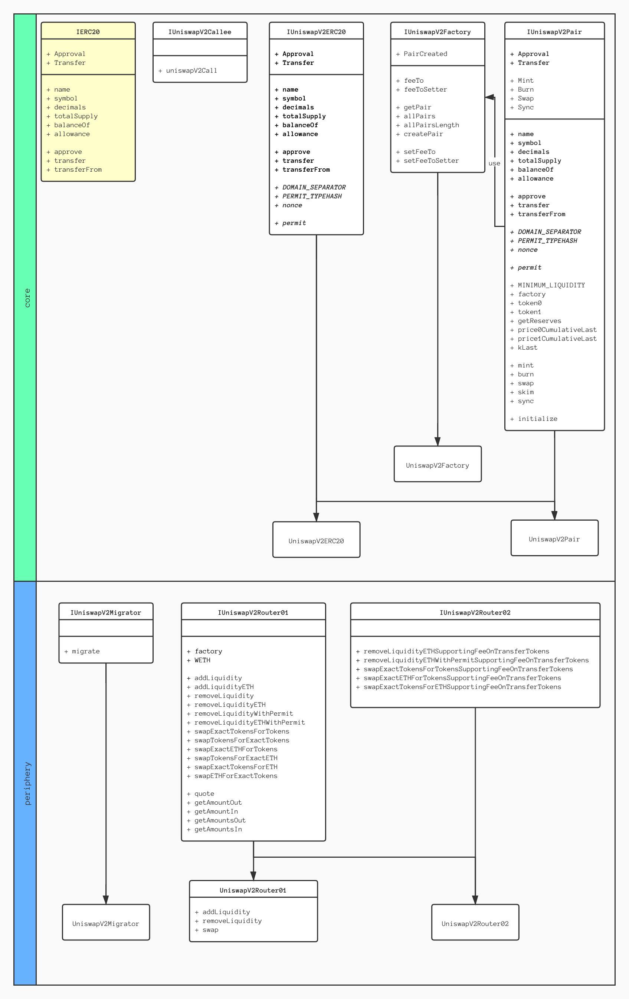
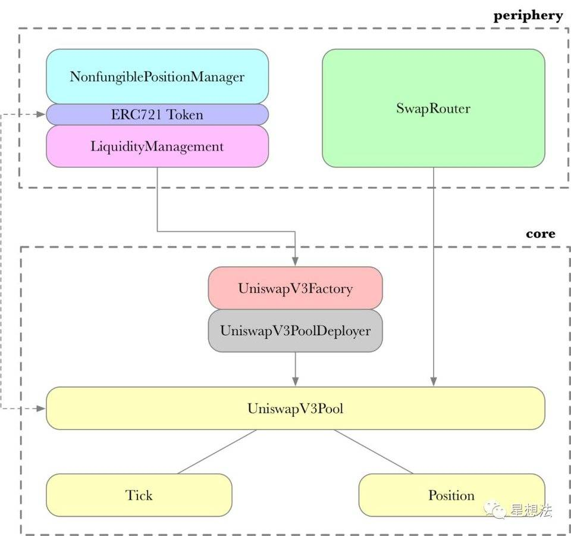
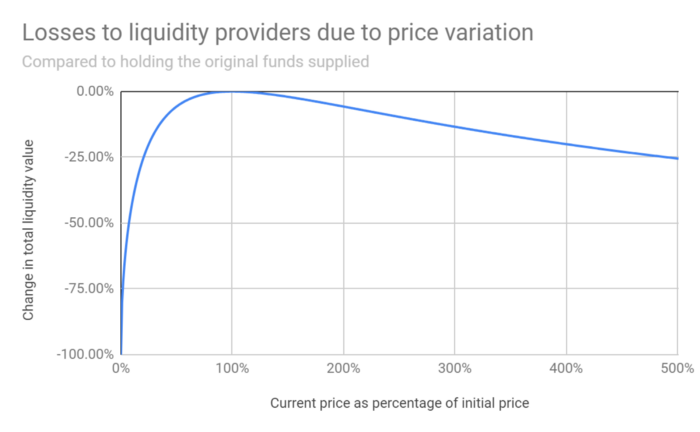
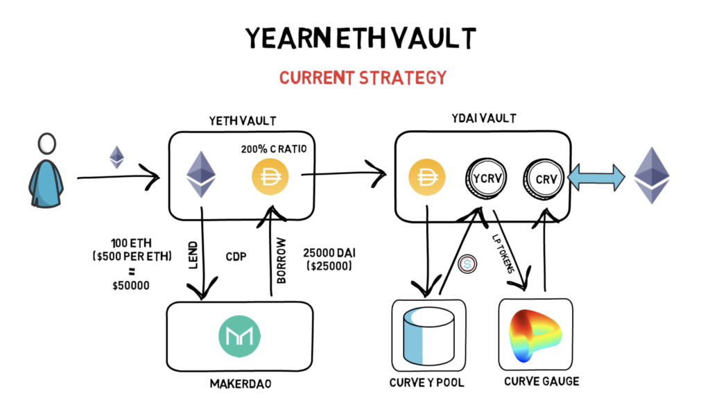

# 流动性挖矿
## 概念

### Mining

**挖矿**

>**在没有中央权威存在的条件下，既鼓励矿工支持比特币网络，又让比特币的货币流通体系有了最初的货币注入源头。--- 《比特币白皮书》**

把通过消耗 CPU 的计算能力和时间来产生比特币，比喻成金矿消耗资源将黄金注入经济。

工作量证明，简单来说，就是 **多劳多得**

如何定义 **劳**，如何获取 **得**，催生了以下各种各样的挖矿概念。

### Trade Mining

**交易即挖矿**

交易手续费传统加密货币交易所的重要收入手段之一。

2018年5月横空出世的交易所 **FCoin** 通过提出 交易即挖矿 的模式，将手续费绑定为平台发行的平台币 **FT** 奖励，即交易得越多可以获得越多的奖励，试图激励用户产生更多的交易。

再加上邀请返佣等措施，使得 FCoin 风靡一时。

但无限制的 **FT**，各种为了获取奖励而刷单的机器人，颇像击鼓传花的模式等，导致 **FCoin** 迅速陨落。

### Liquidity Mining

**流动性挖矿**

在我看来，也是一种通过巧妙的手段试图将交易手续费转化为加密货币参与者的收益的模式。然而它也是昙花一现，或能成为巨人杀手？Time will give all the answers。

## Liquidity Pool

**流动性池**

本质上，就是锁定在智能合约里面的一堆加密货币。

通过提供流动性来促进交易，在去中心化交易所里面被广泛使用。

### AMM

**automated market making 自动做市商**

首先需要理解一下，传统交易所撮合交易的基本模式 **OrderBook 订单簿。**

交易中的两方

* Buyers 出价方 - 期望最低的价格获得他们所需要的资产
* Sellers 售卖方 - 期望最高的价格出售他们所拥有的资产

当双方的价格达成一致，则交易达成。但现实交易中，往往会出现价格不一致的状况，此时就需要引入 **做市商** 这个角色。

做市商通过判断一定时间内，某资产的涨跌情况，匹配买卖双方的期望，促成交易。赚取的是交易当中的差价，付出的是一定交易手续费。当差价能大于手续费时，做市商就会有意愿一直提供这样的流动性。

在 Ethereum 上，每次转移资产都需要需要消耗一定的 gas 费，作为矿工的激励，另外低效的交易能力和较高的时延，均会使做市商不愿在去中心化交易所当中提供足够的流动性。

**AMM** 则是通过广大加密货币持有者质押手中的资产，组成各种各样的交易对，最终集合起来成为流动性池。然后通过一定的算法，按比例分发交易中所抽取的手续费作为激励。

### LP

**Liquidity Provider 流动性提供者**

创建一个交易对，需要将交易所需的两种加密货币注入到智能合约，合约会自动生成一种 **LP Token** 来作为该交易对的流动性凭证。后面 **LP** 可以使用 **LP Token** 来换回当初的两种加密货币，且加上该交易对中每笔交易的手续费。

## Uniswap

构建在 Ethereum 上的智能合约，真正将 **AMM**，准确的来说应该是 **CFMM**（constant function market maker 恒定函数做市商）融入到加密货币市场的去中心化交易所。

### 恒定乘积函数 x-y-k 模型

其中，**R(α)** 和 **R(β)** 分别代表两种资产的池内储备数量，**γ** 代表的是交易费率。无论资产 α 或 β 的交易数量是多少，当费用为零时，**R(α)\*R(β) 的乘积恒等于常数 k**。这一等式常被简化为 **x*y=k**，其中 **x** 和 **y** 分别代表两种资产的储备额。实际上，由于 Uniswap 会收取 0.3% 的交易费添加到资金池内，每笔交易都会 **增加 k**。

### V1

有趣的是，之前担任机械工程师的 Hayden Adams 在没有任何编程知识的情况下创办了 Uniswap。

### V2

源码比较清晰，理解重点**增加/抽取流动性以及 swap 操作**

* [core](https://github.com/Uniswap/uniswap-v2-core.git?fileGuid=dDGWywJCg3DKhcqc) - 核心逻辑，创建交易对，单个 swap 的逻辑
* [perphery](https://github.com/Uniswap/uniswap-v2-periphery.git?fileGuid=dDGWywJCg3DKhcqc) - 外围服务，组装一个或多个 swap 形成的交易链条

### V3

核心思想是流动性集中。

通过 **虚拟资金池** 和 **流动性区间** 等手段，来提高 V2 版较低的资金使用率。

鉴于 V3 还没有真正部署到主网，具体的效果还需要进一步验证，更多可先参阅[白皮书](https://uniswap.org/whitepaper-v3.pdf?fileGuid=dDGWywJCg3DKhcqc)。

总体框架

## Impermanent Loss

**无常损失**

字面意思，不一定会产生的损失。简单理解为，**AMM** 中 **LP** 在提供流动性时发生的资金暂时损失。

**AMM** 中的资产价值只会依赖于交易对代币储量，与外部交易市场无关。当 **LP** 质押的交易对中某种代币的价格大幅波动时，则流动性池必须持续依赖套利者去确保池中的价格能反应真实价格，以维持两个代币的相同价值。这导致了一种情况，即价值升值的代币的利润被套利者从 **LP** 那里夺走了。[具体例子](https://finematics.com/impermanent-loss-explained/?fileGuid=dDGWywJCg3DKhcqc)

不同价格比率下，无常损失的走势

## Farming Strategies

**耕作策略**

流动性挖矿，交易量决定了收益。越频繁的交易意味着越多的手续费。

虽然说，提供流动性的 LP 已经可以获得远远高于传统储蓄账户的 APY，但大家的目标总是从各种各样的交易对中寻找出最高 APY 的一个。

### [Yearn Vaults](https://yearn.finance/vaults?fileGuid=dDGWywJCg3DKhcqc)

只需提供一种代币，Valuts 会自动地帮助你完成一系列的智能合约操作将代币分布在不同的流动性池里，争取获得最大的 APY。

### [Matcha](https://matcha.xyz/?fileGuid=dDGWywJCg3DKhcqc)

面对用户的 DEX 聚合器，由 0x 协议构建，使用 0x API 和智能订单路由来聚合流动性并提供最佳交易执行。

## Risk

* DEX 卷款跑路，毕竟 LP 的资产需要注入到 DEX 的智能合约地址，而相关权限通常由 DEX 管控
* 智能合约漏洞
* 无需审核的交易对，使得各种垃圾币交易混入
* 杠杆问题
* 流动性窃取 - [SushiSwap 吸血鬼攻击](https://finematics.com/vampire-attack-sushiswap-explained/?fileGuid=dDGWywJCg3DKhcqc)

人间一日，币圈一年。上述概念可能早已过时，请谨慎对待。

---

## 相关资料

* [Guide To Decentralized Finance](https://finematics.com/guide-to-decentralized-finance/?fileGuid=dDGWywJCg3DKhcqc)
* [ChainNews 流动性挖矿板块](https://www.chainnews.com/tag_19485.htm?fileGuid=dDGWywJCg3DKhcqc)
* [全景式解读去中心化交易所发展现状：AMM、订单簿与聚合器](https://www.chainnews.com/articles/361716698289.htm?fileGuid=dDGWywJCg3DKhcqc)
* [FCoin 的兴衰：一个通证设计失败的案例](https://www.chainnews.com/articles/629882658032.htm?fileGuid=dDGWywJCg3DKhcqc)
* [uniswap - V3 源代码导读 by 星想法](https://www.chainnews.com/articles/874467291934.htm?fileGuid=dDGWywJCg3DKhcqc)
* [Formal Specification of Constant Product Market Maker Model and Implementation](https://github.com/runtimeverification/verified-smart-contracts/blob/uniswap/uniswap/x-y-k.pdf?fileGuid=dDGWywJCg3DKhcqc)
* [理解自动做市商，Part-1：价格影响](https://ethfans.org/posts/amm-price-impact-by-paradigm-research?fileGuid=dDGWywJCg3DKhcqc)
