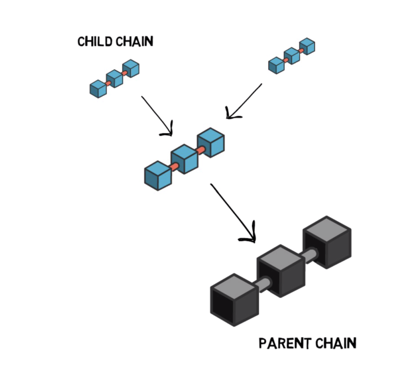

# Ethereum Layer 2 Scaling
## Challenges

自网络启动以来，以太坊扩容一直是讨论得最多的话题之一。

### 不可能三角

这三个角分别是**规模性、去中心化、安全性**。

与分布式理论中经过严谨的数学推导的 **CAP** 不一样，这个三角并没有被证明不可能。但目前这几乎是所有公链所面临的问题，只能满足其中两个点。

### 网络拥堵

伴随着以太坊生态的繁荣，在这个全球计算机上搭建的应用越来越多，交易量也迅速提高。但为了满足去中心化和安全性，以太坊低效的交易处理能力问题日益突出。DeFi 的出现和交易竞价机制，更是让大量的普通转账都需要等待被处理，网络拥堵成为了常态，也使得其他拥有更高效交易处理能力的公链在需求溢出的情况下得到发展机会。

### 状态爆炸

无论是历史还是状态数据都会占用存储资源。虽然以太坊通过挖矿难度的调整对历史和状态的增长进行了管理，但是对历史和状态的总大小却没有任何控制，这些数据会持续地无休止地累积下去。

**状态数据增长图**

### 解决方向

一般而言，以太坊的扩容方式，主要有两种

**Layer 1**

第一层是标准基础共识层，目前几乎所有交易都在此结算。

以太坊目前可以在 Layer 1 上每秒处理约 15 笔交易，整个量级在现代的交易系统面前简直不值一提。

ETH 2.0 将会引入 POS 共识和分片机制，这将大大提高基础层的交易吞吐量，但这是涉及底层共识的一个根本性转变，大量的开发工作和可行性研究致使 Layer 1 的扩容并不会得到快速实现。

**Layer 2**

第二层不需要对第一层进行任何更改，它可以使用其现有的元素构建在第一层之上。第二层还通过将其状态锚定到第一层来利用第一层的安全性，且在未来 2.0 两层结合的情况下，交易吞吐量的提升将会再上一个高度。

## Channels

**通道技术**

支付通道是最早被广泛讨论的扩展解决方案之一。

核心原理就是在交易双方之间开启一个特殊的通道，在这个通道里面可以发送多笔交易，将最终的交易结果同步回链上，而且通道与通道之间还可以连接起来，最终形成一个可供多方交易的网络。

尽管通道有可能每秒轻松处理数千笔交易，但它也有一些缺点。参与者必须事先知道，用户必须在多重签名合同中锁定他们的资金。最重要的是，这种扩展方案只能应用于特定的程序，不能用于扩展通用智能合约。

相关的项目[Raiden 雷电网络](https://github.com/raiden-network/raiden?fileGuid=tQ9tYhQHvxDQyTK6)，对应比特币的[Lighting Network 闪电网络](https://lightning.network/#intro?fileGuid=tQ9tYhQHvxDQyTK6)。

## Plasma

Plasma是第2层缩放解决方案，最初由 Joseph Poon 和 Vitalik Buterin 提出。它是在以太坊上构建可扩展应用程序的框架。

利用智能合约和默克尔树来创建无限数量的 **子链**（以太坊区块链的副本）。

**子链**是无信任和非托管的链，用户可以控制其资金。这意味着，如果发生错误或被黑客攻击，用户可以引用 Plasma 链的最新正确快照以恢复状态并找回其代币。这里有一个挑战期，用户从 Plasma 链中提取资金后将在以太坊主链上支付一笔交易费。

优势在于，Plasma 可以以较低的每笔交易成本维持高达 1,000 TPS，而每个 Plasma 区块的 gas 成本是固定的。与状态通道不同，Plasma 还可以处理灵活数量的用户，从一开始就不需要设置数量。资金的安全性和可找回性也很高。

缺点是 Plasma 没有支持智能合约执行的灵活性，因为它仅支持转移或 swap 等基本功能。此外，尽管用户可以提取资金，但他们还需要定期检查 Plasma 链以发现任何错误，以防止被黑客利用。与状态通道类似，需要「监视塔」来维护网络快照。由于这些原因，Plasma 已不再是首选解决方案。

相关的项目包括[Polygon](https://polygon.technology/?fileGuid=tQ9tYhQHvxDQyTK6)（以前称为 Matic），[OMG Network](https://omg.network/?fileGuid=tQ9tYhQHvxDQyTK6)。

## Sidechains

**侧链**

侧链是与以太坊兼容的独立区块链，具有自己的共识模型和区块参数。它使用另一个代币与以太坊挂钩连接，从而创建了双向桥。

优势在于，侧链是具有自己的代币的区块链，能够支持智能合约（不在主链上），因此针对灵活性进行了优化，并具有多种用例。相对而言，这项技术是作为扩展解决方案而建立的，根据侧链的设计，它可以提供大约 10,000 TPS 的速度。

缺点是它不是一个无信任的环境，因为用户需要将资金托管转移到侧链。安全性也是另一个需要关注的问题，因为与以太坊相比，侧链不那么成熟，去中心化也更差，以太坊在过去几年中从去中心化中受益匪浅。此外，双向挂钩意味着侧链代币还需要保持价值并在经济上可行，这通常是通过在该侧链上收取费用并具有有效的代币经济学来实现的。

相关的项目包括[xDAI](https://www.xdaichain.com/?fileGuid=tQ9tYhQHvxDQyTK6)、[POA](https://www.poa.network/?fileGuid=tQ9tYhQHvxDQyTK6)。

## Rollup

Rollups 通过将侧链交易捆绑或“汇总”到单个交易中并生成加密证明，也称为 SNARK（简洁的非交互式知识论证）来提供扩展。只有这个证明被提交给基础层。

与状态通道不同，Rollup 中的资金是由智能合约持有的，运行方在该合约中将资金投入 Layer 1 智能合约中。所有交易都在 Layer 2 上发生，并且如果用户认为 Layer 2 操作是恶意的，则可以在 Layer 1 上执行。不良行为者将被削减质押物，举报的人将得到一部分被削减的质押物作为报酬。

Rollups 的可扩展性也可以被以太坊 2.0 放大。事实上，因为 rollup 只需要扩展数据层，它们可以在以太坊 2.0 阶段 1 中获得巨大的提升，这是关于数据的分片。

### Optimistic Rollup

Optimistic Rollup 使用了与以太坊主链平行运行的侧链。在完成一批交易之后，Rollup 会向主网提出一个新状态。打个比方，他们撮合并公证了交易。他们每秒可以处理约 300 个智能合约调用或每秒约 2,000 个基础转账。由于它与以太坊虚拟机 EVM 兼容，因此在以太坊上做的任何事情也可以在 Optimistic Rollup 上做。这是一种用于扩展通用智能合约的解决方案，并且是一种以合理的安全程度迁移去中心化应用程序 DApp 的简便方法。

但其妥协之处在于，资金可能会受到潜在攻击媒介的威胁。如果发布了不正确的状态转换，则用户将能够撤消不正确的区块并大幅削减不良行为者的质押资金。提款速度也很慢，可能要花几天时间，以允许提出质疑或纠纷期。

相关的项目包括[Optimism](https://github.com/ethereum-optimism/optimism?fileGuid=tQ9tYhQHvxDQyTK6)、[Arbitrum](https://github.com/OffchainLabs/arbitrum?fileGuid=tQ9tYhQHvxDQyTK6)

### ZK Rollup

虽然 Optimism 假定交易默认情况下是有效的，并且仅在遇到挑战时才运行计算，但 ZK Rollups 会在链外运行所有计算，并提交要存储在以太坊上的有效性证明。零知识（Zero Knowledge，ZK）是指发行人必须提供的加密证明，才能将一系列交易记录在以太坊区块链上。

该证明有时被称为 SNARK （简洁的非交互式知识论证）。运营方需要为每个状态转换生成证明，以太坊上的 Rollup 合约对此进行了验证。该 SNARK 证明存在一系列从一个状态到另一个状态的顺序交易。这类似于向以太坊区块链展示计算结果，而不向他们展示所有交易数据或结果的得出方式。因此，验证区块更快，更便宜，因为涉及的数据更少。

ZK Snarks （可与 ZK Proofs 互换使用）经常被诸如 Z Cash 之类的隐私币使用。但是 ZK Rollups 使用零知识技术来提高效率，而不是私密性，方法是将成千上万笔交易放在链下进行，然后将它们作为单个 Rollup 交易提交到以太坊上。据报道，ZK Rollup 将能够在 ETH1 上处理约 3,000 TPS，在 ETH2 上处理 20,000 TPS，而费用仅为 Layer 1 成本的 1％。相比之下，信用卡通常处理 5,000 TPS，尽管据说它们可以处理更高的吞吐量（65,000 TPS）。

优点是，在 Layer 1 和 Layer 2 之间转移资金没有延迟，因为合约接受的有效性证明已经验证了资金。因此，如果用户决定将其资金从 Layer 2 退出到 Layer 1，则结算比 Optimistic Rollups 更快。但是，由于需要生成 ZK 证明，因此 Layer 2 到 Layer 2 的交易大约需要 10 到 30 分钟。另一个缺点是，智能合约支持仍在开发中，因此 ZK Rollup 只能实现简单的交易转移。目前也无法将 EVM 封装在零知识证明中，因此 DApps 尚不能迁移到 ZK Rollup。

相关的项目包括[ZkSync](https://zksync.io/dev/?fileGuid=tQ9tYhQHvxDQyTK6)、[Loopring](https://github.com/Loopring/protocols?fileGuid=tQ9tYhQHvxDQyTK6)

### Validium

Validium 使用有效性证明（例如 ZK Rollup），但数据未保存在以太坊链中。由于每次转账都必须经过授权，因此 Validium 中的资金是安全的。将数据保留在主链之外，每个 Validium 链最多可实现 20,000 TPS，这可以彼此并行运行。

这样做的好处是没有提现延迟，并且不容易遭受基于欺诈的系统所面临的攻击。权衡之处是它对智能合约的支持有限，并且需要强大的计算能力和 10 到 30 分钟的时间来生成 ZK 证明，这对于低通量应用而言既不节省时间，也不具有成本效益。因此，它可能会在上手的时候遇到鸡和蛋的问题。

相关的项目包括[Starkware](https://starkware.co/?fileGuid=tQ9tYhQHvxDQyTK6)

## 总结

扩容方案不外乎 **纵向分层**、**横向扩展。**

抛开令人眼花缭乱的概念名词，以太坊选择两方面同时进行，并努力地成为一个更庞大、更高效的系统。

但熵增必然带来在安全性的减低，希望以太坊不会千里之堤毁于蚁穴。

---

## 参考引用

* [Ethereum Layer 2 Scaling Explained](https://finematics.com/ethereum-layer-2-scaling-explained/?fileGuid=tQ9tYhQHvxDQyTK6)
* [Ecosystem of Ethereum Scaling Solutions - Messari](https://messari.io/article/ecosystem-of-ethereum-scaling-solutions?fileGuid=tQ9tYhQHvxDQyTK6)
* [一文纵览各类以太坊二层扩容方案进展与优劣势](https://www.chainnews.com/articles/994970846078.htm?fileGuid=tQ9tYhQHvxDQyTK6)
* [区块链与状态爆炸 - JanX](https://talk.nervos.org/t/topic/1515?fileGuid=tQ9tYhQHvxDQyTK6)
* [简述 Rollup 等以太坊 Layer 2 方案差异及取舍 - Vitalik Buterin](https://www.chainnews.com/articles/112624561001.htm?fileGuid=tQ9tYhQHvxDQyTK6)
* [OptimismPBC vs Arbitrum](https://ethfans.org/posts/compare-OptimismPBC-vs-Arbitrum?fileGuid=tQ9tYhQHvxDQyTK6)
* [一文了解以太坊二层扩容方案 Optimistic Rollup 的设计原理](https://www.chainnews.com/articles/623191846657.htm?fileGuid=tQ9tYhQHvxDQyTK6)
* [ChainNews Layer 2 板块](https://www.chainnews.com/tag_11654.htm?fileGuid=tQ9tYhQHvxDQyTK6)
* [Research: Trade-offs in Rollup Solutions](https://blog.kyber.network/research-trade-offs-in-rollup-solutions-a1084d2b444?fileGuid=tQ9tYhQHvxDQyTK6)
