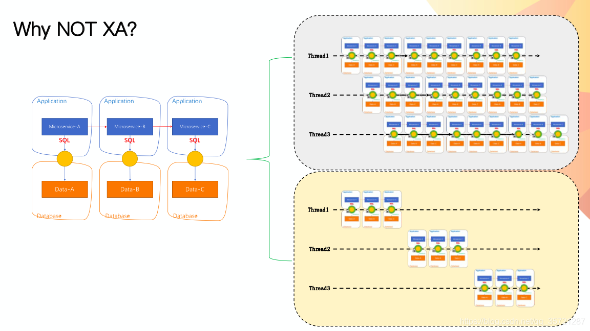

## 概念

### 数据库事务

把多条执行语句作为一个整体进行操作，确保所有操作可以全部成功或者全部失败。

### ACID

* A - Atomic，原子性。要么全部执行，要么全部失败。
* C - Consistent，一致性。事务完成后，所有数据状态都是一致的。
* I - Isolation，隔离性。如果有多个事务并发执行，每个事务作出的修改必须与其他事务隔离。
* D - Duration，持久性。事务完成后，对数据库数据的修改被持久化存储。

### 分布式事务

在分布式环境下，为了满足可用性、性能与服务弹性的需要，降低一致性与隔离性的要求。

### CAP

在一个分布式系统中，Consistency（一致性）、Availability（可用性）、Partition tolerance（分区容错性），三者不可兼得。

**CA without P**：如果不要求P（不允许分区），则C（强一致性）和A（可用性）是可以保证的。但放弃P的同时也就意味着放弃了系统的扩展性，也就是分布式节点受限，没办法部署子节点，这是违背分布式系统设计的初衷的。传统的关系型数据库RDBMS：Oracle、MySQL就是CA。

**CP without A**：如果不要求A（可用），相当于每个请求都需要在服务器之间保持强一致，而P（分区）会导致同步时间无限延长(也就是等待数据同步完才能正常访问服务)，一旦发生网络故障或者消息丢失等情况，就要牺牲用户的体验，等待所有数据全部一致了之后再让用户访问系统。设计成CP的系统其实不少，最典型的就是分布式数据库，如Redis、HBase等。对于这些分布式数据库来说，数据的一致性是最基本的要求，因为如果连这个标准都达不到，那么直接采用关系型数据库就好，没必要再浪费资源来部署分布式数据库。

**AP wihtout C**：要高可用并允许分区，则需放弃一致性。一旦分区发生，节点之间可能会失去联系，为了高可用，每个节点只能用本地数据提供服务，而这样会导致全局数据的不一致性。典型的应用就如某米的抢购手机场景，可能前几秒你浏览商品的时候页面提示是有库存的，当你选择完商品准备下单的时候，系统提示你下单失败，商品已售完。这其实就是先在 A（可用性）方面保证系统可以正常的服务，然后在数据的一致性方面做了些牺牲，虽然多少会影响一些用户体验，但也不至于造成用户购物流程的严重阻塞。

### BASE

* Basic Availability 基本可用
* Soft state 柔性状态
* Eventual consistency 最终一致性

BASE 是对 CAP 中一致性和可用性权衡的结果，其来源于对大规模互联网系统分布式实践的结论，是基于 CAP 定理逐步演化而来的，其核心思想是即使无法做到强一致性，但每个应用都可以根据自身的业务特点，采用适当的方式来使系统达到最终一致性。

## 业务场景

银行跨行转账业务

## 解决方案

由于分布式事务方案，无法做到完全的ACID的保证，没有一种完美的方案，能够解决掉所有业务问题。因此在实际应用中，会根据业务的不同特性，选择最适合的分布式事务方案。

### XA/两阶段提交

XA是由X/Open组织提出的分布式事务的规范，XA规范主要定义了(全局)事务管理器(TM)和(局部)资源管理器(RM)之间的接口。本地的数据库如mysql在XA中扮演的是RM角色。

目前主流的数据库基本都支持XA事务，包括 mysql、oracle、sqlserver、postgresql。

XA 事务由一个或多个资源管理器（RM）、一个事务管理器（TM）和一个应用程序（ApplicationProgram）组成。

特点

* 简单易理解，开发难度低
* 需要对资源进行长时间锁定，并发度低

转账例子 XA 时序图

### [AT 事务模式](http://seata.io/zh-cn/docs/dev/mode/at-mode.html)

自实现的 XA 模式，业务无需编写各类补偿操作，回滚通过 undo log 由框架自动完成。

与 XA 的比较

* SQL 支持不及 XA
* 隔离性，AT 是相对全局，由 TC 控制。XA 则是由 RM 的本地数据库锁保证。
* 入侵性，数据库本身支持的 XA 无疑对业务入侵较小
* 性能，AT 是一阶段提交，所以比 XA 好

### SAGA

Saga 是这一篇数据库论文 [saga](http://link.zhihu.com/?target=https%3A//www.cs.cornell.edu/andru/cs711/2002fa/reading/sagas.pdf) 提到的一个方案。其核心思想是将长事务拆分为多个本地短事务，由 Saga 事务协调器协调，如果正常结束那就正常完成，如果某个步骤失败，则根据相反顺序一次调用补偿操作。

特点

* 并发度高，不像 XA 模式长时间锁定资源
* 业务入侵度大，需要定义正常及补偿操作
* 一致性较弱，对中间结果不敏感

转账例子 Saga 时序图

### TCC

关于 TCC（Try-Confirm-Cancel）的概念，最早是由 Pat Helland 于 2007 年发表的一篇名为《Life beyond Distributed Transactions:an Apostate’s Opinion》的论文提出。

特点

* 并发度较高，无长期资源锁定。
* 开发量较大，需要提供Try/Confirm/Cancel接口。
* 一致性较好，不会发生 SAGA 已扣款最后又转账失败的情况

转账例子 TCC 时序图

### 本地消息表

本地消息表这个方案最初是 ebay 架构师 Dan Pritchett 在 2008 年发表给 ACM 的文章。设计核心是将需要分布式处理的任务通过消息的方式来异步确保执行。

特点

* 长事务仅需要分拆成多个任务，使用简单
* 生产者需要额外的创建消息表
* 每个本地消息都需要进行轮询
* 消费者的逻辑如果无法通过重试成功，那么还需要更多的机制，来回滚操作

转账例子大致流程

写本地消息和业务操作放在一个本地事务里，保证了业务和发消息的原子性，要么他们全都成功，要么全都失败。

容错机制

* 扣减余额失败时，事务直接回滚，无后续步骤
* 轮询生产消息失败，增加余额事务失败都会进行重试

### 事务消息

在上述的本地消息表方案中，生产者需要额外创建消息表，还需要对本地消息表进行轮询，业务负担较重。阿里开源的RocketMQ 4.3之后的版本正式支持事务消息，该事务消息本质上是把本地消息表放到RocketMQ上，解决生产端的消息发送与本地事务执行的原子性问题。

特点

* 长事务仅需要分拆成多个任务，并提供一个回查接口，使用简单
* 消费者的逻辑如果无法通过重试成功，那么还需要更多的机制，来回滚操作

转账例子大致流程

事务消息发送及提交： 

* 发送消息（half消息）
* 服务端存储消息，并响应消息的写入结果
* 根据发送结果执行本地事务（如果写入失败，此时half消息对业务不可见，本地逻辑不执行）
* 根据本地事务状态执行 Commit 或者 Rollback/Commit 操作发布消息，消息对消费者可见）

补偿流程：

* 对没有 Commit/Rollback 的事务消息（pending状态的消息），从服务端发起一次“回查”
* Producer 收到回查消息，返回消息对应的本地事务的状态，为 Commit 或者 Rollback

### 最大努力通知

发起通知方通过一定的机制最大努力将业务处理结果通知到接收方。具体包括

* 有一定的消息重复通知机制。因为接收通知方可能没有接收到通知，此时要有一定的机制对消息重复通知。
* 消息校对机制。如果尽最大努力也没有通知到接收方，或者接收方消费消息后要再次消费，此时可由接收方主动向通知方查询消息信息来满足需求。

前面介绍的的本地消息表和事务消息都属于可靠消息，与这里介绍的最大努力通知有什么不同？

可靠消息一致性，发起通知方需要保证将消息发出去，并且将消息发到接收通知方，**消息的可靠性关键由发起通知方来保证**。

最大努力通知，发起通知方尽最大的努力将业务处理结果通知为接收通知方，但是可能消息接收不到，此时需要接收通知方主动调用发起通知方的接口查询业务处理结果，**通知的可靠性关键在接收通知方**。

解决方案上，最大努力通知需要：

* 提供接口，让接受通知放能够通过接口查询业务处理结果
* 消息队列ACK机制，消息队列按照间隔1min、5min、10min、30min、1h、2h、5h、10h的方式，逐步拉大通知间隔 ，直到达到通知要求的时间窗口上限。之后不再通知

## 适用场景

---

## 参考引用

* [分布式事务最经典的七种解决方案 - 叶东富](https://zhuanlan.zhihu.com/p/387487859)
* [Seata doc](http://seata.io/zh-cn/docs/overview/what-is-seata.html)
* [Go 分布式事务管理器 dtm](https://github.com/yedf/dtm)
