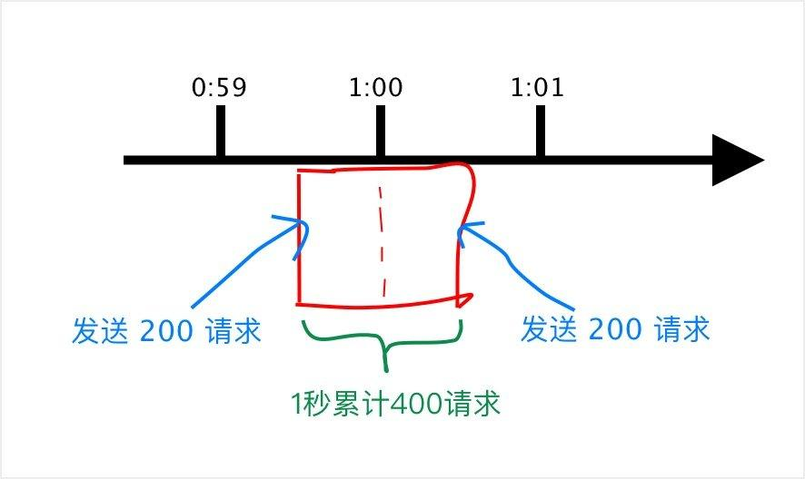
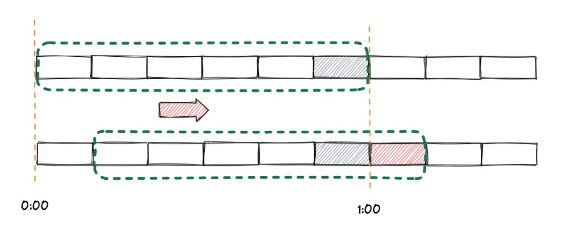
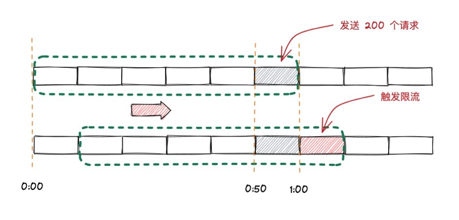
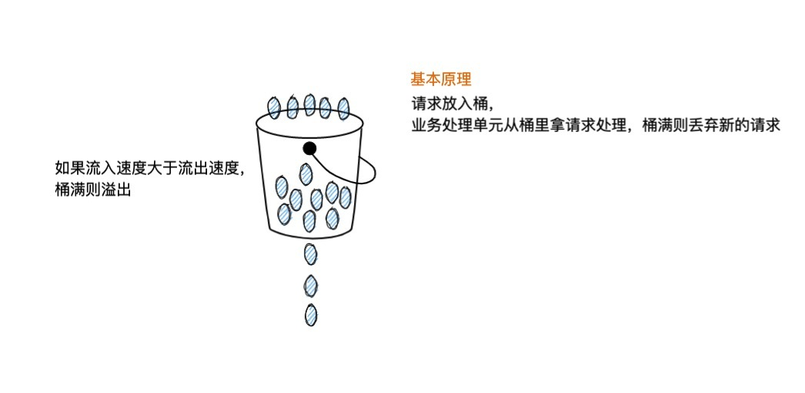
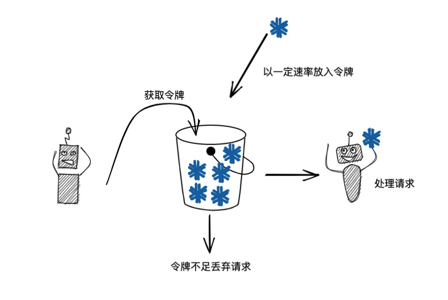
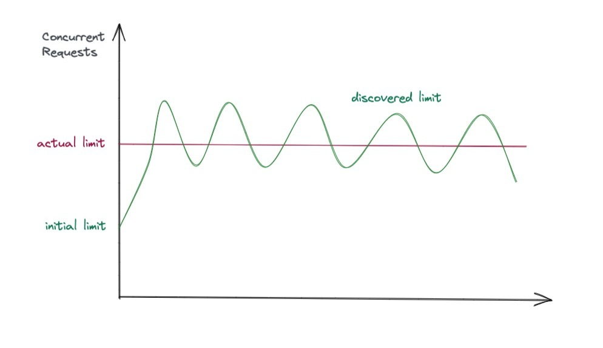
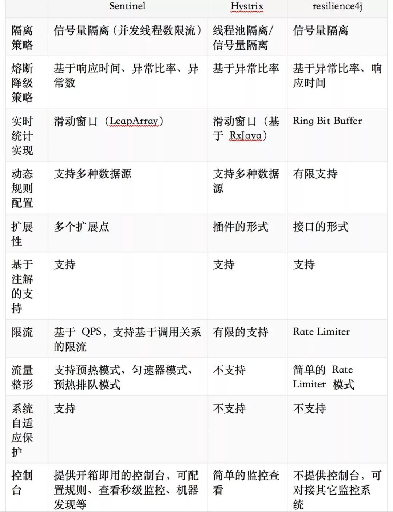

## 类型

### 计数器

又称固定窗口算法。在一段时间间隔内，对请求进行计数，与阀值进行比较判断是否需要限流，一旦到了时间临界点，将计数器清零。

* 优点：原理简单，实现简单
* 缺点：策略过于粗暴，无法应对两个时间窗口临界时的瞬时流量



**简单实现**

```go
package main
 
import (
    "log"
    "sync"
    "time"
)
 
type Counter struct {
    rate  int           //计数周期内最多允许的请求数
    begin time.Time     //计数开始时间
    cycle time.Duration //计数周期
    count int           //计数周期内累计收到的请求数
    lock  sync.Mutex
}
 
func (l *Counter) Allow() bool {
    l.lock.Lock()
    defer l.lock.Unlock()
 
    if l.count == l.rate-1 {
        now := time.Now()
        if now.Sub(l.begin) >= l.cycle {
            //速度允许范围内， 重置计数器
            l.Reset(now)
            return true
        } else {
            return false
        }
    } else {
        //没有达到速率限制，计数加1
        l.count++
        return true
    }
}
 
func (l *Counter) Set(r int, cycle time.Duration) {
    l.rate = r
    l.begin = time.Now()
    l.cycle = cycle
    l.count = 0
}
 
func (l *Counter) Reset(t time.Time) {
    l.begin = t
    l.count = 0
}
 
func main() {
    var wg sync.WaitGroup
    var lr Counter
    lr.Set(3, time.Second) // 1s内最多请求3次
    for i := 0; i < 10; i++ {
        wg.Add(1)
        log.Println("创建请求:", i)
        go func(i int) {
          if lr.Allow() {
              log.Println("响应请求:", i)
          }
          wg.Done()
        }(i)
 
        time.Sleep(200 * time.Millisecond)
    }
    wg.Wait()
}
```

### 
### 滑动窗口

滑动窗口是针对计数器存在的临界点缺陷，所谓 滑动窗口（Sliding window） 是一种流量控制技术，这个词出现在 TCP 协议中。滑动窗口把固定时间片进行划分，并且随着时间的流逝，进行移动，固定数量的可以移动的格子，进行计数并判断阀值。 



上图中我们用红色的虚线代表一个时间窗口（一分钟），每个时间窗口有 6 个格子，每个格子是 10 秒钟。每过 10 秒钟时间窗口向右移动一格，可以看红色箭头的方向。我们为每个格子都设置一个独立的计数器 Counter，假如一个请求在 0:45 访问了那么我们将第五个格子的计数器 +1（也是就是 0:40~0:50），在判断限流的时候需要把所有格子的计数加起来和设定的频次进行比较即可。

那么滑动窗口如何解决我们上面遇到的问题呢？来看下面的图： 



当用户在0:59 秒钟发送了 200个请求就会被第六个格子的计数器记录 +200，当下一秒的时候时间窗口向右移动了一个，此时计数器已经记录了该用户发送的 200 个请求，所以再发送的话就会触发限流，则拒绝新的请求。 

* 优点：流量控制比固定窗口更加平滑
* 缺点：切分的窗口数量对流量的平滑性有很大的影响
**简单实现**

[https://github.com/RussellLuo/slidingwindow](https://github.com/RussellLuo/slidingwindow)

### 漏桶 Leaky Bucket

我们有一个固定容量的桶，有水流进来，也有水流出去。对于流进来的水来说，我们无法预计一共有多少水会流进来，也无法预计水流的速度。但是对于流出去的水来说，这个桶可以固定水流出的速率。而且，当桶满了之后，多余的水将会溢出。

我们将算法中的水换成实际应用中的请求，我们可以看到漏桶算法天生就限制了请求的速度。当使用了漏桶算法，我们可以保证接口会以一个常速速率来处理请求。



**简单实现**

```go
type LeakyBucket struct {
    rate       float64 //固定每秒出水速率
    capacity   float64 //桶的容量
    water      float64 //桶中当前水量
    lastLeakMs int64   //桶上次漏水时间戳 ms

    lock sync.Mutex
}

func (l *LeakyBucket) Allow() bool {
    l.lock.Lock()
    defer l.lock.Unlock()

    now := time.Now().UnixNano() / 1e6
    eclipse := float64((now - l.lastLeakMs)) * l.rate / 1000 //先执行漏水
    l.water = l.water - eclipse                              //计算剩余水量
    l.water = math.Max(0, l.water)                           //桶干了
    l.lastLeakMs = now
    if (l.water + 1) < l.capacity {
        // 尝试加水,并且水还未满
        l.water++
        return true
    } else {
        // 水满，拒绝加水
        return false
    }
}

func (l *LeakyBucket) Set(r, c float64) {
    l.rate = r
    l.capacity = c
    l.water = 0
    l.lastLeakMs = time.Now().UnixNano() / 1e6
}
```

### 令牌桶

想象有一个固定大小的桶，系统会以恒定速率向桶中放 Token，桶满则暂时不放。

而用户则需要从桶中获取 Token，取得 Token 后才可以进行下一步操作。



**简单实现**

```go
type TokenBucket struct {
    rate         int64 //固定的token放入速率, r/s
    capacity     int64 //桶的容量
    tokens       int64 //桶中当前token数量
    lastTokenSec int64 //桶上次放token的时间戳 s

    lock sync.Mutex
}

func (l *TokenBucket) Allow() bool {
    l.lock.Lock()
    defer l.lock.Unlock()

    now := time.Now().Unix()
    l.tokens = l.tokens + (now-l.lastTokenSec)*l.rate // 先添加令牌
    if l.tokens > l.capacity {
        l.tokens = l.capacity
    }
    l.lastTokenSec = now
    if l.tokens > 0 {
        // 还有令牌，领取令牌
        l.tokens--
        return true
    } else {
        // 没有令牌,则拒绝
        return false
    }
}

func (l *TokenBucket) Set(r, c int64) {
    l.rate = r
    l.capacity = c
    l.tokens = 0
    l.lastTokenSec = time.Now().Unix()
}
```

请求注解（RFC）中定义了两种令牌桶算法——**单速率三色标记算法**和**双速率三色标记算法**，其评估结果都是为报文打上红、黄、绿三色标记。QoS会根据报文的颜色，设置报文的丢弃优先级，其中单速率三色标记比较关心报文尺寸的突发，而双速率三色标记则关注速率上的突发，两种算法都可工作于色盲模式和非色盲模式。

### 自适应

使用自适应阈值可以动态调整限流，通过运行中不断试探，最终可以在系统处理能力和限流之间找到一个动态平衡。既能最大限度利用系统处理能力，又能确保系统稳定性。

目前比较简单的自定义算法是参考 TCP 拥塞算法的斜率算法。斜率算法设置一个基准值，可以结合应用的 Load、CPU 使用率、总体平均 RT、入口 QPS 和并发线程数等几个维度的监控指标评估系统负载，负载高了降低限流阈值，负载低了提高限流阈值。

```go
gradient =（RTTnoload / RTTactual）
newLimit = currentLimit×gradient + queueSize
```
其中，RTTnoload 表示无负载时的 rt，RTTactual 表示当前实际 rt。gradient 小于 1 表示负载偏高，大于 1 表示负载偏低。经过一段时间的试探，就能把系统流量控制在合理范围。



### 
### 分布式

通常使用 Redis + Lua 在单一存储中实现以上算法来应对多台机器的统一流量控制。

## 工具库

### Java

* [Sentinel](https://sentinelguard.io/zh-cn/index.html)
* [Hystrix](https://github.com/Netflix/Hystrix)
* [Resilience4j](https://github.com/resilience4j/resilience4j)



### Golang

* [golang.org/x/time/rate](https://pkg.go.dev/golang.org/x/time/rate)
* [Uber Go rate limiter](https://pkg.go.dev/go.uber.org/ratelimit)
* [Kratos ratelimit](https://github.com/go-kratos/kratos/blob/v1.0.x/docs/ratelimit.md)

---


## 参考引用

* [Go 实现各类限流的方法 - JarvibDing](https://www.jb51.net/article/211748.htm)
* [漏桶算法和令牌桶算法，区别到底在哪里？](https://cloud.tencent.com/developer/news/841709)
* [自适应限流工具](https://blog.csdn.net/truelove12358/article/details/121698524)
* [Go微服务 -- 自适应限流](https://www.cnblogs.com/failymao/p/15232183.html)
