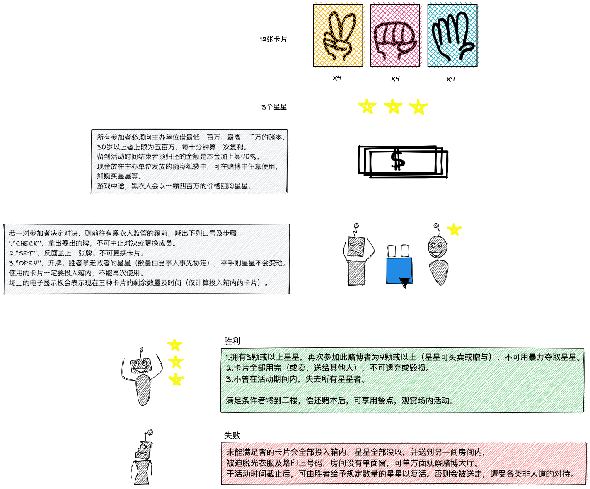

《赌博默示录》（日语：賭博黙示録カイジ）是福本伸行的日本漫画作品。1996年开始在讲谈社漫画杂志周刊Young Magazine上连载。

续篇分别为《赌博破戒录》（賭博破戒録カイジ）、《赌博堕天录》（賭博堕天録カイジ）、《赌博堕天录 和也篇》（賭博堕天録カイジ 和也編）、《赌博堕天录 单张扑克篇》（賭博堕天録カイジ ワン・ポーカー編）、《赌博堕天录 24亿逃出篇》（賭博堕天録カイジ 24億脱出編），故事互相连贯。

## 故事简介

### 第一章 希望之船 （赌博默示录1～5）

主角伊藤开司自1996年3月开始，来到东京3年仍无所事事，过着每天和人赌博、喝酒的堕落生活。

由于过去的同事古畑向帝爱集团以一个月20%的利率借了30万元，但古畑潜逃1年后，被欺骗而做保的开司莫名背上385万的债务。

为了偿还债务，开司接受远藤的邀请登上名为艾斯波瓦鲁（法文“希望”之意）之船，参加限时赌局的规则：参与者须向主办方高额借贷的巨款，以标著“剪刀、石头、布”的扑克为道具，夺取对手身上的星星，赌局结束时，牌未用完及星星少于3颗者将判定失资格。而星星超过3颗者，将其欠款一笔勾销。

### 第二章 绝望之城 （赌博默示录5～13）

参赛者首先到比赛场地，六条离地面10米高的铁条，最先走到对面的前两名可获得2,000万元与1,000万元的奖金，“勇者之路”。来宾在铁条下方下注，宣办方声称只要通过就能得到奖金。

通过赛马者如要领取奖金，而要再重复走一次同样的路。

接着开司向帝爱集团第2号人物，利根川发起挑战，项目是皇帝牌（E-Card）。有两种牌型“皇帝方”及“奴隶方”，皇帝方有皇帝1张市民4张；奴隶方有奴隶1张、市民4张，皇帝胜市民、市民胜奴隶、奴隶胜皇帝。

绝望之城最终章，开司挑战帝爱王国的皇帝，会长兵藤和尊。使用新开封的面纸盒，在其中放入纸巾作成的签，先抽中中奖签的人获胜。开司赌上4根手指以赢取1亿元的钜款。

## 游戏

### 限定猜拳

**蜈蚣博弈**

|players|傻白甜主人公开司、船井|
|:----|:----|
|strategies|两个人每局同时出相同的牌，直到牌全部出完即双方可以同时成为胜利者。 约定出牌的顺序为石头、剪刀、布|
|payoffs|开司：外债 385W，本金 1000W，10 分钟算复利，尽快结束使利息不到 385W 可获利    船井：外债未知，本金 1000W，目标成为胜利者|
|action|<ul><li>在连续 9 局平局后，两人就这样顺利地消耗着卡片。</li><li>第 10 局开司按约定出“石头”，船井却出了“布”。赢取了开司一颗星星。</li><li>第 11 局船井道歉上局手误，开司信以为真，再次输掉一颗星星。</li>|

蜈蚣博弈（centipede game）是由罗森塞尔（Rosenthal）在1981年提出的。在蜈蚣博弈中，博弈双方轮流进行策略（行动）选择，而可供选择的策略只有两种：合作或不合作。

只要双方坚持选择合作，从长远来看，双方得到的利益都会不断增加，从而创造一种双赢的局面，但是在一方选择合作，而另一方接着选择不合作的时候，选择不合作的一方会获得一个更高的收益。

**胜留败走**

|players|开司 3 人组（开司、古畑、安胖子）：因为开司手里只剩 1 张牌和 1 颗星，此时需要通过资源整合即找到那些手里有星没牌或者有牌没星的人，联合到一起进行游戏，才能重新产生了获胜希望。 整合后资源：现金 1400W、星星 3 颗、牌 4 张剪刀  猎狗: 故意避开和星星多的人比赛，低抛高吸。且信奉均衡理论，即手里的 3 种牌数量希望尽可能均衡。  资源：7 张牌，星星 4 颗|
|:----|:----|
|strategies|开司利用身上只有一颗星星的状况故意引诱猎狗进行对决，再通过打破他以为的均衡理论赢取星星|
|action|<ul><li>第 1 局：猎狗出多余了牌“布”，开司“剪刀”赢</li><li>第 2 局：猎狗出“石头”，开司“剪刀”输</li><li>第 3 局：猎狗认为开司只剩两张牌，绝对不可能是“剪刀”，而是一张“石头”和一张“布”，或两张“石头”，两张“布”。他只要出“布”就立与不败之地。结果开司赢</li><li>第 4 局：猎狗已经输急了，开司只有一张牌，对方坚信自己的理论，就是说开司绝不会出“剪刀”。自己出了“布”，结果开司赢。</li>|

所谓“胜留败走”是指，如果你的“剪子”输给了对手的“石头”，那么下一轮你更有可能出能战胜“石头”的“布”；而如果你是获胜者，那么下一轮你更有可能沿用和上一轮相同的出手。换句话说，赢家保持现状、输家做出改变。

基于以上统计结果，你在游戏中可以运用以下策略来获胜：如果你是输家，下一轮换用能打败对手的出手；如果你是赢家，下一轮不要再使用原来的出手，而是选择对方刚才输你的出手。比如，你用“石头”打败了对手的“剪子”，那么下一轮你不能再出“石头”，而应该出对手刚才出的“剪子”，因为对方很可能想通过出“布”赢你刚才的“石头”。

**不完全信息博弈**

|players|开司 3 人组：星星 5 颗，通过现金购买牌 30 张“石头” + 少量“剪刀”，“布”  红衣男：星星 4 颗，通过现金大量买断牌“布”|
|:----|:----|
|information|共同知识 <ol><li>公告上会显示剩余所有牌的数量，通过囤积其中一种牌在最后时刻可以大大提高胜率</li><li>3人组目标是“石头”，红衣男目标是“布”，红衣男稳赢</li></ol> 3人组优势信息 <ol><li>因为不确定要赢的人的数量，所以囤积的目标牌不一定是偶数，但其余牌需要偶数因为最后必须两两打平直至全部消耗完</li><li>红衣男透露他这一局是最后一局，开司推测所持有的牌大概率是“布”</li>|
|strategies|加大赌注争取与信息劣势一方进行博弈以获取最大利益|
|payoff|开司：一盘对决的筹码提高至 600W 外加 3 颗星星，输了直接成为失败者  红衣男：输了只付出 3 颗星星，还不用马上成为失败者|
|action|开司：加上言语挑衅，出牌为“剪刀”  红衣男：出牌为“布”|

由于牢牢掌握信息优势，3 人组置之死地而后生，一盘就拿回 3 颗星星。

|players|开司 3 人组  船井  剩余牌量不多且被别人知道底牌信息的 5 人|
|:----|:----|
|information|时间继续消耗下去，最终所有人均会成为失败者|
|strategies|将众人所持有的牌收集到一处，全部洗一遍，然后重新分发，且对决只能在混牌的 7 人里面互相进行|
|payoff|3 人组：如果无人与之对决，就算有必胜的牌也无法赢取星星，但因为手牌数量众多，即使混牌也能推算出获胜的概率|
|action|船井混牌时通过在牌上做了标识，获得了信息优势，从而赢取 1 颗星|

* 人类社会的大多数博弈都是不完全信息博弈
* 博弈论中的信息甄别就是解决信息披露问题
* 信息甄别的关键是下套，引诱或逼迫信息优势方采取对策来披露信息，实现信息共享
* 下套成功的关键是大小合适，松紧合适

## 未完待续...

---

## 相关

* [《赌博默示录》wiki](https://zh.wikipedia.org/wiki/%E8%B3%AD%E5%8D%9A%E9%BB%98%E7%A4%BA%E9%8C%84)
* [如何评价《赌博默示录》？- 知乎](https://www.zhihu.com/question/23275076)
