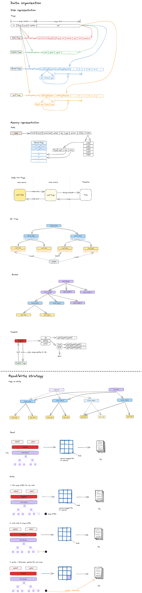

BoltDB is an embedded, key-value database developed by Ben Johnson. It is designed to be lightweight, efficient, and reliable, making it a popular choice for applications that require a simple and fast storage solution. 

## Overview

Here is an overview of the main features of BoltDB:

1. Embedded Database
2. LMDB
3. ACID Transactions
4. Key-Value Store
5. MVCC
6. B+Tree Data Structure
7. mmap
8. High Performance
9. Crash Recovery
10. Small Memory Footprint

Overall, BoltDB offers a reliable, lightweight, and efficient solution for embedding a key-value store within your application. Its ACID transactions, MVCC concurrency control, and performance optimizations make it a popular choice for various applications, ranging from small-scale projects to large-scale systems.

---
## Reference

* [boltdb 源码分析](https://youjiali1995.github.io/storage/boltdb/)
* [Boltdb 源码导读](https://www.qtmuniao.com/2020/11/29/bolt-data-organised/)
* [深入浅出 boltdb](http://blog.mrcroxx.com/posts/code-reading/boltdb-made-simple/1-storage-cache/)
* [boltdb](https://github.com/boltdb/bolt)
* [LMDB project](http://www.lmdb.tech/doc/index.html)
