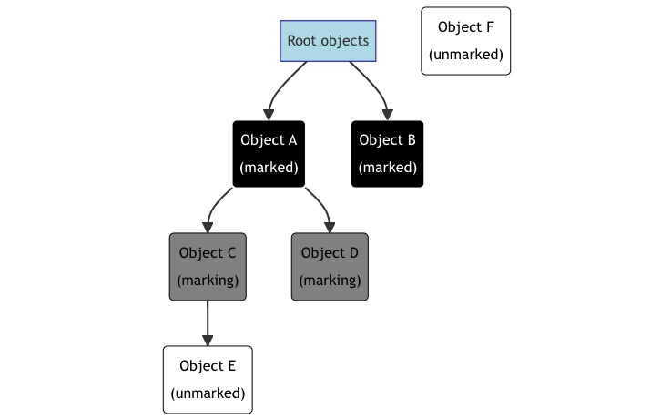
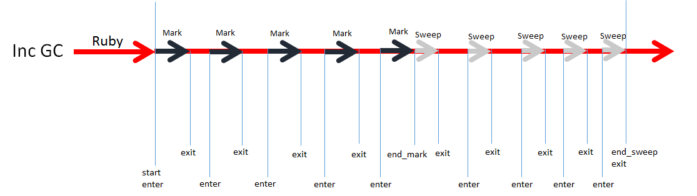

>[原文：Garbage Collection in Ruby - Peter Zhu](https://blog.peterzhu.ca/notes-on-ruby-gc)

## 概述

Ruby 的垃圾收集器代码位于一个名为 [gc.c](https://github.com/ruby/ruby/blob/master/gc.c) 的文件中。

“垃圾收集器”可能并不是对它的最好称呼，因为除了垃圾回收之外，``gc.c`` 中的代码还负责内存分配和管理。换句话说，对象的整个生命周期都由垃圾收集器管理。

## 原始对象类型

虽然在 Ruby 源代码中，对象的工作方式似乎都一样，但实际上 Ruby 内部有许多不同类型的对象。这些类型大致可分为两类：**immediates** 直接值（不受垃圾收集器管理）和 **heap allocated** 堆分配对象（受垃圾收集器管理）。

### 直接值 **immediates**

并非所有 Ruby 对象都由垃圾收集器管理。有几种特殊类型的对象被称为直接值。在 Ruby 程序中，直接值的行为与其他 Ruby 对象无异，但表示方式却大不相同。以下类型被表示为直接值：

* ``nil``
* ``true`` 和 ``false``
* ``Fixnum``：介于 -(2^62) 和 2^62 - 1 之间的小整数（在 64 位系统中）。
* ``Float``：用直接值表示的浮点数。然而，有些浮点数不是直接值，而是为堆分配对象。
* ``Static Symbol``：源代码中的常量符号（如 ``:foo``）。运行时生成的动态符号（如 ``"foo".to_sym`` 或 ``:"foo#{my_variable}"`` ）不是直接值，而是堆分配对象。

直接值利用了非直接 Ruby 对象的特定属性（将在 "slots" 部分进一步详细讨论）。

所有指向 Ruby 对象的指针都是以 ``40 字节`` 为单位对齐的（即指针是 40 的倍数）。这种对齐方式保证了最低三位始终为 0（因为 40 的倍数也意味着 8 的倍数）。

Ruby 利用这一点来进行[指针标记](https://en.wikipedia.org/wiki/Tagged_pointer)，即使用指针的最低三位来存储类型，并使用其余位来存储数据。因此，如果指针的最低三位为 0，那么该对象将由垃圾收集器管理。如果低三位不为零，那么它就是一个直接值。

你可以看到 Ruby 用来[标记指针的各种值](https://github.com/ruby/ruby/blob/e51014f9c05aa65cbf203442d37fef7c12390015/include/ruby/internal/special_consts.h#L98-L106)。

### 堆分配 Heap allocated

Ruby 中实际上有 14 种不同的堆分配对象类型。它们是

* Array
* Bignum
* Class
* Complex
* File
* Float
* Hash
* MatchData
* Object
* Rational
* Regexp
* String
* Struct
* Symbol

我们将在下一节详细介绍 Ruby 如何分配这些类型。

## 数据结构

下面我们将讨论 Ruby 的垃圾收集器用于分配对象和管理内存的各种数据结构。我们将从最小的单元（slots 槽）开始，逐步过渡到更大（heap pages 堆页）和更大（size pools 尺寸池）的管理单元。


### VALUE 类型

指向 Ruby 对象的每个指针都存储在名为 VALUE 的类型中。VALUE 类型的定义与系统中指针的大小相同。对于堆分配的对象，VALUE 类型直接指向对象的内存地址。对于直接值，指针的底部 3 位用于存储对象的类型，其余位用于存储数据。

### Slots

每个堆分配的对象都依赖于一个 slot。由于历史原因，slots 的大小是 40 字节的倍数。我们将在 "size pools" 部分详细讨论 slot 的大小。

每个 slot 都以两个字段开始，这两个字段都是 VALUE 类型，分别称为 ``flags`` 和 ``klass``：

* **flags** 用于存储对象的相关数据。在 64 位系统中，前 12 位用于存储对象的各种元数据，如冻结状态、对象年龄（用于[分代垃圾收集器](https://blog.peterzhu.ca/notes-on-ruby-gc/#generational-garbage-collector)）和写屏障保护状态（将在 "写屏障" 部分讨论）。然后是特定对象类型可用于存储数据的 20 位。例如，小数组使用其中的一些位来存储数组的长度。剩下的 32 位作为 [object shapes](https://bugs.ruby-lang.org/issues/18776) 使用，用于存储对象的信息（主要保存有关实例变量的信息）。
* **klass** 是指向 Class 对象的指针，它是此对象的类。

slot 中的剩余空间被对象用来存储该类型的数据。例如，数组使用剩余空间存储数组的内容，而类则存储方法表、常量表和超类列表等信息。

### Heap Page

堆被分为多个 page，每个 page 大小为 64KB。这些 page 被进一步划分为 slot。每个 page 的 slot 大小是固定的（即每个 page 只有一种尺寸的 slot）。这是为了简化和提高性能，因为这意味着当我们遍历 page 上的对象时，不需要改变 slot 的大小。

垃圾收集器以 pages 为单位从系统中分配内存，而不是单独分配每个 slot。这样做有很多原因，其中之一就是为了提高分配性能。从系统中分配大块内存比频繁分配小块内存要有效得多。

### Size pools

在 Ruby 3.2 中引入的尺寸池是[可变宽度分配（Variable Width Allocation）](https://shopify.engineering/ruby-variable-width-allocation)功能的核心，该功能允许通过垃圾收集器分配动态大小的对象。在此功能之前，所有对象都是以 40 字节 slot 分配的，任何额外的数据都必须通过系统进行外部分配。这限制了性能并降低了内存利用率。

尺寸池用于管理具有相同大小 slot 的 page。目前使用的 slot 大小（在 64 位系统上）是 ``40 bytes * 2 ^ N``，共有五个尺寸池。每个池的 slot 大小分别为 ``40 字节、80 字节、160 字节、320 字节和 640 字节``。选择幂次多项式是为了在内存效率、性能和支持大尺寸之间取得良好平衡。使用过多的细粒度尺寸意味着频繁的重新分配，从而降低性能，而使用过少的尺寸意味着内存利用率低。

由于可变宽度分配是逐步引入的，并非所有对象类型都支持该功能，因此为了提高这些类型的空间效率，第一个尺寸池的大小为 40 字节，完全兼容不支持该功能的对象类型。

### rb_objspace_t 结构

``rb_objspace_t`` 结构包含有关垃圾收集器的所有元数据，包括尺寸池、垃圾收集器内部数据、垃圾收集器状态以及各种统计信息。

## 对象分配

使用 ``NEWOBJ_OF`` 宏分配对象。对象的类型、类别和大小等信息都会传递给垃圾收集器。

这些宏调用垃圾收集器的内部函数来分配和初始化对象。在垃圾收集器中，对象分配的核心是 ``newobj_of0`` 函数。在这个函数中需要注意的是，有两种分配路径：快速路径和慢速路径。

### 快速路径 Fast path

为了加快分配速度，每个 Ractor 中都有一个缓存，其中包含一个空闲 slots 的链表。通过缓存一些空闲 slots，可以在不同的 Ractors 中并行分配 slots，而不会出现竞争条件，从而无需执行同步。当我们需要分配一个对象时，就会从链表的头部移除一个 slot。不过，缓存中的 slot 最终会用完，这意味着我们需要进入慢速路径。

### 慢速路径 Slow path

当缓存中的 slots 用完时，我们需要切换到慢速路径。之所以称为慢速路径，是因为它需要锁定 Ruby 虚拟机，这意味着一次只能有一个 Ractor 进入慢速路径。慢速路径首先查看 page 中是否有空闲的 slot 链表。如果存在这样的 page，它会移除第一个 page，并将 page 中的空闲 slots 链表移至 Ractor 缓存。

如果没有空闲的 page，则首先检查是否允许分配新的 page。每个 size pool 都有一个可分配页计数器（allocatable_pages），用于跟踪在触发新的垃圾回收周期之前允许 size pool 分配的页数。不过，一旦可分配页数为 0，就会触发新的垃圾回收周期，这将在下一节中讨论。

## 垃圾回收的生命周期

垃圾收集器分为两个阶段：首先是标记，然后是清扫（如果启用，还包括压缩）。

在标记阶段，存活的对象会被标记。然后，在清扫阶段，未标记的 slots 会被释放，并添加到page 上的空闲 slots 链表中。

Ruby 使用的垃圾收集器被称为 "stop-the-world "垃圾收集器，这意味着在垃圾收集器执行期间，所有 Ruby 代码的执行都必须暂停。例如，在大型 Rails 应用程序中，当垃圾收集器运行时，这可能会导致 Ruby 代码长时间暂停。Ruby 有两种方案来解决这个问题，一种是增量标记对象，另一种是使用分代垃圾收集器，这两种方法都将在后面的章节中讨论。

## 标记阶段

标记阶段通过从根对象开始递归标记 Ruby 对象的子对象来遍历存活 Ruby 对象。对象使用三种颜色进行标记：白色、灰色和黑色。三色标记算法的工作原理如下：

1. 所有对象最初都是白色的。
2. 将根对象标记为灰色。
3. 当存在另一个对象 O 是灰色时：
    1. 将 O 标记为黑色。
    2. 将 O 的每个子对象 C 标记为灰色。
标记阶段结束时，只有黑色和白色对象。所有白色对象都已死亡，可由垃圾收集器回收。



在上图中，对象 A 和 B 已经标记了它们的子对象，因此标记为黑色。对象 C 和 D 尚未标记，所以标记为灰色。对象 E 尚未标记，所以是白色。我们还有一个对象 F，它没有被任何 Ruby 对象引用，所以不会被标记，在标记过程结束前将保持白色，因此将在清扫阶段被回收。

### 分代垃圾收集器

分代垃圾收集器基于[弱代际假设理论](https://en.wikipedia.org/wiki/Tracing_garbage_collection#Generational_GC_(ephemeral_GC))，该理论认为，对象往往死得早，而存活时间长的对象则有可能继续存活。分代垃圾收集器会记录特定对象存活的垃圾收集周期数，当这个数字超过阈值时，该对象就会被提升到老年代。在 Ruby 的垃圾收集器中，一个对象需要 **存活三个垃圾收集周期** 才会被提升到老年代。为了利用这一特性来提高性能，我们有两种类型的垃圾回收周期：次要周期和主要周期。

**次要垃圾回收周期（Minor garbage collection cycles）** 只标记年轻对象，因此可以跳过旧对象，从而加快运行速度。

**主要垃圾回收周期（Major garbage collection cycles）** 同时标记新旧对象，因此可以释放更多内存。


在上图中，在一个 Minor 周期中，对象 A 的后代都不会在标记过程中被遍历。

对象存活的代数存储在 ``RBasic`` 结构的标志中。我们可以使用 ``RVALUE_FLAGS_AGE`` 和 ``RVALUE_OLD_P_RAW``（分别返回对象的年龄和是否老化）来获取对象的年龄。

#### 写屏障 Write barrier

如果我们给旧对象添加一个子对象（即新对象），会怎么样呢？那么在 Minor 周期中，新对象将不会被标记，因此会被清空。这将是一个非常糟糕的错误！


在上图中，由于对象 A 和 C 都是旧对象，因此在标记过程中不会遍历它们。因此，在 Minor 周期中，对象 F 不会被标记，因此会被清扫。

为了解决这个问题，我们引入了写屏障的概念。写屏障本质上是一个回调，每当有对象被写入时，它就会通知垃圾收集器。当有一个旧的父对象和一个新的子对象被调用写屏障时，旧的父对象会被标记并放入 **记忆集（Remember set）** 中。记忆集是将在下一个 Minor 周期中标记的对象列表。每次垃圾回收周期结束后，都会清除记忆集。垃圾收集器会立即将记忆集中的所有年轻代对象提升到老年代。


分代垃圾回收在 Ruby 2.1 中引入。由于并非所有对象类型都支持写屏障，为了逐步引入该功能并保持与旧的本地扩展的向后兼容性，Ruby 支持不具有写屏障的对象，这些对象被称为 "**未受保护的写屏障（write barrier unprotected）**" 对象（而支持写屏障的对象被称为 "受保护的写屏障" 对象）。每当一个旧的受写屏障保护的对象引用一个不受写屏障保护的对象时，父对象（旧的受写屏障保护的对象）就会被添加到记忆集中。我们将其添加到记忆集中，是因为如果没有写屏障，我们就不知道子对象何时被写入该对象。

如果你对更多细节感兴趣，Koichi Sasada（写屏障的作者）有一篇关于实现 [渐进式写屏障](http://www.atdot.net/~ko1/activities/rgengc_ismm.pdf) 的优秀论文。

### 增量标记 Incremental marking

Ruby 2.2 引入了增量垃圾收集器。Koichi Sasada（增量标记的作者）有一篇[出色的文章](https://blog.heroku.com/incremental-gc)解释了增量垃圾收集器的工作原理，我将尝试在下文中对其进行总结。



增量式标记的主要思想是不一次性运行标记阶段，而是将其分成若干块，与 Ruby 代码的执行交错进行。由于 Ruby 有垃圾收集器（stop-the-world）（即当垃圾收集器运行时，Ruby 代码无法运行），因此分割标记阶段可以显著减少垃圾收集器执行时造成的停顿。

增量标记只标记一定数量的 slots，然后才继续执行 Ruby 代码。因此，在 Ruby 代码执行过程中，有些对象可能被标记为黑色，有些对象可能被标记为灰色，而有些对象可能还未被标记。

增量标记利用了写屏障，当一个对象被写入一个已标记的对象时，它就会知道，并相应地设置子对象的标记状态。但由于并非所有对象都支持写屏障，增量标记需要在最后标记所有已标记但未受写屏障保护的对象，因此会产生额外的开销。

增量标记只出现在 Major 周期中，因为 Minor 周期相对较快，并且它不会遍历旧对象，而增加增量标记会带来额外的开销。

## 清扫阶段

标记阶段结束后，所有存活对象都被标记为黑色，所有死亡对象都未被标记。然后，清扫阶段会遍历每个 page 的每个 slot，释放未标记的对象。对象通过 obj_free 函数释放，该函数可执行释放从系统分配的内存或关闭文件描述符等操作。被释放的 slot 会被放入该 page 的空闲 slot 链表中。

### 惰性清扫 lazy sweeping

清扫所有死对象可能会导致 Ruby 代码执行的长时间停顿。与标记工作可以分几步逐步进行以减少垃圾收集器中停顿的连续时间类似，lazy sweeping 将清扫过程分成许多小步骤，每一步清扫 2048 个 slot。这个过程是惰性地执行的。也就是说，当需要分配一个对象但没有空闲 slot 时，我们会在分配对象前执行一个清扫步骤。

## 压缩阶段

当我们的 Ruby 程序分配和删除对象时，堆内存（即页面内的空闲位置）不可避免地会出现 "空洞"，因为有些对象会存活较长时间，而另一些对象则会被清空。

这就是所谓的 "碎片化"，即在存活对象之间有许多空闲的 slot。碎片化会增加内存使用量，因为它会阻止大部分为空的页面被释放。拥有大量页面还会降低垃圾收集器和代码正常执行的速度。很明显，它会减慢垃圾收集器的速度，因为标记和清扫阶段都会遍历页面。碎片化还会降低 Ruby 代码的执行速度，因为 CPU 缓存会因为缓存更多的空槽而不是有用的数据而变得不那么有效。

如果我们也有办法将相关对象移得更近，或许还能通过增加缓存命中率来提高性能（Ruby 垃圾收集器目前还没有这样做）。

Ruby 2.7 中引入的压缩阶段试图通过将 Ruby 对象移动到不同的 page 来解决这个问题。

Ruby 3.2 中引入的 "可变宽度分配" 功能还可利用压缩阶段，通过在不同尺寸的池中移动对象来调整对象的大小，将对象放置在最合适的 slot 中，从而提高运行时性能和空间效率。

压缩目前是一项可选功能，可以通过调用 ``GC.compact`` 手动触发，也可以通过设置 ``GC.auto_compact = true`` 启用，以便在 Major 垃圾回收周期中自动运行。

### 固定对象 Pinning objects

由于各种原因，某些对象无法移动。其中一个原因是，压缩是一个相对较新的功能，因此 Ruby 中的许多类型以及带有本地扩展的 gem 都不支持压缩。我们也无法移动堆栈中正在使用的对象。这些对象被称为固定对象。如果我们移动了固定的对象，那么可能会出现指向已损坏或错误对象的指针，从而导致错误和崩溃！

为了解决这个问题，我们修改了用于标记 Ruby 对象的原始 C API 函数 ``rb_gc_mark``，使其既能标记对象，又能固定对象。我们还为支持压缩的类型引入了一个新函数 ``rb_gc_mark_movable``。这样，不支持压缩的对象类型将继续工作，而新的类型则可以逐步引入以支持压缩。

### 压缩算法

为了说明压缩算法，我将以下面的堆为例。这是一个简化的例子，因为它只显示了两个尺寸池。箭头表示对象之间的引用。例如，从对象 A 和 B 到对象 F 之间存在引用。


#### Major 垃圾回收周期的标记

在进行压缩之前，我们必须先进行 Major 垃圾回收周期的标记阶段。这将标记所有实时对象和无法移动的固定对象。

#### 对象移动阶段

压缩采用双向压缩算法。顾名思义，我们有两个游标（或手指），一个游标从右向左移动，称为 "扫描游标"，用于查找存活对象；另一个游标从左向右移动，称为 "空闲游标"，用于查找空闲 slots。

我们遍历每个 size pool，并尝试从每个 size pool 中移动扫描游标处的一个对象（从技术上讲，出于性能考虑，实现过程中每次从每个 size pool 中移动一整页对象，但这一细节对解释算法并不重要）。对于我们尝试移动的每个对象，我们都会分析最佳大小，并尝试将其移动到该size pool 的空闲游标处。但是，如果它试图移动到的 size pool 已经完成了压缩，那么我们就不会移动该对象。

我们每次只从每个 size pool 移动一个对象（而不是先从一个 size pool 移动所有对象，然后再移动到下一个 size pool），以确保所有对象都有同等机会移动到最佳大小。如果我们从最小的 size pool 开始移动所有对象，那么我们就会偏向于增大对象的大小（因为较小的对象一般都希望变大）。另一方面，如果我们从最大 size pool 中开始移动所有对象，那么我们就会偏向于缩小对象的尺寸（因为较大的对象通常希望变小）。但你可能会问，难道我们不能在 size pool 满的时候，通过在压缩过程中向 size pool 添加页面来消除这种偏差吗？你说得没错，但这样做会违背压缩的目的之一，即减少内存使用量，而不是增加内存使用量。

移动对象后，我们会在对象的原始 slot 处留下一个 ``T_MOVED``。这被称为转发地址，在引用更新阶段用于查找对象的新地址。

一旦扫描游标和空闲游标相遇，size pool 的对象移动就完成了。一旦扫描游标和空闲游标在所有 size pool 中相遇，则移动阶段结束。

在 Ruby 的伪代码中，该算法看起来是这样的（当然，实际版本是用 C 语言实现的）。

```ruby
# Continue looping until all size pools have finished compacting.
while !size_pool.all?(&:finished_compacting?)
  # Loop through the size pools
  size_pools.each do |size_pool|
    # Skip this size pool if it has finished compacting (i.e., the scan and
    # free cursors have met).
    next if size_pool.finished_compacting?
    # Move the scan cursor forwards.
    obj = size_pool.next_live_object
    # Get the optimal size for this object.
    optimal_size = obj.optimal_size
    # Find the size pool that fits the destination size.
    dest_size_pool = size_pools.find { |s| optimal_size <= s.slot_size }
    # Move the free cursor forwards for the destination size pool.
    dest = dest_size_pool.next_free_slot
    # Skip moving this object if the destination size pool has finished
    # compacting.
    next unless dest
    # Write obj into dest.
    dest.write(obj)
    # Leave a T_MOVED forwarding object in obj that points to dest.
    obj.write(T_MOVED.new(dest))
  end
end
```

（[原文](https://blog.peterzhu.ca/notes-on-ruby-gc/#object-movement-phase)附带详细动画过程）


#### 
#### 引用更新阶段

压缩完成后，我们会遍历堆中的所有对象，更新其已移动的引用（指针）（指向 ``T_MOVED`` 的指针），并更新指针，使其直接指向已移动的对象。


#### 完成清扫

此时，空闲游标左侧的所有对象都保证是活对象（因为我们用活对象填满了空闲游标左侧的所有空槽）。在空闲游标右侧的堆仍未清扫，堆中混合了活对象、死对象和 ``T_MOVED`` 对象。然后，我们从空闲游标开始清扫，回收死对象和 ``T_MOVED`` 对象。


## 结论

就到这里吧！在这篇博文中，我们回顾了垃圾收集器中的一些重要数据结构，讨论了如何表示和创建 Ruby 对象，还讨论了垃圾回收周期中的各个阶段（标记、清扫和压缩）。


---
## 相关资料

* [Optimizing Ruby’s Memory Layout: Variable Width Allocation](https://shopify.engineering/ruby-variable-width-allocation)
* [Generational GC in Python and Ruby](http://patshaughnessy.net/2013/10/30/generational-gc-in-python-and-ruby)
