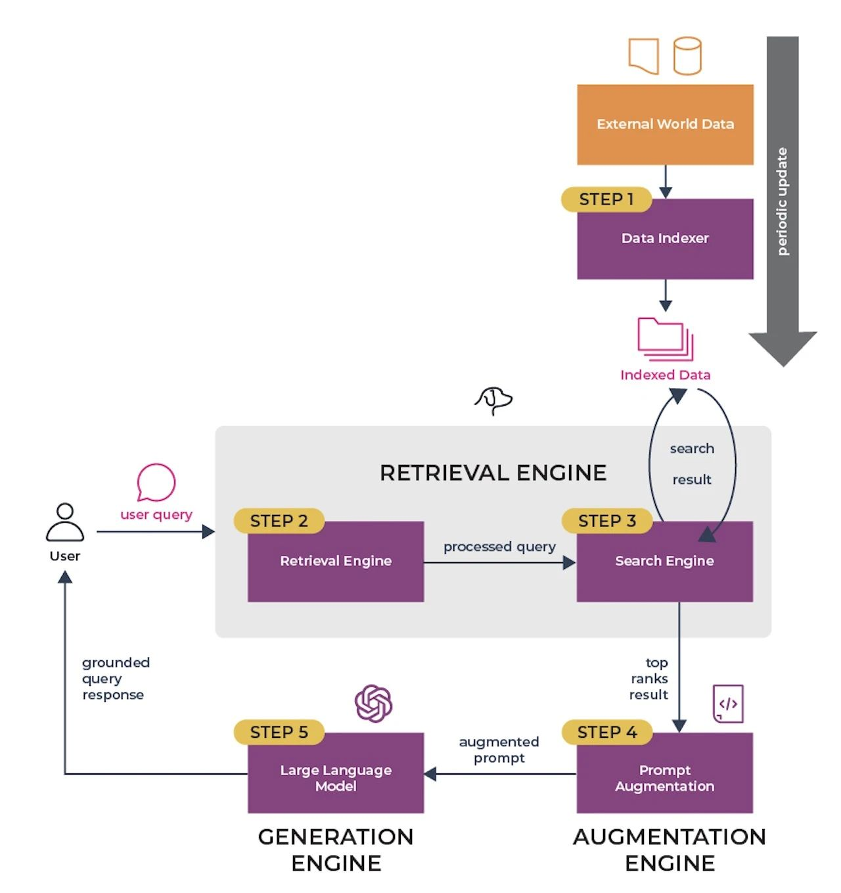
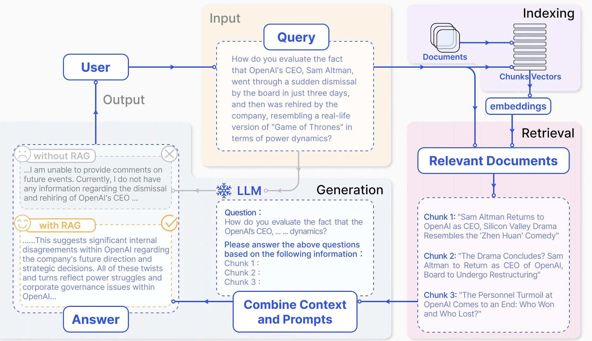
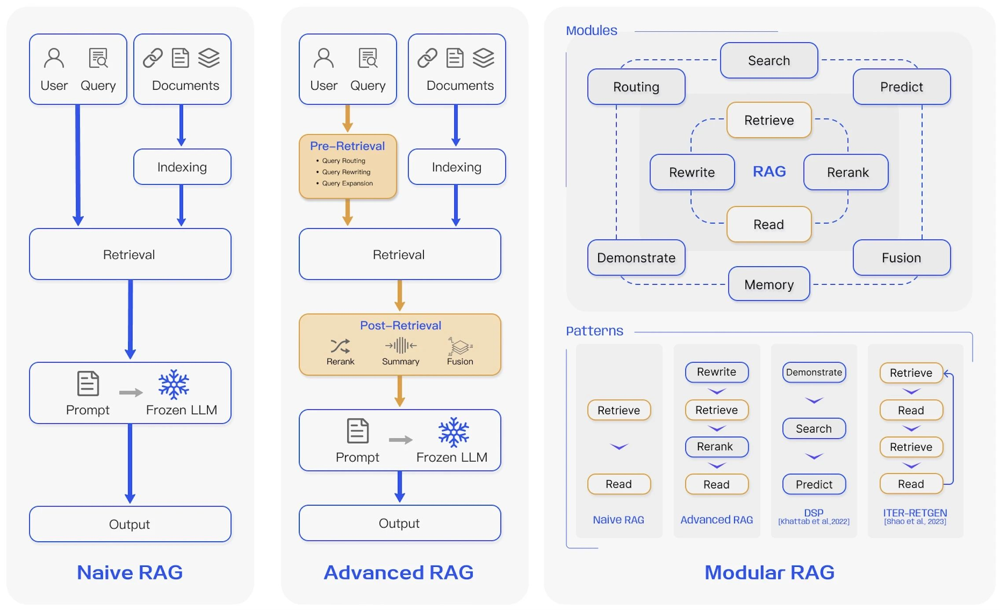
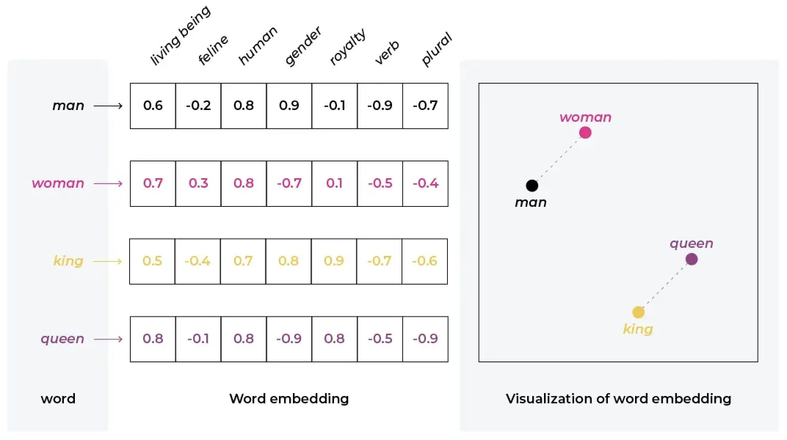
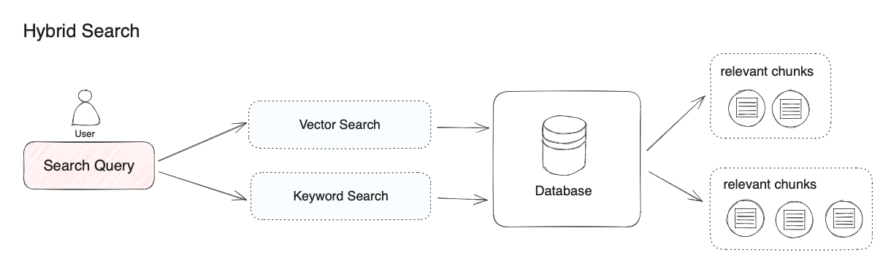
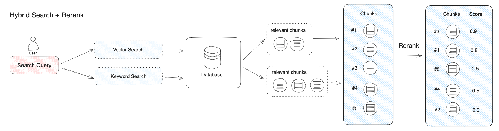

# RAG

## RAG 是什么？

检索增强生成（Retrieval-Augmented Generation）是指对大型语言模型输出进行优化，使其能够在生成响应之前引用训练数据来源之外的权威知识库。大型语言模型（LLM）用海量数据进行训练，使用数十亿个参数为回答问题、翻译语言和完成句子等任务生成原始输出。在 LLM 本就强大的功能基础上，RAG 将其扩展为能访问特定领域或组织的内部知识库，所有这些都无需重新训练模型。这是一种经济高效地改进 LLM 输出的方法，让它在各种情境下都能保持相关性、准确性和实用性。

我们可以把大模型比做是一个超级专家，他熟悉人类各个领域的知识，但他也有自己的局限性，比如他不知道你个人的一些状况，因为这些信息是你私人的，不会在互联网上公开，所以他没有提前学习的机会。

当你想雇佣这个超级专家来充当你的家庭财务顾问时，需要允许他在接受你的提问时先翻看一下你的投资理财记录、家庭消费支出等数据。这样他才能根据你个人的实际情况提供专业的建议。

**这就是 RAG 系统所做的事情：帮助大模型临时性地获得他所不具备的外部知识，允许它在回答问题之前先找答案。**

### RAG 工作流程



### 关键步骤

- 数据索引，构建检索的基石
- 输入查询处理，理解并转化用户需求
- 搜索和排名，找到最相关的信息
- 提示增强，丰富输入，提升输出
- 响应生成，构建最终答案
- 评估反馈，持续优化的关键



## RAG 架构迭代



## 向量数据库

RAG的核心之一就是向量数据库，这种数据库专门用于处理向量数据，为机器学习和人工智能等领域提供了强大的支持。

这种数据库的主要优势在于它能高效地处理和存储大量的向量化数据，它们通常采用了特殊的数据结构和索引策略，来有效组织和检索向量数据，**这对于RAG系统的检索组件来说是核心功能。**

这些数据库能够处理高维度数据的同时，提供近似最近邻（ANN）查询，这种查询可以快速找到与查询向量相似的数据项。

使得RAG系统能够快速从海量数据中检索出与用户查询最相关的信息，显著提高信息处理的速度。此外，向量数据库在提高数据处理的精确度方面也发挥着关键作用。它能确保检索结果的精确性和相关性，从而增强RAG系统生成模型的输出质量。

向量数据库产品

- [Weaviate](https://weaviate.io/)
- [Qdrant](https://qdrant.tech/)
- [Milvus/Zilliz](https://milvus.io/)
- [Chroma](https://www.trychroma.com/)

## Embedding

矢量数据库不仅存储原始数据（可以是图像、音频或文本），还存储其编码形式：Embedding。
这些Embedding本质上是存储数据上下文表示的数字（即vector）列表。

直观上，当我们提到Embedding时，我们谈论的是实际存在于更高维度的数据（图像、文本、音频）的压缩、低维表示。

Embedding基于一个技巧：获取一段内容（文字，图片，视频.....）并将该内容转换为浮点数数组。

```json
{
  "word": "Valentine's Day",
  "vector": [0.12, 0.75, -0.33, 0.85, 0.21, ...etc...]
}
```

它建立了一座桥梁，连接了人类语言的丰富多彩与算法的冷冰冰的计算效率。

算法擅长数字游戏，却不通人情，而通过文本向量化，它们仿佛获得了解读和处理语言的新技能。

其应用范围广泛，从推荐触动人心的内容，到让聊天机器人更具人情味，再到在浩瀚的文本海洋中寻找微妙的规律，文本向量化无处不在。

文本向量化 让机器能够进行情感分析、语言转换等看似高深的任务，以一种越来越接近人类的方式来理解和处理语言。



**如何生成 Embbedding ?**

- 模型托管方式生成 嵌入：比如一些MaaS(模型即服务)服务厂商会提供嵌入模型的API，比如OpenAI 的 text-embedding-3-large
- 自己部署模型生成 嵌入：另外一种是使用开源的嵌入模型，然后通过使用GPU服务器运行起来，自己封装接口。

## 混合检索

RAG 检索环节中的主流方法是向量检索，即语义相关度匹配的方式。技术原理是通过将外部知识库的文档先拆分为语义完整的段落或句子，并将其转换（Embedding）为计算机能够理解的一串数字表达（多维向量），同时对用户问题进行同样的转换操作。

计算机能够发现用户问题与句子之间细微的语义相关性，比如 “猫追逐老鼠” 和 “小猫捕猎老鼠” 的语义相关度会高于 “猫追逐老鼠” 和 “我喜欢吃火腿” 之间的相关度。在将相关度最高的文本内容查找到后，RAG 系统会将其作为用户问题的上下文一起提供给大模型，帮助大模型回答问题。

除了能够实现复杂语义的文本查找，向量检索还有其他的优势：

- 相近语义理解（如老鼠/捕鼠器/奶酪，谷歌/必应/搜索引擎）
- 多语言理解（跨语言理解，如输入中文匹配英文）
- 多模态理解（支持文本、图像、音视频等的相似匹配）
- 容错性（处理拼写错误、模糊的描述）

虽然向量检索在以上情景中具有明显优势，但有某些情况效果不佳。比如：

- 搜索一个人或物体的名字（例如，伊隆·马斯克，iPhone 15）
- 搜索缩写词或短语（例如，RAG，RLHF）
- 搜索 ID（例如， `gpt-3.5-turbo` ， `titan-xlarge-v1.01` ）

而上面这些的缺点恰恰都是传统关键词搜索的优势所在，传统关键词搜索擅长：

- 精确匹配（如产品名称、姓名、产品编号）
- 少量字符的匹配（通过少量字符进行向量检索时效果非常不好，但很多用户恰恰习惯只输入几个关键词）
- 倾向低频词汇的匹配（低频词汇往往承载了语言中的重要意义，比如“你想跟我去喝咖啡吗？”这句话中的分词，“喝”“咖啡”会比“你”“想”“吗”在句子中承载更重要的含义）

对于大多数文本搜索的情景，首要的是确保潜在最相关结果能够出现在候选结果中。向量检索和关键词检索在检索领域各有其优势。混合搜索正是结合了这两种搜索技术的优点，同时弥补了两方的缺点。

在混合检索中，你需要在数据库中提前建立向量索引和关键词索引，在用户问题输入时，分别通过两种检索器在文档中检索出最相关的文本。



“混合检索”实际上并没有明确的定义，本文以向量检索和关键词检索的组合为示例。如果我们使用其他搜索算法的组合，也可以被称为“混合检索”。比如，我们可以将用于检索实体关系的知识图谱技术与向量检索技术结合。

不同的检索系统各自擅长寻找文本（段落、语句、词汇）之间不同的细微联系，这包括了精确关系、语义关系、主题关系、结构关系、实体关系、时间关系、事件关系等。可以说没有任何一种检索模式能够适用全部的情景。**混合检索通过多个检索系统的组合，实现了多个检索技术之间的互补。**

## Rerank

混合检索能够结合不同检索技术的优势获得更好的召回结果，但在不同检索模式下的查询结果需要进行合并和归一化（将数据转换为统一的标准范围或分布，以便更好地进行比较、分析和处理），然后再一起提供给大模型。这时候我们需要引入一个评分系统：重排序模型（Rerank Model）。

**重排序模型通过将候选文档列表与用户问题语义匹配度进行重新排序，从而改进语义排序的结果**。其原理是计算用户问题与给定的每个候选文档之间的相关性分数，并返回按相关性从高到低排序的文档列表。常见的 Rerank 模型如：Cohere rerank、bge-reranker 等。



## Tools

### LlamaIndex

[LlamaIndex](https://docs.llamaindex.ai/en/stable/) 是一个用于构建上下文增强型 LLM 应用程序的框架。上下文增强指的是在私人数据或特定领域数据之上应用 LLM 的任何用例。

### Dify

**[Dify](https://dify.ai/)** 是一款开源的大语言模型(LLM) 应用开发平台。它融合了后端即服务（Backend as Service）和 [LLMOps](https://docs.dify.ai/v/zh-hans/learn-more/extended-reading/what-is-llmops) 的理念，使开发者可以快速搭建生产级的生成式 AI 应用。即使你是非技术人员，也能参与到 AI 应用的定义和数据运营过程中。

由于 Dify 内置了构建 LLM 应用所需的关键技术栈，包括对数百个模型的支持、直观的 Prompt 编排界面、高质量的 RAG 引擎以及灵活的 Agent 框架，并同时提供了一套易用的界面和 API。这为开发者节省了许多重复造轮子的时间，使其可以专注在创新和业务需求上。

### RAGFlow

[RAGFlow](https://ragflow.io/) 是一款基于深度文档理解构建的开源 RAG（Retrieval-Augmented Generation）引擎。RAGFlow 可以为各种规模的企业及个人提供一套精简的 RAG 工作流程，结合大语言模型（LLM）针对用户各类不同的复杂格式数据提供可靠的问答以及有理有据的引用。

## 参考引用

- [精通RAG架构：从0到1，基于LLM+RAG构建生产级企业知识库](https://mp.weixin.qq.com/s/PJgAIpxzRcuDlH-uDzbc1A)
- [Dify doc](https://docs.dify.ai/)
- 《Retrieval-Augmented Generation for Large
Language Models: A Survey》