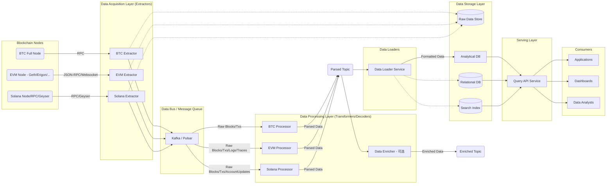

## Blockchain Data Processing Framework Design

**1. 核心设计原则**

*   **模块化与解耦:** 各组件职责单一，通过标准接口（如消息队列、API）交互，易于独立开发、部署、扩展和替换。
*   **高性能:** 最大化数据处理吞吐量，最小化查询延迟。采用并行处理、批处理、高效存储和索引技术。
*   **可扩展性:** 系统能够水平扩展以应对数据量的增长和新链的接入。无论是数据采集、处理还是存储层，都应易于增加节点或资源。
*   **可靠性与一致性:** 确保数据的准确性，能够处理链重组（reorgs），保证至少“最终一致性”。具备监控、告警和故障恢复能力。
*   **可维护性:** 清晰的架构，标准化的开发流程，良好的文档和监控。
*   **通用性:** 设计通用的数据模型和处理流程，同时兼容不同链的特性。

**2. 系统架构 (基于微服务和数据管道)**

可以采用经典的 Lambda 或 Kappa 架构思想，结合微服务实现。

**架构说明:**

1.  **数据采集层 (Extractors):**
    *   **职责:** 连接各自的区块链节点，获取原始区块、交易、事件（Logs）、状态变更（Traces）等数据。
    *   **实现:**
        *   **BTC:** 通过 Bitcoin Core 的 RPC 接口（`getblock`, `getrawtransaction`）轮询或 ZMQ 接口订阅新块和新交易。需要处理 UTXO 模型。
        *   **EVM:** 通过 JSON-RPC 接口 (`eth_getBlockByNumber`, `eth_getTransactionReceipt`, `eth_getLogs`) 轮询或 Websocket 订阅 (`newHeads`, `logs`)。为了获取详细的内部调用和状态变化，可能需要使用 `debug_traceTransaction` 或 `trace_block` 等 Trace API（需要支持 Trace 的节点如 Erigon 或 OpenEthereum/Geth 带 Trace 选项）。
        *   **Solana:** 优先考虑使用 Geyser Plugin。Geyser 是 Solana 节点提供的数据流插件接口，能以更高吞吐量、更低延迟的方式推送账户更新、交易信息、区块信息等到外部系统（如 Kafka）。备选方案是轮询 RPC 接口（`getBlock`, `getTransaction`），但性能和实时性较差。
    *   **产出:** 将获取的原始数据（通常是 JSON 或二进制格式）推送到消息队列。可选择性地备份原始数据到对象存储（如 S3、GCS）以供后续重新处理或审计。
    *   **考虑:** 需要管理节点连接、处理 RPC 错误和重试、处理链重组的初步检测（记录块哈希和父哈希）。

2.  **数据总线 / 消息队列 (Message Queue):**
    *   **职责:** 作为各层之间的缓冲和解耦，处理峰值流量，提供发布/订阅能力。
    *   **技术选型:** Kafka 或 Pulsar。它们都支持高吞吐、持久化、分区和水平扩展。
    *   **实现:** 为不同类型的数据（如原始块、原始交易、解析后数据、富化数据）或不同的链创建不同的 Topic。利用分区（Partition）机制实现并行处理。

3.  **数据处理层 (Transformers/Decoders):**
    *   **职责:** 从消息队列消费原始数据，进行解析、解码、标准化和（可选）富化。
    *   **实现:**
        *   **链特定处理器 (BTC/EVM/Solana Processor):**
            *   解析区块头、交易结构。
            *   **EVM:** 解码 RLP 编码的数据，解析交易输入（Input Data）以识别函数调用和参数（需要 ABI），解析事件日志（需要 ABI），处理 Trace 数据以获取内部调用和状态变化。
            *   **Solana:** 解码交易指令（Instructions），根据 Program ID 和指令数据解析具体操作（可能需要 IDL 或特定解码器），解析账户数据变化。
            *   将不同链的数据转换为统一的内部数据模型（见下文）。
        *   **数据富化器 (Data Enricher - 可选):**
            *   可以是一个或多个独立的微服务。
            *   基于解析后的数据进行额外信息补充，例如：
                *   将地址关联到已知的标签（如交易所、协议名称）。
                *   计算交易的法币价值（需要接入价格预言机或市场数据源）。
                *   解析特定的 DeFi 协议交互。
    *   **产出:** 将处理后的、结构化的数据推送到新的消息队列 Topic（如 `parsed-transactions`, `enriched-events`）。
    *   **技术:** 可以使用 Flink, Spark Streaming, Kafka Streams 或独立的 Go/Python/Java 微服务实现。利用消费者组（Consumer Group）机制实现处理能力的水平扩展。

4.  **数据存储层 (Storage):**
    *   **职责:** 持久化存储处理后的数据，并为查询优化。
    *   **技术选型 (根据查询需求选择，通常是组合):**
        *   **分析型数据库 (Columnar Database):** **核心存储**。适用于海量数据的聚合、过滤和扫描查询。
            *   **ClickHouse:** 开源，性能极高，特别适合时间序列和事件数据分析。运维相对复杂。
            *   **云原生数仓 (BigQuery, Snowflake, Redshift):** 托管服务，弹性伸缩，按需付费，易于管理。可能有厂商锁定风险。
        *   **(可选) 原始数据存储 (Object Storage):** 如 AWS S3, Google Cloud Storage, MinIO。用于备份原始区块/交易数据，成本低廉，可用于数据回溯或重新处理。
        *   **(可选) 关系型数据库 (Relational Database):** 如 PostgreSQL。适用于存储元数据、地址标签、ABI 信息、小型查找表等关系性强、数据量相对较小的数据。可以通过分区提升性能。
        *   **(可选) 搜索引擎 (Search Index):** 如 Elasticsearch。适用于需要全文搜索、复杂条件过滤（特别是针对 JSON 结构内部字段）的场景，例如搜索特定事件参数或交易 Input Data 中的文本。
    *   **数据模型 (核心):** 设计一套统一的核心数据模型来表示跨链的通用概念，同时允许扩展字段来存储链特定的信息。例如：
        *   `blocks`: `chain_id`, `block_number`, `block_hash`, `timestamp`, `parent_hash`, `miner`, `gas_used`, `tx_count`, `size`, `chain_specific_fields` (JSON/Map)
        *   `transactions`: `chain_id`, `tx_hash`, `block_number`, `block_hash`, `timestamp`, `from_address`, `to_address`, `value`, `gas_price`, `gas_limit`, `gas_used`, `fee`, `nonce`, `input_data`, `status`, `chain_specific_fields` (JSON/Map)
        *   `transfers`: `chain_id`, `tx_hash`, `log_index` (or internal index), `from_address`, `to_address`, `contract_address` (token), `amount`, `token_standard` (e.g., ERC20, ERC721, SPL), `token_id` (for NFTs)
        *   `events` / `logs`: `chain_id`, `tx_hash`, `log_index`, `contract_address`, `topic1`, `topic2`, `topic3`, `topic4`, `data`, `decoded_params` (JSON/Map), `event_name`
        *   `internal_transactions` / `traces`: `chain_id`, `tx_hash`, `trace_id`, `parent_trace_id`, `type` (CALL, CREATE, DELEGATECALL), `from_address`, `to_address`, `value`, `gas`, `gas_used`, `input`, `output`, `error`
        *   `account_updates` (Solana specific): `chain_id`, `tx_hash`, `account_address`, `pre_balance`, `post_balance`, `pre_data`, `post_data`, `is_writable`, `owner_program`
    *   **分区与索引:** 在存储层（特别是分析型数据库）必须根据 `timestamp` 或 `block_number` 进行分区，通常按天或按月。在常用查询字段（如 `from_address`, `to_address`, `contract_address`, `tx_hash`）上建立适当的索引或排序键（如 ClickHouse 的 `ORDER BY`）。

5.  **数据加载层 (Loaders):**
    *   **职责:** 从消息队列消费处理后的数据，并将其批量写入目标数据库。
    *   **实现:** 通常是独立的微服务，负责适配不同数据库的写入 API。采用批处理（Batching）写入以提高效率。处理写入失败和重试。
    *   **技术:** 可以使用 Kafka Connectors，或 Flink/Spark 的 Sink，或独立的 Go/Python/Java 微服务。

6.  **服务层 (Serving Layer):**
    *   **职责:** 提供统一的查询接口（如 RESTful API, GraphQL）供上层应用或用户访问处理后的数据。
    *   **实现:**
        *   构建 API 服务，接收查询请求。
        *   根据请求查询一个或多个数据库（分析库、关系库、搜索库）。
        *   可能需要实现查询优化、分页、缓存（如 Redis）等功能。
        *   对 API 进行认证和限流。
    *   **技术:** Go, Python (FastAPI/Flask), Node.js (Express), Java (Spring Boot) 等。

7.  **消费者 (Consumers):**
    *   使用 API 获取数据的各种应用，如链上浏览器、数据分析平台、交易机器人、监控仪表盘等。

**3. 存储策略**

*   **主存储:** 优先选择高性能的列式数据库（ClickHouse 或云数仓），因为它最适合处理海量区块链数据的分析查询（按时间范围聚合、按地址过滤等）。
*   **分区:** 按时间（如 `toDate(timestamp)` 或 `toYYYYMM(timestamp)`）和可能的 `chain_id` 进行分区是必须的。
*   **排序键 (ClickHouse):** 合理设置 `ORDER BY` 键对查询性能至关重要，通常包含 `chain_id`, `contract_address`, `from_address`, `to_address`, `timestamp` 的组合，具体取决于主要查询模式。
*   **数据模型:** 采用宽表模型，将相关信息（如 block, transaction, transfer, event）适度冗余或关联存储，避免或减少查询时的 JOIN 操作（在列存数据库中 JOIN 通常较昂贵）。可以使用嵌套数据结构（如 ClickHouse 的 Nested 类型或 JSON/Map）存储可变或稀疏的字段。
*   **压缩:** 利用列式存储的高压缩比，选择合适的压缩算法（如 LZ4, ZSTD）。

**4. 海量数据处理**

*   **水平扩展:** 整个架构（采集、处理、加载、存储、查询）都应设计为可水平扩展。通过增加服务实例、消息队列分区、数据库分片/节点来实现。
*   **批处理:** 在数据加载和某些离线处理场景下，采用批处理（Batch Processing）可以显著提高吞吐量。
*   **流式处理:** 对于需要低延迟的场景（如实时监控），采用流式处理（Stream Processing）框架。
*   **分区裁剪:** 数据库查询时利用分区键（通常是时间）来仅扫描相关的数据分区。
*   **索引与排序:** 在存储层正确使用索引和排序键，加速查询过滤。
*   **数据汇总/预计算:** 对于常见的聚合查询（如每日交易量、活跃地址数），可以创建预计算的汇总表（Materialized Views 或定时任务生成），用空间换时间。
*   **冷热数据分离 (可选):** 如果数据量极其庞大且历史数据查询频率低，可以考虑将冷数据归档到更廉价的存储（如对象存储）或使用数据库自带的分层存储功能。

**5. 性能考虑**

*   **采集端:** 使用最高效的节点接口（如 Solana Geyser, EVM Trace API）。并行获取数据。
*   **处理端:** 使用高性能语言（Go, Rust, Java）或优化的流处理框架。无状态处理，易于水平扩展。利用消息队列分区实现并行消费。
*   **存储端:** 选择高性能数据库（ClickHouse）。优化表结构、分区、排序键、压缩。
*   **查询端:** 优化 API 查询逻辑。避免全表扫描。使用缓存。
*   **网络:** 保证组件间（特别是数据库与处理/查询节点间）的网络带宽和低延迟。

**6. 可扩展性考虑**

*   **新增链:**
    1.  部署新链的节点。
    2.  开发新的链特定 Extractor。
    3.  开发新的链特定 Processor（可能需要更新通用数据模型以适应新链特性）。
    4.  更新 Loader 以支持新链数据写入（如果分区或表结构与链相关）。
    5.  更新 API 层以支持查询新链数据。
    *   由于采用模块化设计，大部分核心组件（消息队列、存储引擎、API 框架）无需更改。
*   **数据量增长:** 水平扩展 Extractor、Processor、Loader 的实例数量。扩展消息队列分区。扩展数据库集群（增加节点或 Shard）。

**7. 可靠性与维护**

*   **链重组 (Reorgs):**
    *   Extractor 需要检测潜在的重组（当收到的新块的父哈希与已知最高块哈希不匹配时）。
    *   Processor 需要能够处理重组事件，通常做法是：
        *   标记数据所属的块哈希和块高。
        *   设定一个“最终确认”的区块深度（Confirmation Depth）。
        *   当检测到重组时，删除或标记无效深度内（小于最终确认深度）受影响块的数据，然后处理新的正确链上的块。
        *   查询时，通常只查询已超过最终确认深度的块数据，或者提供选项让用户查询可能变化的最新数据。
*   **监控与告警:** 对所有组件（节点连接、消息队列积压、处理延迟、数据库性能、API 响应时间）进行全面监控，并设置关键指标的告警。
*   **容错:** 服务实例应能容忍失败并自动重启。消息队列提供数据持久性。数据库应有备份和恢复机制。
*   **幂等性:** 数据处理和加载过程应尽量设计为幂等的，即同一条原始消息处理多次结果一致，防止因重试导致数据重复。

------

**相关阅读**

- [Crypto Data Engineering Guide](https://read.cryptodatabytes.com/p/2025-annual-guide-crypto-data-engineering)